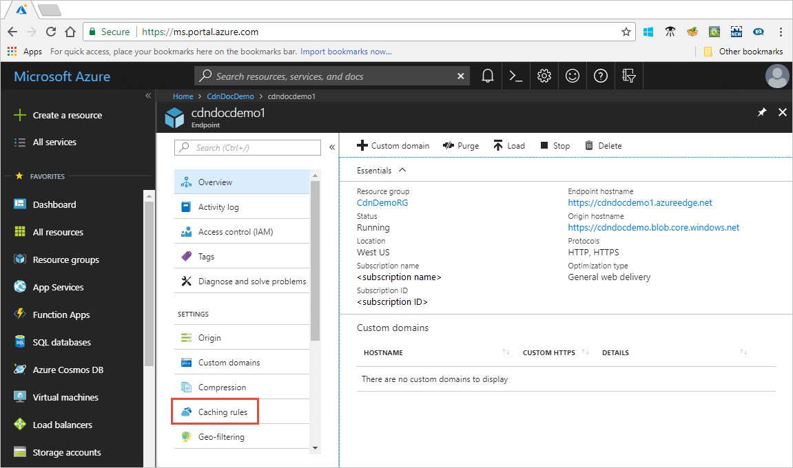
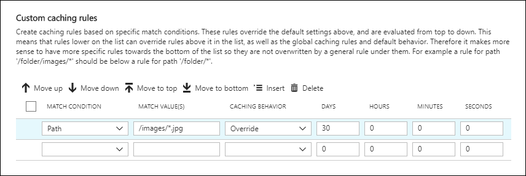

# Tutorial: Set Azure CDN caching rules

> [!NOTE] 
> Caching rules are available only for **Azure CDN Standard from Verizon** and **Azure CDN Standard from Akamai** profiles. For **Azure CDN from Microsoft** profiles, you must use the [Standard rules engine](cdn-standard-rules-engine-reference.md) For **Azure CDN Premium from Verizon** profiles, you must use the [Verizon Premium rules engine](cdn-rules-engine.md) in the **Manage** portal for similar functionality.
 

This tutorial describes how you can use Azure Content Delivery Network (CDN) caching rules to set or modify default cache expiration behavior both globally and with custom conditions, such as a URL path and file extension. Azure CDN provides two types of caching rules:
- Global caching rules: You can set one global caching rule for each endpoint in your profile, which affects all requests to the endpoint. The global caching rule overrides any HTTP cache-directive headers, if set.

- Custom caching rules: You can set one or more custom caching rules for each endpoint in your profile. Custom caching rules match specific paths and file extensions, are processed in order, and override the global caching rule, if set. 

In this tutorial, you learn how to:
> [!div class="checklist"]
> - Open the caching rules page.
> - Create a global caching rule.
> - Create a custom caching rule.

[!INCLUDE [quickstarts-free-trial-note](../../includes/quickstarts-free-trial-note.md)]

## Prerequisites

Before you can complete the steps in this tutorial, you must first create a CDN profile and at least one CDN endpoint. For more information, see [Quickstart: Create an Azure CDN profile and endpoint](cdn-create-new-endpoint.md).

## Open the Azure CDN caching rules page

1. In the [Azure portal](https://portal.azure.com), select a CDN profile, then select an endpoint.

2. In the left pane under Settings, select **Caching rules**.

   

   The **Caching rules** page appears.

   

## Set global caching rules

Create a global caching rule as follows:

1. Under **Global caching rules**, set **Query string caching behavior** to **Ignore query strings**.

2. Set **Caching behavior** to **Set if missing**.
       
3. For **Cache expiration duration**, enter 10 in the **Days** field.

    The global caching rule affects all requests to the endpoint. This rule honors the origin cache-directive headers, if they exist (`Cache-Control` or `Expires`); otherwise, if they are not specified, it sets the cache to 10 days. 

    

## Set custom caching rules

Create a custom caching rule as follows:

1. Under **Custom caching rules**, set **Match condition** to **Path** and **Match value** to `/images/*.jpg`.
    
2. Set **Caching behavior** to **Override** and enter 30 in the **Days** field.
       
    This custom caching rule sets a cache duration of 30 days on any `.jpg` image files in the `/images` folder of your endpoint. It overrides any `Cache-Control` or `Expires` HTTP headers that are sent by the origin server.

    

    
## Clean up resources

In the preceding steps, you created caching rules. If you no longer want to use these caching rules, you can remove them by performing these steps:
 
1. Select a CDN profile, then select the endpoint with the caching rules you want to remove.

2. In the left pane under Settings, select **Caching rules**.

3. Under **Global caching rules**, set **Caching behavior** to **Not set**.
 
4. Under **Custom caching rules**, select the check box next to the rule you want to delete.

5. Select **Delete**.

6. From the top of the page, select **Save**.

## Next steps

In this tutorial, you learned how to:

> [!div class="checklist"]
> - Open the caching rules page.
> - Create a global caching rule.
> - Create a custom caching rule.

Advance to the next article to learn how to configure additional caching rule settings.

> [!div class="nextstepaction"]
> [Control Azure CDN caching behavior with caching rules](cdn-caching-rules.md)

