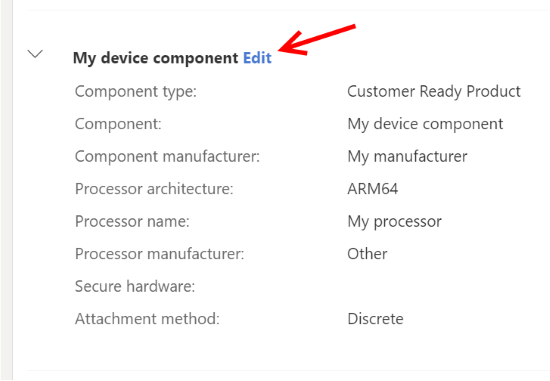
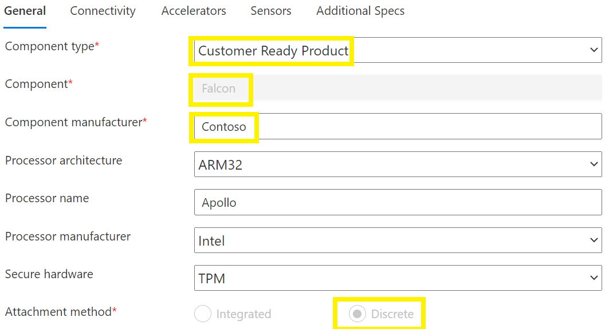
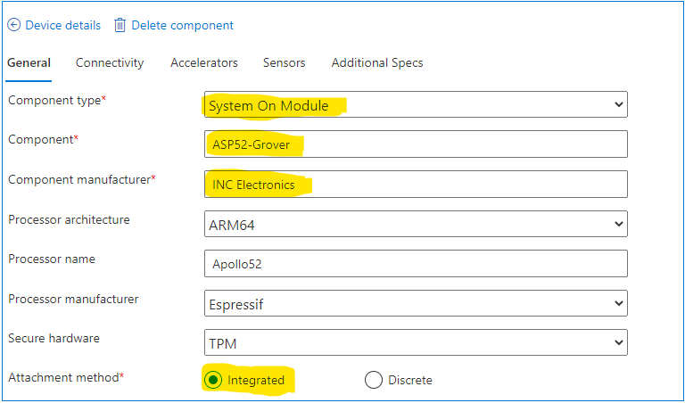

# Add components on the portal

While completing the [tutorial to add device details](tutorial-02-adding-device-details.md) to your certification project, you will be expected to describe the hardware specifications of your device. To do so, users can highlight multiple, separate hardware products (referred to as **components**) that make up your device. This enables you to better promote devices that come with additional hardware, and allows customers to find the right product by searching on the catalog based on these features.

## Prerequisites

- You should be signed in and have a project for your device created on the [Azure Certified Device portal](https://certify.azure.com). For more information, view the [tutorial](tutorial-01-creating-your-project.md).

## How to add components

Every project submitted for certification will include one **Customer Ready Product** component (which in many cases will represent the holistic product itself). To better understand the distinction of a Customer Ready Product component type, view our [certification glossary](./resources-glossary.md). All additional components are at your discretion to include to accurately capture your device.

1. Select `Add a component` on the Product details tab.

    

1. Complete relevant form fields for the component.

    

1. Save your information using the `Save Product Details` button at the bottom of the page:  

    

1. Once you have saved your component, you can further tailor the hardware capabilities it supports. Select the `Edit` link by the component name.  

    

1. Provide relevant hardware capability information where appropriate.  

      

    The editable component fields (shown above) include:

    - **General**: Hardware details such as processors and secure hardware
    - **Connectivity**: Connectivity options, protocols, and interfaces such as radio(s) and GPIO
    - **Accelerators**: Specify hardware acceleration such as GPU and VPU
    - **Sensors**: Specify available sensors such as GPS and vibration
    - **Additional Specs**: Additional information about the device such as physical dimensions and storage/battery information

1. Select `Save Product Details` at the bottom of the Product details page.

## Component use requirements and recommendations

You may have questions regarding how many components to include, or what component type to use. Below are examples of a few sample scenarios of devices that you may be certifying, and how you can use the components feature.

| Product Type                                       | No. Components | Component 1 / Attachment Type      | Components 2+ / Attachment Type                    |
|----------------------------------------------------|------------|----------------------------------|--------------------------------------------------|
| Finished Product                                   | 1          | Customer Ready Product, Discrete | N/A                                              |
| Finished Product with **detachable peripheral(s)** | 2 or more  | Customer Ready Product, Discrete | Peripheral / Discrete or Integrated              |
| Finished Product with **integrated component(s)**  | 2 or more  | Customer Ready Product, Discrete | Select appropriate type / Discrete or integrated |
| Solution-Ready Dev Kit                             | 2 or more  | Customer Ready Product, Discrete | Select appropriate type / Discrete or integrated |

## Example component usage

Below are examples of how an OEM called Contoso would use the components feature to certify their product, called Falcon.

1. Falcon is a complete stand-alone device that does not integrate into a larger product.
    1. No. of components: 1
    1. Component device type: Customer Ready Product
    1. Attachment type: Discrete

     

1. Falcon is a device that includes an integrated peripheral camera module manufactured by INC Electronics that connects via USB to Falcon.
    1. No. of components: 2
    1. Component device type: Customer Ready Product, Peripheral
    1. Attachment type: Discrete, Integrated
    
    > [!Note]
    > The peripheral component is considered integrated because it is not removable.

     

1. Falcon is a device that includes an integrated System on Module from INC Electronics that uses a built-in processor Apollo52 from company Espressif and has an ARM64 architecture.
    1. No. of components: 2
    1. Component device type: Customer Ready Product, System on Module
    1. Attachment type: Discrete, Integrated

    > [!Note]
    > The peripheral component is considered integrated because it is not removable. The SoM component would also include processor information.

     

## Additional tips

We've provided below more clarifications regarding our component usage policy. If you have any questions about appropriate component usage, contact our team at [iotcert@microsoft.com](mailto:iotcert@microsoft.com), and we'll be more than happy to help!

1. A project must contain **only** one Customer Ready Product component. If you are certifying a project with two independent devices, those devices should be certified separately.
1. It is primarily up to you to use (or not use) components to promote your device's capabilities to potential customers.
1. During our review of your device, the Azure Certification team will only require at least one Customer Ready Product component to be listed. However, we may request edits to the component information if the details are not clear or appear to be lacking (for example, component manufacturer is not supplied for a Customer Ready Product type).

## Next steps

Now that you're ready to use our components feature, you're now ready to complete your device details or edit your project for further clarity.

- [Tutorial: Adding device details](tutorial-02-adding-device-details.md)
- [Editing your published device](how-to-edit-published-device.md)

