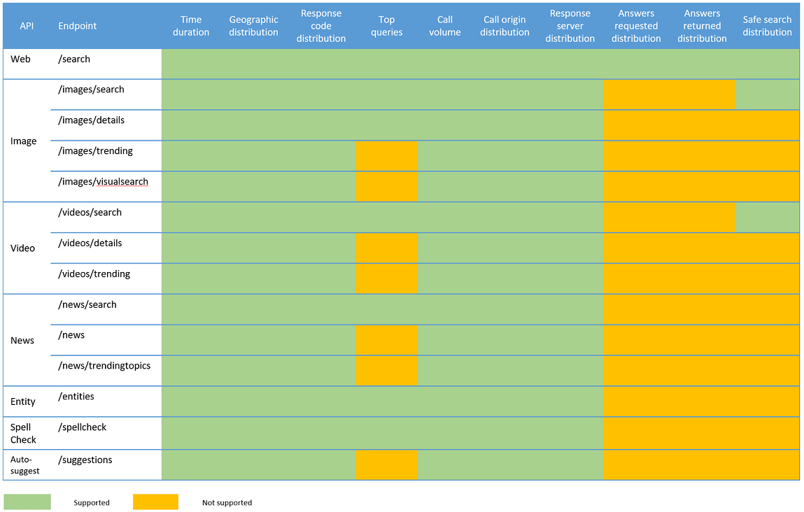

# Add analytics to the Bing Search APIs

Bing Statistics provides analytics for the Bing Search APIs. These analytics include call volume, top query strings, geographic distribution, and more. You can enable Bing Statistics in the [Azure portal](https://ms.portal.azure.com) by navigating to your Azure resource and clicking **Enable Bing Statistics**.

> [!IMPORTANT]
> * Bing Statistics is not available with resources on the free `F0` pricing tier.
> * You may not use any data available via the Bing Statistics dashboard to create applications for distribution to third parties.
> * Enabling Bing Statistics increases your subscription rate slightly. See [pricing](https://aka.ms/bingstatisticspricing) for details.

The following image shows the available analytics for each Bing Search API endpoint.

## Access your analytics

Bing updates analytics data every 24 hours and maintains up to 13 months' worth of history that you can access from the [analytics dashboard](https://bingapistatistics.com). Make sure you're signed in using the same Microsoft account (MSA) you used to sign up for Bing Statistics.

> [!NOTE]  
> * It may take up to 24 hours for metrics to surface on the dashboard. The dashboard shows the date and time the data was last updated.  
> * Metrics are available from the time you enable the Bing Statistics Add-in.

## Filter the data

By default, the charts and graphs display all metrics and data that you have access to. You can filter the data shown in the charts and graphs by selecting the resources, markets, endpoints, and reporting period you're interested in. You can change the following filters:

- **Resource ID**: The unique resource ID that identifies your Azure subscription. The list contains multiple IDs if you subscribe to more than one Bing Search API tier. By default, all resources are selected.  
  
- **Markets**: The markets where the results come from. For example, en-us (English, United States). By default, all markets are selected. The `en-WW` market is the market that Bing uses if the call does not specify a market and Bing is unable to determine the user's market.  
  
- **Endpoints**: The Bing Search API endpoints. The list contains all endpoints for which you have a paid subscription. By default, all endpoints are selected.  

- **Time Frame**: The reporting period. You can specify:
  - **All**: Includes up to 13 months' worth of data  
  - **Past 24 hours**: Includes analytics from the last 24 hours  
  - **Past week**: Includes analytics from the previous 7 days  
  - **Past month**: Includes analytics from the previous 30 days  
  - **A custom date range**: Includes analytics from the specified date range, if available  

## Charts and graphs

The dashboard shows charts and graphs of the metrics available for the selected endpoint. Not all metrics are available for all endpoints. The charts and graphs for each endpoint are static (you may not select the charts and graphs to display). The dashboard shows only charts and graphs for which there's data.

<!--
For example, if you don't include the User-Agent header in your calls, the dashboard will not include device-related graphs.
-->

The following are possible metrics and endpoint restrictions.

- **Call Volume**: Shows the number of calls made during the reporting period. If the reporting period is for a day, the chart shows the number of calls made per hour. Otherwise, the chart shows the number of calls made per day of the reporting period.  
  
  > [!NOTE]
  > The call volume may differ from billing reports, which generally includes only successful calls.

- **Top Queries**: Shows the top queries and the number of occurrences of each query during the reporting period. You can configure the number of queries shown. For example, you can show the top 25, 50, or 75 queries. Top Queries is not available for the following endpoints:  

  - /images/trending
  - /images/details
  - /images/visualsearch
  - /videos/trending
  - /videos/details
  - /news
  - /news/trendingtopics
  - /suggestions  
  
  > [!NOTE]  
  > Some query terms may be suppressed to remove confidential information such as emails, telephone numbers, SSN, etc.

- **Geographic Distribution**: The markets where search results originate. For example, `en-us` (English, United States). Bing uses the `mkt` query parameter to determine the market, if specified. Otherwise, Bing uses signals such as the caller's IP address to determine the market.

- **Response Code Distribution**: The HTTP status codes of all calls during the reporting period.

- **Call Origin Distribution**: The types of browsers used by the users. For example, Microsoft Edge, Chrome, Safari, and FireFox. Calls made from outside a browser (such as bots, Postman, or using curl from a console app) are grouped under Libraries. The origin is determined using the request's User-Agent header value. If the request doesn't include the User-Agent header, Bing tries to derive the origin from other signals.  

- **Safe Search Distribution**: The distribution of safe search values. For example, off, moderate, or strict. The `safeSearch` query parameter contains the value, if specified. Otherwise, Bing defaults the value to moderate.  

- **Answers Requested Distribution**: The Web Search API answers that you requested in the `responseFilter` query parameter.  

- **Answers Returned Distribution**: The answers that Web Search API returned in the response.

- **Response Server Distribution**: The application server that served your API requests. The possible values are Bing.com (for traffic served from desktop and laptop devices) and Bing.com-mobile (for traffic served from mobile devices). The server is determined using the request's User-Agent header value. If the request doesn't include the User-Agent header, Bing tries to derive the server from other signals.

## Next steps

* [What are the Bing Search APIs?](bing-api-comparison.md)
* [Bing Search API use and display requirements](use-display-requirements.md)
