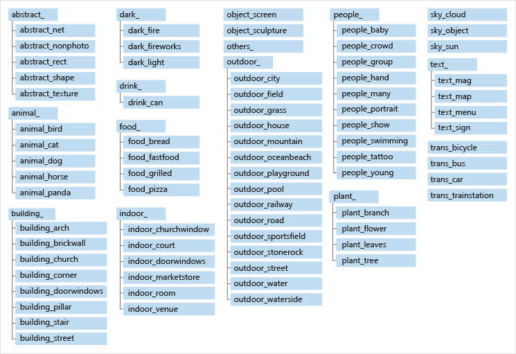
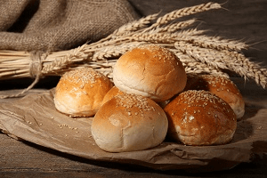

# Categorize images by subject matter

In addition to tags and a description, Computer Vision returns the taxonomy-based categories detected in an image. Unlike tags, categories are organized in a parent/child hereditary hierarchy, and there are fewer of them (86, as opposed to thousands of tags). All category names are in English. Categorization can be done by itself or alongside the newer tags model.

## The 86-category concept

Computer vision can categorize an image broadly or specifically, using the list of 86 categories in the following diagram. For the full taxonomy in text format, see [Category Taxonomy](category-taxonomy.md).



## Image categorization examples

The following JSON response illustrates what Computer Vision returns when categorizing the example image based on its visual features.


```json
{
    "categories": [
        {
            "name": "people_",
            "score": 0.81640625
        }
    ],
    "requestId": "bae7f76a-1cc7-4479-8d29-48a694974705",
    "metadata": {
        "height": 200,
        "width": 300,
        "format": "Jpeg"
    }
}
```

The following table illustrates a typical image set and the category returned by Computer Vision for each image.

| Image | Category |
|-------|----------|
|  | people_group |
|  | animal_dog |
|  | outdoor_mountain |
|  | food_bread |

## Use the API

The categorization feature is part of the [Analyze Image](https://westcentralus.dev.cognitive.microsoft.com/docs/services/computer-vision-v3-2-ga/operations/56f91f2e778daf14a499f21b) API. You can call this API through a native SDK or through REST calls. Include `Categories` in the **visualFeatures** query parameter. Then, when you get the full JSON response, simply parse the string for the contents of the `"categories"` section.

* [Quickstart: Computer Vision REST API or client libraries](./quickstarts-sdk/client-library.md?pivots=programming-language-csharp)

## Next steps

Learn the related concepts of [tagging images](concept-tagging-images.md) and [describing images](concept-describing-images.md).
