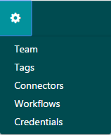
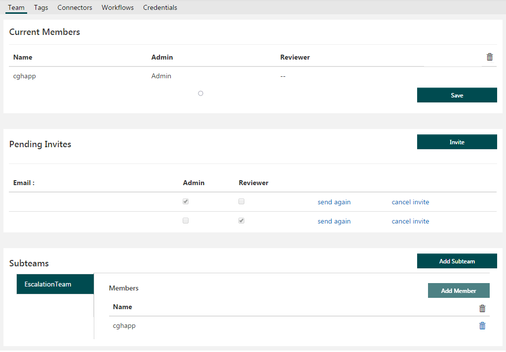
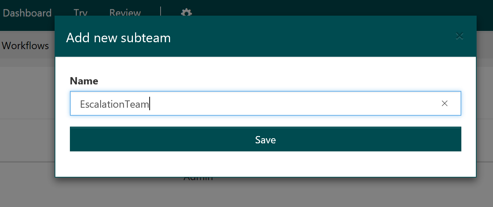
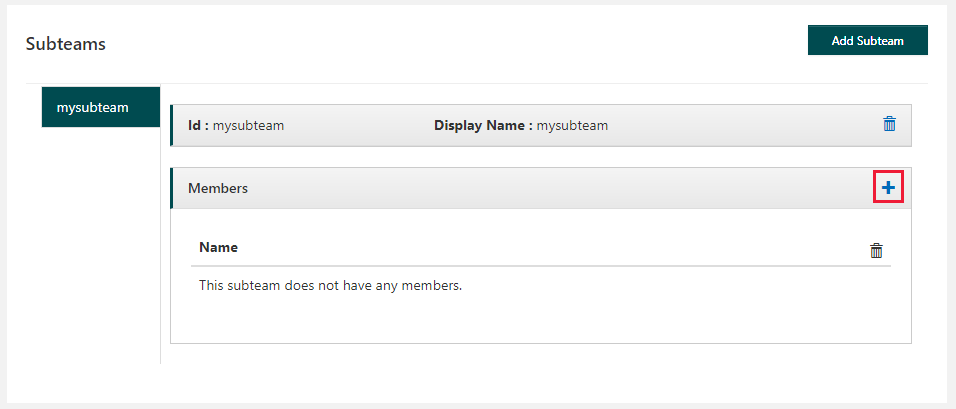
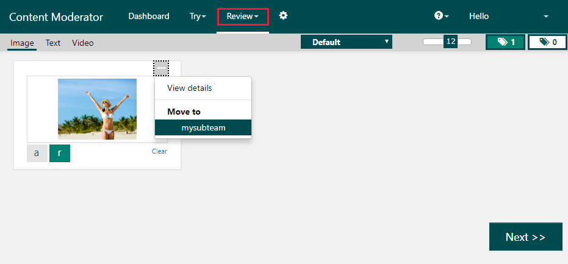
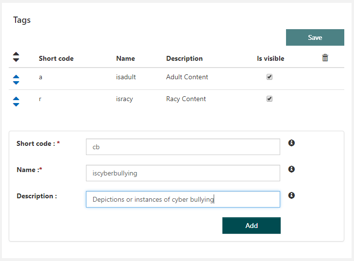
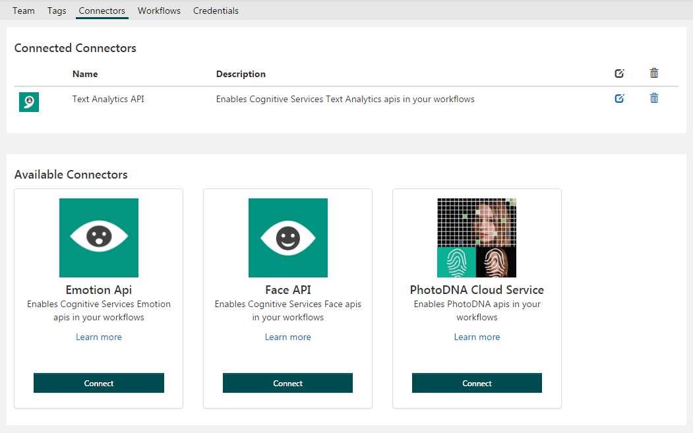
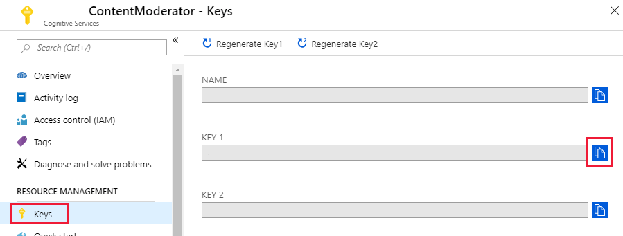
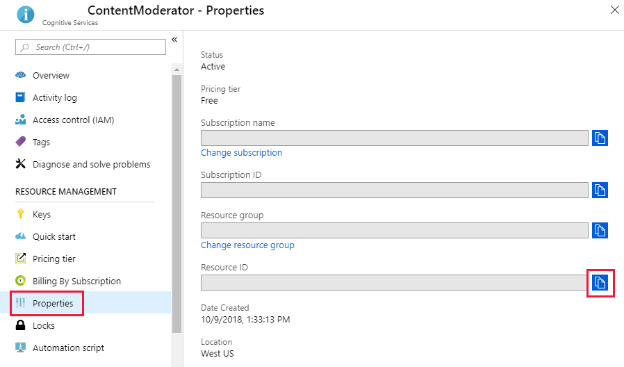

# Configure the Review tool

The [Review tool](https://contentmoderator.cognitive.microsoft.com) has several important features that you can access through the **Settings** menu on the dashboard.

## Manage team and subteams

The **Team** tab lets you manage your team and subteams&mdash;groups of users who can be notified when certain [human reviews](../review-api.md#reviews) are started. You can only have one team (which you create when you sign up with the Review tool), but you can create multiple subteams. The team administrator can invite members, set their permissions, and assign them to different subteams.

Subteams are useful for creating escalation teams or teams dedicated to reviewing specific categories of content. For example, you might send adult content to a separate team for further review.

This section explains how to create subteams and quickly assign reviews on the fly. However, you can use [Workflows](workflows.md) to assign reviews based on specific criteria.

### Create a subteam

Go to the **Subteams** section and click **Add Subteam**. Enter your subteam name in the dialog and click **Save**.

#### Invite teammates

You cannot assign someone to a subteam if they are not already a member of the default team, so you need to add reviewers to the default team first. Click **Invite** on the **Team** tab.

#### Assign teammates to subteam

Click the **Add Member** button to assign members from your default team to one or more subteams. You can only add existing users to a subteam. For adding new users who are not in the review tool, invite them by using the "Invite" button on the Team Settings page.

### Assign reviews to subteams

Once you have created your subteams and assigned members, you can start assigning content [reviews](../review-api.md#reviews) to those subteams. This is done from the **Review** tab of the site.
To assign content to a subteam, click the ellipsis in the upper-right corner, select **Move to**, and select a subteam.

### Switch between subteams

If you are a member of more than one subteam, you can switch between those subteams to change which content reviews are displayed for you. In the **Review** tab, select the drop-down menu labeled **Default** and select **Choose Subteam**. You can view the content reviews for different subteams, but only those of which your are a member.

## Tags

The **Tags** tab lets you define custom moderation tags in addition to the two default moderation tags&mdash;**isadult** (**a**) and **isracy** (**r**). When you create a custom tag, it becomes available in reviews alongside the default tags. You can change which tags show up in reviews by switching their visibility settings.

### Create custom tags

To create a new tag, you must enter a short code, name, and description in the respective fields.

- **Short code**: Enter a two-letter code for your tag. Example: **cb**
- **Name**:	Enter a short and descriptive tag name in lowercase without spaces. Example: **isbullying**.
- **Description**: (optional) Enter a description of the kind of content that your tag targets. Example: **Depictions or instances of cyber bullying**.

Click **Add** to add a tag, and click **Save** when you are finished creating tags.

### Delete tags

You can delete custom tags by selecting the trash icon next to their entries on the Tags list, but you cannot delete the default tags.

## Connectors

The **Connectors** tab lets you manage your connectors, which are service-specific plugins that can process content in different ways as part of content [workflows](../review-api.md#workflows).

The default connector when you create a workflow is the Content Moderator connector, which can mark content as **adult** or **racy**, find profanity, and so on. However, you can use other connectors, listed here, as long as you have credentials for their respective services (to use the Face API connector, for example, you will need to get a [Face API](https://docs.microsoft.com/azure/cognitive-services/face/overview) subscription key).

The [Review tool](./human-in-the-loop.md) includes the following connectors:

- Emotion API
- Face API
- PhotoDNA Cloud Service
- Text Analytics API

### Add a connector

To add a connector (and make it available for use in content [workflows](../review-api.md#workflows)), select the appropriate **Connect** button. In the next dialog, enter your subscription key for that service. When you are done, your new connector should appear at the top of the page.

## Workflows

The **workflows** tab lets you manage your [workflows](../review-api.md#workflows). Workflows are cloud-based filters for content, and they work with connectors to sort content in different ways and take appropriate actions. Here, you can define, edit, and test your workflows. See [Define and use workflows](Workflows.md) for guidance on how to do this.

## Credentials

The **Credentials** tab provides quick access to your Content Moderator subscription key, which you will need to access any of the moderation services from a REST call or client SDK.

### Use external credentials for workflows

The [Review tool](https://contentmoderator.cognitive.microsoft.com) generates a free trial key for Azure Content Moderator services when you sign up, but you can also configure it to use an existing key from your Azure account. This is recommended for large-scale scenarios, as free trial keys have strict usage limits ([Pricing and limits](https://azure.microsoft.com/pricing/details/cognitive-services/content-moderator/)).

If you have created a [Content Moderator resource](https://ms.portal.azure.com/#create/Microsoft.CognitiveServicesContentModerator) in Azure, navigate to it in the Azure portal and select the **Keys** blade. Copy one of your keys.

In the [Review tool](https://contentmoderator.cognitive.microsoft.com)'s **Credentials** tab, go to the **Workflow Settings** pane, select **Edit**, and paste your key into the **Ocp-Apim-Subscription-Key** field. Now, workflows that call the moderation APIs will use your Azure credential.

> [!NOTE]
> The other two fields in the **Workflow Settings** pane are for custom term and image lists. See the [Custom terms](../try-terms-list-api.md) or [Custom images](../try-image-list-api.md) guides to learn about these.

### Use your Azure account with the review APIs

To use your Azure key with the review APIs, you need to retrieve your Resource ID. Go to your Content Moderator resource in the Azure portal and select the **Properties** blade. Copy the Resource ID value and paste it into the **Whitelisted Resource Id(s)** field of the Review tool's **Credentials** tab.

If you've entered your subscription key in both places, the trial key that comes with your Review tool account will not be used but will remain available.

## Next steps

Follow the [Review tool quickstart](../quick-start.md) to start using the Review tool in content moderation scenarios.