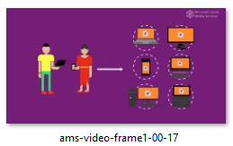
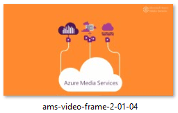
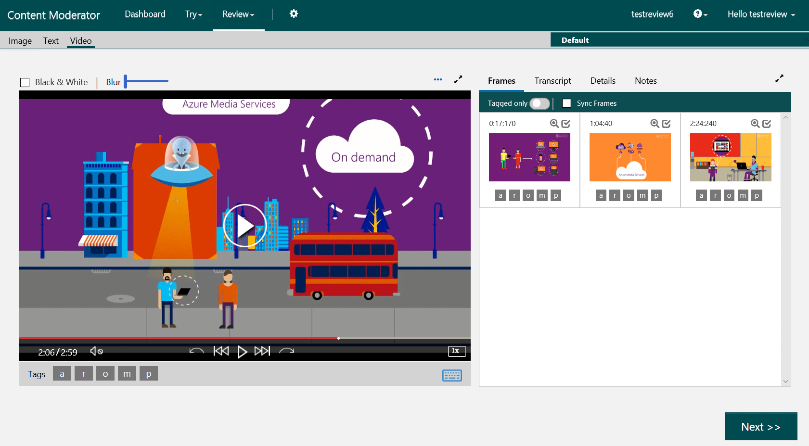

# Create video reviews using .NET

This article provides information and code samples to help you quickly get started using the [Content Moderator SDK with C#](https://www.nuget.org/packages/Microsoft.Azure.CognitiveServices.ContentModerator/) to:

- Create a video review for human moderators
- Add frames to a review
- Get the frames for the review
- Get the status and details of the review
- Publish the review

## Prerequisites

- Sign in or create an account on the Content Moderator [Review tool](https://contentmoderator.cognitive.microsoft.com/) site.
- This article assumes that you have [moderated the video (see quickstart)](video-moderation-api.md) and have the response data. You need it for creating frame-based reviews for human moderators.

## Ensure your API key can call the review API for review creation

After completing the previous steps, you may end up with two Content Moderator keys if you started from the Azure portal.

If you plan to use the Azure-provided API key in your SDK sample, follow the steps mentioned in the [Using Azure key with the review API](review-tool-user-guide/configure.md#use-your-azure-account-with-the-review-apis) section to allow your application to call the review API and create reviews.

If you use the free trial key generated by the review tool, your review tool account already knows about the key and therefore, no additional steps are required.

### Prepare your video and the video frames for review

The video and sample video frames to review must be published online because you need their URLs.

> [!NOTE]
> The program uses manually saved screenshots from the video with random adult/racy scores to illustrate the 
> use of the review API. In a real-world situation, you use the [video moderation output](video-moderation-api.md#run-the-program-and-review-the-output) to create images and assign scores. 

For the video, you need a streaming endpoint so that the review tool plays the video in the player view.


- Copy the **URL** on this [Azure Media Services demo](https://aka.ms/azuremediaplayer?url=https%3A%2F%2Famssamples.streaming.mediaservices.windows.net%2F91492735-c523-432b-ba01-faba6c2206a2%2FAzureMediaServicesPromo.ism%2Fmanifest) page for the manifest URL.

For the video frames (images), use the following images:

 |  |  |
| :---: | :---: | :---: |
[Frame 1](https://blobthebuilder.blob.core.windows.net/sampleframes/ams-video-frame1-00-17.PNG) | [Frame 2](https://blobthebuilder.blob.core.windows.net/sampleframes/ams-video-frame-2-01-04.PNG) | [Frame 3](https://blobthebuilder.blob.core.windows.net/sampleframes/ams-video-frame-3-02-24.PNG) |

## Create your Visual Studio project

1. Add a new **Console app (.NET Framework)** project to your solution.

1. Name the project **VideoReviews**.

1. Select this project as the single startup project for the solution.

### Install required packages

Install the following NuGet packages for the TermLists project.

- Microsoft.Azure.CognitiveServices.ContentModerator
- Microsoft.Rest.ClientRuntime
- Microsoft.Rest.ClientRuntime.Azure
- Newtonsoft.Json

### Update the program's using statements

Modify the program's using statements as follows.

```csharp
using System;
using System.Collections.Generic;
using System.IO;
using System.Threading;
using Microsoft.Azure.CognitiveServices.ContentModerator;
using Microsoft.Azure.CognitiveServices.ContentModerator.Models;
using Newtonsoft.Json;
```

### Add private properties

Add the following private properties to namespace **VideoReviews**, class **Program**. Update the `AzureEndpoint` and `CMSubscriptionKey` fields with the values of your endpoint URL and subscription key. You can find these in the **Quick start** tab of your resource in the Azure portal.


```csharp
namespace VideoReviews
{
    class Program
    {
        // NOTE: Enter a valid endpoint URL
        /// <summary>
        /// The endpoint URL of your subscription
        /// </summary>
        private static readonly string AzureEndpoint = "YOUR ENDPOINT URL";

        // NOTE: Enter a valid subscription key.
        /// <summary>
        /// Your Content Moderator subscription key.
        /// </summary>
        private static readonly string CMSubscriptionKey = "YOUR CONTENT MODERATOR KEY";

        // NOTE: Replace this example team name with your Content Moderator team name.
        /// <summary>
        /// The name of the team to assign the job to.
        /// </summary>
        /// <remarks>This must be the team name you used to create your 
        /// Content Moderator account. You can retrieve your team name from
        /// the Content Moderator web site. Your team name is the Id associated 
        /// with your subscription.</remarks>
        private const string TeamName = "YOUR CONTENT MODERATOR TEAM ID";

        /// <summary>
        /// The minimum amount of time, in milliseconds, to wait between calls
        /// to the Content Moderator APIs.
        /// </summary>
        private const int throttleRate = 2000;
```

### Create Content Moderator Client object

Add the following method definition to namespace **VideoReviews**, class **Program**.

```csharp
/// <summary>
/// Returns a new Content Moderator client for your subscription.
/// </summary>
/// <returns>The new client.</returns>
/// <remarks>The <see cref="ContentModeratorClient"/> is disposable.
/// When you have finished using the client,
/// you should dispose of it either directly or indirectly. </remarks>
public static ContentModeratorClient NewClient()
{
    return new ContentModeratorClient(new ApiKeyServiceClientCredentials(CMSubscriptionKey))
    {
        Endpoint = AzureEndpoint
    };
}
```

## Create a video review

Create a video review with **ContentModeratorClient.Reviews.CreateVideoReviews**. For more information, see the [API reference](https://westus.dev.cognitive.microsoft.com/docs/services/580519463f9b070e5c591178/operations/580519483f9b0709fc47f9c4).

**CreateVideoReviews** has the following required parameters:
1. A string that contains a MIME type, which should be "application/json." 
1. Your Content Moderator team name.
1. An **IList\<CreateVideoReviewsBodyItem>** object. Each **CreateVideoReviewsBodyItem** object represents a video review. This quickstart creates one review at a time.

**CreateVideoReviewsBodyItem** has several properties. At a minimum, you set the following properties:
- **Content**. The URL of the video to be reviewed.
- **ContentId**. An ID to assign to the video review.
- **Status**. Set the value to "Unpublished." If you do not set it, it defaults to "Pending", which means the video review is published and pending human review. Once a video review is published, you can no longer add video frames, a transcript, or a transcript moderation result to it.

> [!NOTE]
> **CreateVideoReviews** returns an IList\<string>. Each of these strings contains an ID for a video review. These IDs are GUIDs and are not the same as the value of the **ContentId** property. 

Add the following method definition to namespace VideoReviews, class Program.

```csharp
/// <summary>
/// Create a video review. For more information, see the API reference:
/// https://westus2.dev.cognitive.microsoft.com/docs/services/580519463f9b070e5c591178/operations/580519483f9b0709fc47f9c4 
/// </summary>
/// <param name="client">The Content Moderator client.</param>
/// <param name="id">The ID to assign to the video review.</param>
/// <param name="content">The URL of the video to review.</param>
/// <returns>The ID of the video review.</returns>
private static string CreateReview(ContentModeratorClient client, string id, string content)
{
    Console.WriteLine("Creating a video review.");

    List<CreateVideoReviewsBodyItem> body = new List<CreateVideoReviewsBodyItem>() {
        new CreateVideoReviewsBodyItem
        {
            Content = content,
            ContentId = id,
            /* Note: to create a published review, set the Status to "Pending".
            However, you cannot add video frames or a transcript to a published review. */
            Status = "Unpublished",
        }
    };

    var result = client.Reviews.CreateVideoReviews("application/json", TeamName, body);

    Thread.Sleep(throttleRate);

    // We created only one review.
    return result[0];
}
```

> [!NOTE]
> Your Content Moderator service key has a requests per second (RPS) rate limit, and if you exceed the limit, the SDK throws an exception with a 429 error code.
>
> A free tier key has a one RPS rate limit.

## Add video frames to the video review

You add video frames to a video review with **ContentModeratorClient.Reviews.AddVideoFrameUrl** (if your video frames are hosted online) or **ContentModeratorClient.Reviews.AddVideoFrameStream** (if your video frames are hosted locally). This quickstart assumes your video frames are hosted online, and so uses **AddVideoFrameUrl**. For more information, see the [API reference](https://westus2.dev.cognitive.microsoft.com/docs/services/580519463f9b070e5c591178/operations/59e7b76ae7151f0b10d451fd).

**AddVideoFrameUrl** has the following required parameters:
1. A string that contains a MIME type, which should be "application/json."
1. Your Content Moderator team name.
1. The video review ID returned by **CreateVideoReviews**.
1. An **IList\<VideoFrameBodyItem>** object. Each **VideoFrameBodyItem** object represents a video frame.

**VideoFrameBodyItem** has the following properties:
- **Timestamp**. A string that contains, in seconds, the time in the video from which the video frame was taken.
- **FrameImage**. The URL of the video frame.
- **Metadata**. An IList\<VideoFrameBodyItemMetadataItem>. **VideoFrameBodyItemMetadataItem** is simply a key/value pair. Valid keys include:
- **reviewRecommended**. True if a human review of the video frame is recommended.
- **adultScore**. A value from 0 to 1 that rates the severity of adult content in the video frame.
- **a**. True if the video contains adult content.
- **racyScore**. A value from 0 to 1 that rates the severity of racy content in the video frame.
- **r**. True if the video frame contains racy content.
- **ReviewerResultTags**. An IList\<VideoFrameBodyItemReviewerResultTagsItem>. **VideoFrameBodyItemReviewerResultTagsItem** is simply a key/value pair. An application can use these tags to organize video frames.

> [!NOTE]
> This quickstart generates random values for the **adultScore** and **racyScore** properties. In a production application, you would obtain these values from the [video moderation service](video-moderation-api.md), deployed as an Azure Media Service.

Add the following method definitions to namespace VideoReviews, class Program.

```csharp
<summary>
/// Create a video frame to add to a video review after the video review is created.
/// </summary>
/// <param name="url">The URL of the video frame image.</param>
/// <returns>The video frame.</returns>
private static VideoFrameBodyItem CreateFrameToAddToReview(string url, string timestamp_seconds)
{
    // We generate random "adult" and "racy" scores for the video frame.
    Random rand = new Random();

    var frame = new VideoFrameBodyItem
    {
        // The timestamp is measured in milliseconds. Convert from seconds.
        Timestamp = (int.Parse(timestamp_seconds) * 1000).ToString(),
        FrameImage = url,

        Metadata = new List<VideoFrameBodyItemMetadataItem>
        {
            new VideoFrameBodyItemMetadataItem("reviewRecommended", "true"),
            new VideoFrameBodyItemMetadataItem("adultScore", rand.NextDouble().ToString()),
            new VideoFrameBodyItemMetadataItem("a", "false"),
            new VideoFrameBodyItemMetadataItem("racyScore", rand.NextDouble().ToString()),
            new VideoFrameBodyItemMetadataItem("r", "false")
        },

        ReviewerResultTags = new List<VideoFrameBodyItemReviewerResultTagsItem>()
        {
            new VideoFrameBodyItemReviewerResultTagsItem("tag1", "value1")
        }
    };

    return frame;
}
```

```csharp
/// <summary>
/// Add a video frame to the indicated video review. For more information, see the API reference:
/// https://westus2.dev.cognitive.microsoft.com/docs/services/580519463f9b070e5c591178/operations/59e7b76ae7151f0b10d451fd
/// </summary>
/// <param name="client">The Content Moderator client.</param>
/// <param name="review_id">The video review ID.</param>
/// <param name="url">The URL of the video frame image.</param>
static void AddFrame(ContentModeratorClient client, string review_id, string url, string timestamp_seconds)
{
    Console.WriteLine("Adding a frame to the review with ID {0}.", review_id);

    var frames = new List<VideoFrameBodyItem>()
    {
        CreateFrameToAddToReview(url, timestamp_seconds)
    };
        
    client.Reviews.AddVideoFrameUrl("application/json", TeamName, review_id, frames);

    Thread.Sleep(throttleRate);
```

## Get video frames for video review

You can get the video frames for a video review with **ContentModeratorClient.Reviews.GetVideoFrames**. **GetVideoFrames** has the following required parameters:
1. Your Content Moderator team name.
1. The video review ID returned by **CreateVideoReviews**.
1. The zero-based index of the first video frame to get.
1. The number of video frames to get.

Add the following method definition to namespace VideoReviews, class Program.

```csharp
/// <summary>
/// Get the video frames assigned to the indicated video review.  For more information, see the API reference:
/// https://westus2.dev.cognitive.microsoft.com/docs/services/580519463f9b070e5c591178/operations/59e7ba43e7151f0b10d45200
/// </summary>
/// <param name="client">The Content Moderator client.</param>
/// <param name="review_id">The video review ID.</param>
static void GetFrames(ContentModeratorClient client, string review_id)
{
    Console.WriteLine("Getting frames for the review with ID {0}.", review_id);

    Frames result = client.Reviews.GetVideoFrames(TeamName, review_id, 0);
    Console.WriteLine(JsonConvert.SerializeObject(result, Formatting.Indented));

    Thread.Sleep(throttleRate);
}
```

## Get video review information

You get information for a video review with **ContentModeratorClient.Reviews.GetReview**. **GetReview** has the following required parameters:
1. Your Content Moderator team name.
1. The video review ID returned by **CreateVideoReviews**.

Add the following method definition to namespace VideoReviews, class Program.

```csharp
/// <summary>
/// Get the information for the indicated video review. For more information, see the reference API:
/// https://westus2.dev.cognitive.microsoft.com/docs/services/580519463f9b070e5c591178/operations/580519483f9b0709fc47f9c2
/// </summary>
/// <param name="client">The Content Moderator client.</param>
/// <param name="review_id">The video review ID.</param>
private static void GetReview(ContentModeratorClient client, string review_id)
{
    Console.WriteLine("Getting the status for the review with ID {0}.", review_id);

    var result = client.Reviews.GetReview(ModeratorHelper.Clients.TeamName, review_id);
    Console.WriteLine(JsonConvert.SerializeObject(result, Formatting.Indented));

    Thread.Sleep(throttleRate);
}
```

## Publish video review

You publish a video review with **ContentModeratorClient.Reviews.PublishVideoReview**. **PublishVideoReview** has the following required parameters:
1. Your Content Moderator team name.
1. The video review ID returned by **CreateVideoReviews**.

Add the following method definition to namespace VideoReviews, class Program.

```csharp
/// <summary>
/// Publish the indicated video review. For more information, see the reference API:
/// https://westus2.dev.cognitive.microsoft.com/docs/services/580519463f9b070e5c591178/operations/59e7bb29e7151f0b10d45201
/// </summary>
/// <param name="client">The Content Moderator client.</param>
/// <param name="review_id">The video review ID.</param>
private static void PublishReview(ContentModeratorClient client, string review_id)
{
    Console.WriteLine("Publishing the review with ID {0}.", review_id);
    client.Reviews.PublishVideoReview(TeamName, review_id);
    Thread.Sleep(throttleRate);
}
```

## Putting it all together

Add the **Main** method definition to namespace VideoReviews, class Program. Finally, close the Program class and the VideoReviews namespace.

```csharp
static void Main(string[] args)
{
    using (ContentModeratorClient client = NewClient())
    {
        // Create a review with the content pointing to a streaming endpoint (manifest)
        var streamingcontent = "https://amssamples.streaming.mediaservices.windows.net/91492735-c523-432b-ba01-faba6c2206a2/AzureMediaServicesPromo.ism/manifest";
        string review_id = CreateReview(client, "review1", streamingcontent);

        var frame1_url = "https://blobthebuilder.blob.core.windows.net/sampleframes/ams-video-frame1-00-17.PNG";
        var frame2_url = "https://blobthebuilder.blob.core.windows.net/sampleframes/ams-video-frame-2-01-04.PNG";
        var frame3_url = "https://blobthebuilder.blob.core.windows.net/sampleframes/ams-video-frame-3-02-24.PNG";

        // Add the frames from 17, 64, and 144 seconds.
        AddFrame(client, review_id, frame1_url, "17");
        AddFrame(client, review_id, frame2_url, "64");
        AddFrame(client, review_id, frame3_url, "144");

        // Get frames information and show
        GetFrames(client, review_id);
        GetReview(client, review_id);

        // Publish the review
        PublishReview(client, review_id);

        Console.WriteLine("Open your Content Moderator Dashboard and select Review > Video to see the review.");
        Console.WriteLine("Press any key to close the application.");
        Console.ReadKey();
    }
}
```

## Run the program and review the output
When you run the application, you see an output on the following lines:

```json
Creating a video review.
Adding a frame to the review with ID 201801v3212bda70ced4928b2cd7459c290c7dc.
Adding a frame to the review with ID 201801v3212bda70ced4928b2cd7459c290c7dc.
Adding a frame to the review with ID 201801v3212bda70ced4928b2cd7459c290c7dc.
Getting frames for the review with ID 201801v3212bda70ced4928b2cd7459c290c7dc.
{
    "ReviewId": "201801v3212bda70ced4928b2cd7459c290c7dc",
    "VideoFrames": [
    {
        "Timestamp": "17000",
        "FrameImage": "https://reviewcontentprod.blob.core.windows.net/testreview6/FRM_201801v3212bda70ced4928b2cd7459c290c7dc_17000.PNG",
        "Metadata": [
        {
            "Key": "reviewRecommended",
            "Value": "true"
        },
        {
            "Key": "adultScore",
            "Value": "0.808312381528463"
        },
        {
            "Key": "a",
            "Value": "false"
        },
        {
            "Key": "racyScore",
            "Value": "0.846378884206702"
        },
        {
            "Key": "r",
            "Value": "false"
        }
        ],
        "ReviewerResultTags": [
        {
            "Key": "tag1",
            "Value": "value1"
        }
    ]
    },
    {
        "Timestamp": "64000",
        "FrameImage": "https://reviewcontentprod.blob.core.windows.net/testreview6/FRM_201801v3212bda70ced4928b2cd7459c290c7dc_64000.PNG",
        "Metadata": [
        {
            "Key": "reviewRecommended",
            "Value": "true"
        },
        {
            "Key": "adultScore",
            "Value": "0.576078300166912"
        },
        {
            "Key": "a",
            "Value": "false"
        },
        {
            "Key": "racyScore",
            "Value": "0.244768953064815"
        },
        {
            "Key": "r",
            "Value": "false"
        }
        ],
        "ReviewerResultTags": [
        {
            "Key": "tag1",
            "Value": "value1"
        }
    ]
    },
    {
        "Timestamp": "144000",
        "FrameImage": "https://reviewcontentprod.blob.core.windows.net/testreview6/FRM_201801v3212bda70ced4928b2cd7459c290c7dc_144000.PNG",
        "Metadata": [
        {
            "Key": "reviewRecommended",
            "Value": "true"
        },
        {
            "Key": "adultScore",
            "Value": "0.664480847150311"
        },
        {
            "Key": "a",
            "Value": "false"
        },
        {
            "Key": "racyScore",
            "Value": "0.933817870418456"
        },
        {
            "Key": "r",
            "Value": "false"
        }
        ],
        "ReviewerResultTags": [
        {
            "Key": "tag1",
            "Value": "value1"
        }
        ]
    }
    ]
}

Getting the status for the review with ID 201801v3212bda70ced4928b2cd7459c290c7dc.
{
    "ReviewId": "201801v3212bda70ced4928b2cd7459c290c7dc",
    "SubTeam": "public",
    "Status": "UnPublished",
    "ReviewerResultTags": [],
    "CreatedBy": "testreview6",
    "Metadata": [
    {
        "Key": "FrameCount",
        "Value": "3"
    }
    ],
    "Type": "Video",
    "Content": "https://amssamples.streaming.mediaservices.windows.net/91492735-c523-432b-ba01-faba6c2206a2/AzureMediaServicesPromo.ism/manifest",
    "ContentId": "review1",
    "CallbackEndpoint": null
}

Publishing the review with ID 201801v3212bda70ced4928b2cd7459c290c7dc.
Open your Content Moderator Dashboard and select Review > Video to see the review.
Press any key to close the application.
```

## Check out your video review

Finally, you see the video review in your Content Moderator review tool account on the **Review**>**Video** screen.



## Next steps

Get the [Content Moderator .NET SDK](https://www.nuget.org/packages/Microsoft.Azure.CognitiveServices.ContentModerator/) and the [Visual Studio solution](https://github.com/Azure-Samples/cognitive-services-dotnet-sdk-samples/tree/master/ContentModerator) for this and other Content Moderator quickstarts for .NET.

Learn how to add [transcript moderation](video-transcript-moderation-review-tutorial-dotnet.md) to the video review. 

Check out the detailed tutorial on how to develop a [complete video moderation solution](video-transcript-moderation-review-tutorial-dotnet.md).
