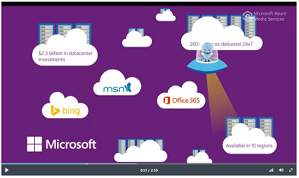
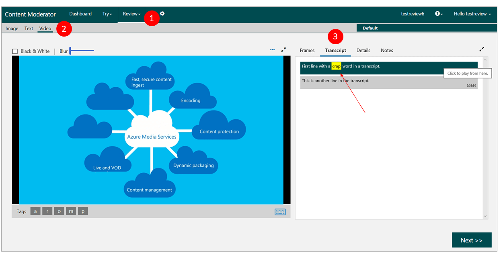

# Create video transcript reviews using .NET

This article provides information and code samples to help you quickly get started using the [Content Moderator SDK with C#](https://www.nuget.org/packages/Microsoft.Azure.CognitiveServices.ContentModerator/) to:

- Create a video review for human moderators
- Add a moderated transcript to the review
- Publish the review

## Prerequisites

- Sign in or create an account on the Content Moderator [Review tool](https://contentmoderator.cognitive.microsoft.com/) site if you haven't done so already.
- This article assumes that you have [moderated the video](video-moderation-api.md) and [created the video review](video-reviews-quickstart-dotnet.md) in the review tool for human decision making. You now want to add moderated video transcripts in the review tool.

## Ensure your API key can call the review API (Job creation)

After completing the previous steps, you may end up with two Content Moderator keys if you started from the Azure portal.

If you plan to use the Azure-provided API key in your SDK sample, follow the steps mentioned in the [Using Azure key with the review API](./review-tool-user-guide/configure.md#use-your-azure-account-with-the-review-apis) section to allow your application to call the review API and create reviews.

If you use the free trial key generated by the review tool, your review tool account already knows about the key and therefore, no additional steps are required.

## Prepare your video for review

Add the transcript to a video review. The video must be published online. You need its streaming endpoint. The streaming endpoint allows the review tool video player to play the video.



- Copy the **URL** on this [Azure Media Services demo](https://aka.ms/azuremediaplayer?url=https%3A%2F%2Famssamples.streaming.mediaservices.windows.net%2F91492735-c523-432b-ba01-faba6c2206a2%2FAzureMediaServicesPromo.ism%2Fmanifest) page for the manifest URL.

## Create your Visual Studio project

1. Add a new **Console app (.NET Framework)** project to your solution.

1. Name the project **VideoTranscriptReviews**.

1. Select this project as the single startup project for the solution.

### Install required packages

Install the following NuGet packages for the TermLists project.

- Microsoft.Azure.CognitiveServices.ContentModerator
- Microsoft.Rest.ClientRuntime
- Microsoft.Rest.ClientRuntime.Azure
- Newtonsoft.Json

### Update the program's using statements

Modify the program's using statements as follows.


```csharp
using System;
using System.Collections.Generic;
using System.IO;
using System.Threading;
using Microsoft.Azure.CognitiveServices.ContentModerator;
using Microsoft.CognitiveServices.ContentModerator;
using Microsoft.CognitiveServices.ContentModerator.Models;
using Newtonsoft.Json;
```

### Add private properties

Add the following private properties to namespace VideoTranscriptReviews, class Program.

Where indicated, replace the example values for these properties.

```csharp
namespace VideoReviews
{
    class Program
    {
        // NOTE: Replace this example location with the location for your Content Moderator account.
        /// <summary>
        /// The region/location for your Content Moderator account, 
        /// for example, westus.
        /// </summary>
        private static readonly string AzureRegion = "YOUR CONTENT MODERATOR REGION";

        // NOTE: Replace this example key with a valid subscription key.
        /// <summary>
        /// Your Content Moderator subscription key.
        /// </summary>
        private static readonly string CMSubscriptionKey = "YOUR CONTENT MODERATOR KEY";

        // NOTE: Replace this example team name with your Content Moderator team name.
        /// <summary>
        /// The name of the team to assign the job to.
        /// </summary>
        /// <remarks>This must be the team name you used to create your 
        /// Content Moderator account. You can retrieve your team name from
        /// the Content Moderator web site. Your team name is the Id associated 
        /// with your subscription.</remarks>
        private const string TeamName = "YOUR CONTENT MODERATOR TEAM ID";

        /// <summary>
        /// The base URL fragment for Content Moderator calls.
        /// </summary>
        private static readonly string AzureBaseURL =
            $"{AzureRegion}.api.cognitive.microsoft.com";

        /// <summary>
        /// The minimum amount of time, in milliseconds, to wait between calls
        /// to the Content Moderator APIs.
        /// </summary>
        private const int throttleRate = 2000;
```

### Create Content Moderator Client object

Add the following method definition to namespace VideoTranscriptReviews, class Program.

```csharp
/// <summary>
/// Returns a new Content Moderator client for your subscription.
/// </summary>
/// <returns>The new client.</returns>
/// <remarks>The <see cref="ContentModeratorClient"/> is disposable.
/// When you have finished using the client,
/// you should dispose of it either directly or indirectly. </remarks>
public static ContentModeratorClient NewClient()
{
    return new ContentModeratorClient(new ApiKeyServiceClientCredentials(CMSubscriptionKey))
    {
        Endpoint = AzureBaseURL
    };
}
```

## Create a video review

Create a video review with **ContentModeratorClient.Reviews.CreateVideoReviews**. For more information, see the [API reference](https://westus.dev.cognitive.microsoft.com/docs/services/580519463f9b070e5c591178/operations/580519483f9b0709fc47f9c4).

**CreateVideoReviews** has the following required parameters:
1. A string that contains a MIME type, which should be "application/json." 
1. Your Content Moderator team name.
1. An **IList\<CreateVideoReviewsBodyItem>** object. Each **CreateVideoReviewsBodyItem** object represents a video review. This quickstart creates one review at a time.

**CreateVideoReviewsBodyItem** has several properties. At a minimum, you set the following properties:
- **Content**. The URL of the video to be reviewed.
- **ContentId**. An ID to assign to the video review.
- **Status**. Set the value to "Unpublished." If you do not set it, it defaults to "Pending", which means the video review is published and pending human review. Once a video review is published, you can no longer add video frames, a transcript, or a transcript moderation result to it.

> [!NOTE]
> **CreateVideoReviews** returns an IList\<string>. Each of these strings contains an ID for a video review. These IDs are GUIDs and are not the same as the value of the **ContentId** property.

Add the following method definition to namespace VideoReviews, class Program.

```csharp
/// <summary>
/// Create a video review. For more information, see the API reference:
/// https://westus2.dev.cognitive.microsoft.com/docs/services/580519463f9b070e5c591178/operations/580519483f9b0709fc47f9c4 
/// </summary>
/// <param name="client">The Content Moderator client.</param>
/// <param name="id">The ID to assign to the video review.</param>
/// <param name="content">The URL of the video to review.</param>
/// <returns>The ID of the video review.</returns>
private static string CreateReview(ContentModeratorClient client, string id, string content)
{
    Console.WriteLine("Creating a video review.");

    List<CreateVideoReviewsBodyItem> body = new List<CreateVideoReviewsBodyItem>() {
        new CreateVideoReviewsBodyItem
        {
            Content = content,
            ContentId = id,
            /* Note: to create a published review, set the Status to "Pending".
            However, you cannot add video frames or a transcript to a published review. */
            Status = "Unpublished",
        }
    };

    var result = client.Reviews.CreateVideoReviews("application/json", TeamName, body);

    Thread.Sleep(throttleRate);

    // We created only one review.
    return result[0];
}
```

> [!NOTE]
> Your Content Moderator service key has a requests per second (RPS) rate limit. If you exceed the limit, the SDK throws an exception with a 429 error code.
>
> A free tier key has a one RPS rate limit.

## Add transcript to video review

You add a transcript to a video review with **ContentModeratorClient.Reviews.AddVideoTranscript**. **AddVideoTranscript** has the following required parameters:
1. Your Content Moderator team ID.
1. The video review ID returned by **CreateVideoReviews**.
1. A **Stream** object that contains the transcript.

The transcript must be in the WebVTT format. For more information, see [WebVTT: The Web Video Text Tracks Format](https://www.w3.org/TR/webvtt1/).

> [!NOTE]
> The program uses a sample transcript in the VTT format. In a real-world solution, you use the Azure Media Indexer service to [generate a transcript](https://docs.microsoft.com/azure/media-services/media-services-index-content) from a video.

Add the following method definition to namespace VideotranscriptReviews, class Program.

```csharp
/// <summary>
/// Add a transcript to the indicated video review.
/// The transcript must be in the WebVTT format.
/// For more information, see the API reference:
/// https://westus2.dev.cognitive.microsoft.com/docs/services/580519463f9b070e5c591178/operations/59e7b8b2e7151f0b10d451fe
/// </summary>
/// <param name="client">The Content Moderator client.</param>
/// <param name="review_id">The video review ID.</param>
/// <param name="transcript">The video transcript.</param>
static void AddTranscript(ContentModeratorClient client, string review_id, string transcript)
{
    Console.WriteLine("Adding a transcript to the review with ID {0}.", review_id);
    client.Reviews.AddVideoTranscript(TeamName, review_id, new MemoryStream(System.Text.Encoding.UTF8.GetBytes(transcript)));
    Thread.Sleep(throttleRate);
}
```

## Add a transcript moderation result to video review

In addition to adding a transcript to a video review, you also add the result of moderating that transcript. You do so with **ContentModeratorClient.Reviews.AddVideoTranscriptModerationResult**. For more information, see the [API reference](https://westus2.dev.cognitive.microsoft.com/docs/services/580519463f9b070e5c591178/operations/59e7b93ce7151f0b10d451ff).

**AddVideoTranscriptModerationResult** has the following required parameters:
1. A string that contains a MIME type, which should be "application/json." 
1. Your Content Moderator team name.
1. The video review ID returned by **CreateVideoReviews**.
1. An IList\<TranscriptModerationBodyItem>. A **TranscriptModerationBodyItem** has the following properties:
1. **Terms**. An IList\<TranscriptModerationBodyItemTermsItem>. A **TranscriptModerationBodyItemTermsItem** has the following properties:
1. **Index**. The zero-based index of the term.
1. **Term**. A string that contains the term.
1. **Timestamp**. A string that contains, in seconds, the time in the transcript at which the terms are found.

The transcript must be in the WebVTT format. For more information, see [WebVTT: The Web Video Text Tracks Format](https://www.w3.org/TR/webvtt1/).

Add the following method definition to namespace VideoTranscriptReviews, class Program. This method submits a transcript to the **ContentModeratorClient.TextModeration.ScreenText** method. It also translates the result into an IList\<TranscriptModerationBodyItem>, and submits to **AddVideoTranscriptModerationResult**.

```csharp
/// <summary>
/// Add the results of moderating a video transcript to the indicated video review.
/// For more information, see the API reference:
/// https://westus2.dev.cognitive.microsoft.com/docs/services/580519463f9b070e5c591178/operations/59e7b93ce7151f0b10d451ff
/// </summary>
/// <param name="client">The Content Moderator client.</param>
/// <param name="review_id">The video review ID.</param>
/// <param name="transcript">The video transcript.</param>
static void AddTranscriptModerationResult(ContentModeratorClient client, string review_id, string transcript)
{
    Console.WriteLine("Adding a transcript moderation result to the review with ID {0}.", review_id);

    // Screen the transcript using the Text Moderation API. For more information, see:
    // https://westus2.dev.cognitive.microsoft.com/docs/services/57cf753a3f9b070c105bd2c1/operations/57cf753a3f9b070868a1f66f
    Screen screen = client.TextModeration.ScreenText("eng", "text/plain", transcript);

    // Map the term list returned by ScreenText into a term list we can pass to AddVideoTranscriptModerationResult.
    List<TranscriptModerationBodyItemTermsItem> terms = new List<TranscriptModerationBodyItemTermsItem>();
    if (null != screen.Terms)
    {
        foreach (var term in screen.Terms)
        {
            if (term.Index.HasValue)
            {
                terms.Add(new TranscriptModerationBodyItemTermsItem(term.Index.Value, term.Term));
            }
        }
    }

    List<TranscriptModerationBodyItem> body = new List<TranscriptModerationBodyItem>()
    {
        new TranscriptModerationBodyItem()
        {
            Timestamp = "0",
            Terms = terms
        }
    };

    client.Reviews.AddVideoTranscriptModerationResult("application/json", TeamName, review_id, body);

    Thread.Sleep(throttleRate);
}
```

## Publish video review

You publish a video review with **ContentModeratorClient.Reviews.PublishVideoReview**. **PublishVideoReview** has the following required parameters:
1. Your Content Moderator team name.
1. The video review ID returned by **CreateVideoReviews**.

Add the following method definition to namespace VideoReviews, class Program.

```csharp
/// <summary>
/// Publish the indicated video review. For more information, see the reference API:
/// https://westus2.dev.cognitive.microsoft.com/docs/services/580519463f9b070e5c591178/operations/59e7bb29e7151f0b10d45201
/// </summary>
/// <param name="client">The Content Moderator client.</param>
/// <param name="review_id">The video review ID.</param>
private static void PublishReview(ContentModeratorClient client, string review_id)
{
    Console.WriteLine("Publishing the review with ID {0}.", review_id);
    client.Reviews.PublishVideoReview(TeamName, review_id);
    Thread.Sleep(throttleRate);
}
```

## Putting it all together

Add the **Main** method definition to namespace VideoTranscriptReviews, class Program. Finally, close the Program class and the VideoTranscriptReviews namespace.

> [!NOTE]
> The program uses a sample transcript in the VTT format. In a real-world solution, you use the Azure Media Indexer service to [generate a transcript](https://docs.microsoft.com/azure/media-services/media-services-index-content) from a video.

```csharp
static void Main(string[] args)
{
    using (ContentModeratorClient client = NewClient())
    {
        // Create a review with the content pointing to a streaming endpoint (manifest)
        var streamingcontent = "https://amssamples.streaming.mediaservices.windows.net/91492735-c523-432b-ba01-faba6c2206a2/AzureMediaServicesPromo.ism/manifest";
        string review_id = CreateReview(client, "review1", streamingcontent);

        var transcript = @"WEBVTT

        01:01.000 --> 02:02.000
        First line with a negative word in a transcript.

        02:03.000 --> 02:25.000
        This is another line in the transcript.
        ";

        AddTranscript(client, review_id, transcript);

        AddTranscriptModerationResult(client, review_id, transcript);

        // Publish the review
        PublishReview(client, review_id);

        Console.WriteLine("Open your Content Moderator Dashboard and select Review > Video to see the review.");
        Console.WriteLine("Press any key to close the application.");
        Console.ReadKey();
    }
}
```

## Run the program and review the output

When you run the application, you see an output on the following lines:

```console
Creating a video review.
Adding a transcript to the review with ID 201801v5b08eefa0d2d4d64a1942aec7f5cacc3.
Adding a transcript moderation result to the review with ID 201801v5b08eefa0d2d4d64a1942aec7f5cacc3.
Publishing the review with ID 201801v5b08eefa0d2d4d64a1942aec7f5cacc3.
Open your Content Moderator Dashboard and select Review > Video to see the review.
Press any key to close the application.
```

## Navigate to your video transcript review

Go to the video transcript review in your Content Moderator review tool on the **Review**>**Video**>**Transcript** screen.

You see the following features:
- The two lines of transcript you added
- The profanity term found and highlighted by the text moderation service
- Selecting a transcription text starts the video from that timestamp



## Next steps

Get the [Content Moderator .NET SDK](https://www.nuget.org/packages/Microsoft.Azure.CognitiveServices.ContentModerator/) and the [Visual Studio solution](https://github.com/Azure-Samples/cognitive-services-dotnet-sdk-samples/tree/master/ContentModerator) for this and other Content Moderator quickstarts for .NET.

Learn how to generate [video reviews](video-reviews-quickstart-dotnet.md) in the review tool.

Check out the detailed tutorial on how to develop a [complete video moderation solution](video-transcript-moderation-review-tutorial-dotnet.md).
