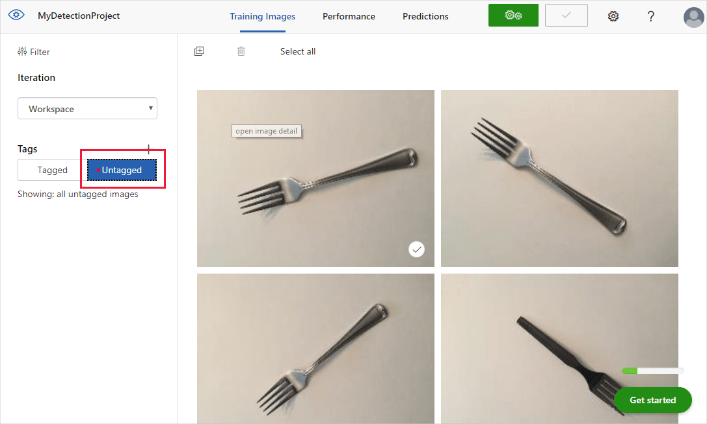
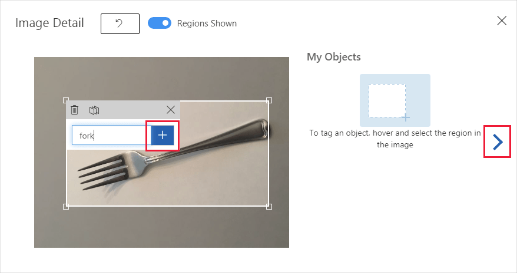

# Quickstart: How to build an object detector with Custom Vision

In this quickstart, you'll learn how to build an object detector through the Custom Vision website. Once you build a detector model, you can use the Custom Vision service for object detection.

If you don't have an Azure subscription, create a [free account](https://azure.microsoft.com/free/?WT.mc_id=A261C142F) before you begin.

## Prerequisites

- A set of images with which to train your detector model. You can use the set of [sample images](https://github.com/Azure-Samples/cognitive-services-python-sdk-samples/tree/master/samples/vision/images) on GitHub. Or, you can choose your own images using the tips below.

## Create Custom Vision resources in the Azure portal

[!INCLUDE [create-resources](includes/create-resources.md)]

## Create a new project

In your web browser, navigate to the [Custom Vision web page](https://customvision.ai) and select __Sign in__. Sign in with the same account you used to sign into the Azure portal.

1. To create your first project, select **New Project**. The **Create new project** dialog box will appear.

    

1. Enter a name and a description for the project. Then select a Resource Group. If your signed-in account is associated with an Azure account, the Resource Group dropdown will display all of your Azure Resource Groups that include a Custom Vision Service Resource. 

   > [!NOTE]
   > If no resource group is available, please confirm that you have logged into [customvision.ai](https://customvision.ai) with the same account as you used to log into the [Azure portal](https://portal.azure.com/). Also, please confirm you have selected the same "Directory" in the Custom Vision portal as the directory in the Azure portal where your Custom Vision resources are located. In both sites, you may select your directory from the drop down account menu at the top right corner of the screen. 

1. Select __Object Detection__ under __Project Types__.

1. Next, select one of the available domains. Each domain optimizes the detector for specific types of images, as described in the following table. You will be able to change the domain later if you wish.

    |Domain|Purpose|
    |---|---|
    |__General__| Optimized for a broad range of object detection tasks. If none of the other domains are appropriate, or you are unsure of which domain to choose, select the Generic domain. |
    |__Logo__|Optimized for finding brand logos in images.|
    |__Compact domains__| Optimized for the constraints of real-time object detection on mobile devices. The models generated by compact domains can be exported to run locally.|

1. Finally, select __Create project__.

## Choose training images

[!INCLUDE [choose training images](includes/choose-training-images.md)]

## Upload and tag images

In this section you will upload and manually tag images to help train the detector. 

1. To add images, click the __Add images__ button and then select __Browse local files__. Select __Open__ to upload the images.

    

1. You'll see your uploaded images in the **Untagged** section of the UI. The next step is to manually tag the objects that you want the detector to learn to recognize. Click the first image to open the tagging dialog window. 

    

1. Click and drag a rectangle around the object in your image. Then, enter a new tag name with the **+** button, or select an existing tag from the drop-down list. It's very important to tag every instance of the object(s) you want to detect, because the detector uses the untagged background area as a negative example in training. When you're done tagging, click the arrow on the right to save your tags and move on to the next image.

    

To upload another set of images, return to the top of this section and repeat the steps.

## Train the detector

To train the detector model, select the **Train** button. The detector uses all of the current images and their tags to create a model that identifies each tagged object.

The training process should only take a few minutes. During this time, information about the training process is displayed in the **Performance** tab.

## Evaluate the detector

After training has completed, the model's performance is calculated and displayed. The Custom Vision service uses the images that you submitted for training to calculate precision, recall, and mean average precision. Precision and recall are two different measurements of the effectiveness of a detector:

- **Precision** indicates the fraction of identified classifications that were correct. For example, if the model identified 100 images as dogs, and 99 of them were actually of dogs, then the precision would be 99%.
- **Recall** indicates the fraction of actual classifications that were correctly identified. For example, if there were actually 100 images of apples, and the model identified 80 as apples, the recall would be 80%.

### Probability Threshold

[!INCLUDE [probability threshold](includes/probability-threshold.md)]

## Manage training iterations

Each time you train your detector, you create a new _iteration_ with its own updated performance metrics. You can view all of your iterations in the left pane of the **Performance** tab. In the left pane you will also find the **Delete** button, which you can use to delete an iteration if it's obsolete. When you delete an iteration, you delete any images that are uniquely associated with it.

## Next steps

In this quickstart, you learned how to create and train an object detector model using the Custom Vision website. Next, get more information on the iterative process of improving your model.

> [!div class="nextstepaction"]
> [Test and retrain a model](test-your-model.md)

