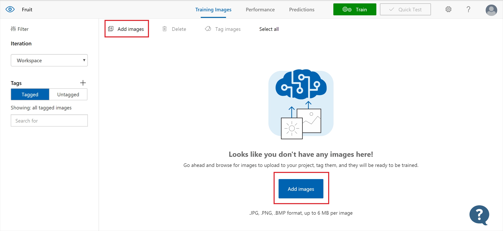
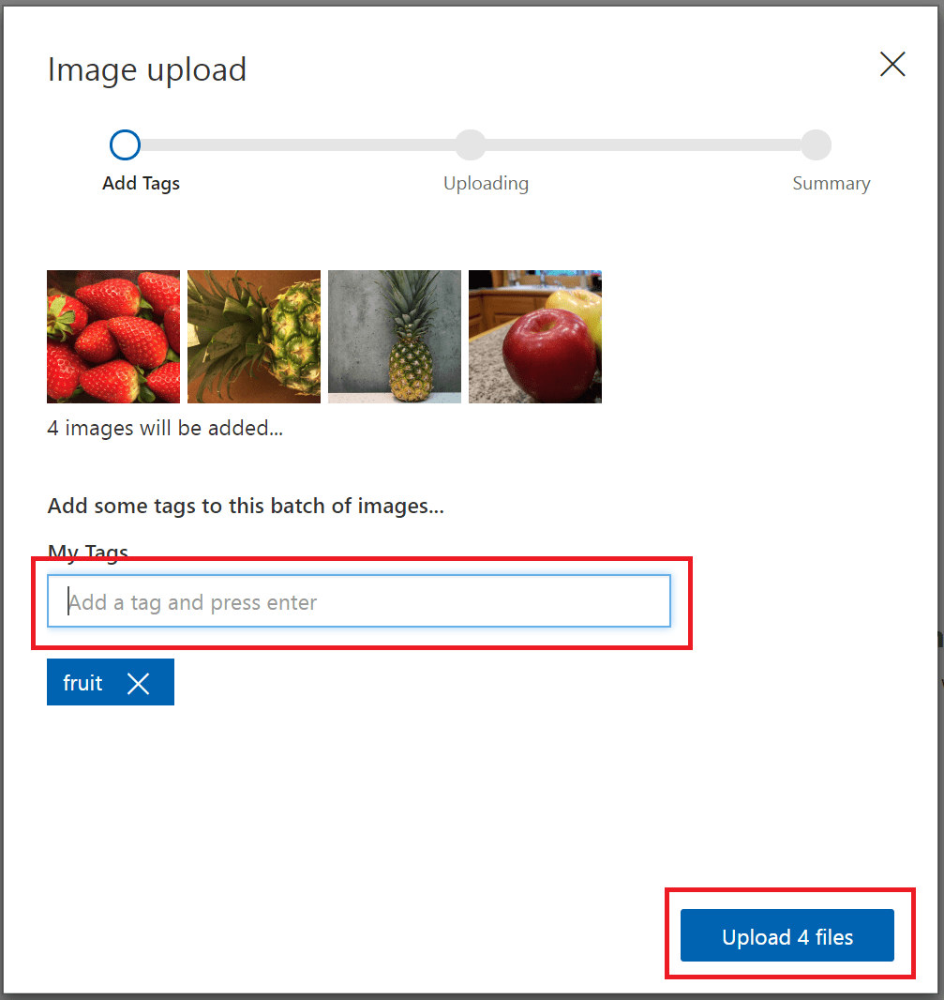

# Quickstart: Build a classifier with the Custom Vision website

In this quickstart, you'll learn how to use the Custom Vision website to create an image classification model. Once you build a model, you can test it with new images and eventually integrate it into your own image recognition app.

If you don't have an Azure subscription, create a [free account](https://azure.microsoft.com/free/cognitive-services/) before you begin.

## Prerequisites

- A set of images with which to train your classifier. See below for tips on choosing images.

## Create Custom Vision resources

[!INCLUDE [create-resources](includes/create-resources.md)]

## Create a new project

In your web browser, navigate to the [Custom Vision web page](https://customvision.ai) and select __Sign in__. Sign in with the same account you used to sign into the Azure portal.

1. To create your first project, select **New Project**. The **Create new project** dialog box will appear.

    

1. Enter a name and a description for the project. Then select a Resource Group. If your signed-in account is associated with an Azure account, the Resource Group dropdown will display all of your Azure Resource Groups that include a Custom Vision Service Resource. 

   > [!NOTE]
   > If no resource group is available, please confirm that you have logged into [customvision.ai](https://customvision.ai) with the same account as you used to log into the [Azure portal](https://portal.azure.com/). Also, please confirm you have selected the same "Directory" in the Custom Vision website as the directory in the Azure portal where your Custom Vision resources are located. In both sites, you may select your directory from the drop down account menu at the top right corner of the screen. 

1. Select __Classification__ under __Project Types__. Then, under __Classification Types__, choose either **Multilabel** or **Multiclass**, depending on your use case. Multilabel classification applies any number of your tags to an image (zero or more), while multiclass classification sorts images into single categories (every image you submit will be sorted into the most likely tag). You'll be able to change the classification type later if you want to.

1. Next, select one of the available domains. Each domain optimizes the classifier for specific types of images, as described in the following table. You will be able to change the domain later if you wish.

    |Domain|Purpose|
    |---|---|
    |__Generic__| Optimized for a broad range of image classification tasks. If none of the other domains are appropriate, or you're unsure of which domain to choose, select the Generic domain. |
    |__Food__|Optimized for photographs of dishes as you would see them on a restaurant menu. If you want to classify photographs of individual fruits or vegetables, use the Food domain.|
    |__Landmarks__|Optimized for recognizable landmarks, both natural and artificial. This domain works best when the landmark is clearly visible in the photograph. This domain works even if the landmark is slightly obstructed by people in front of it.|
    |__Retail__|Optimized for images that are found in a shopping catalog or shopping website. If you want high precision classifying between dresses, pants, and shirts, use this domain.|
    |__Compact domains__| Optimized for the constraints of real-time classification on mobile devices. The models generated by compact domains can be exported to run locally.|

1. Finally, select __Create project__.

## Choose training images

[!INCLUDE [choose training images](includes/choose-training-images.md)]

## Upload and tag images

In this section, you'll upload and manually tag images to help train the classifier. 

1. To add images, select __Add images__ and then select __Browse local files__. Select __Open__ to move to tagging. Your tag selection will be applied to the entire group of images you've selected to upload, so it's easier to upload images in separate groups according to their applied tags. You can also change the tags for individual images after they've been uploaded.

    

1. To create a tag, enter text in the __My Tags__ field and press Enter. If the tag already exists, it will appear in a dropdown menu. In a multilabel project, you can add more than one tag to your images, but in a multiclass project you can add only one. To finish uploading the images, use the __Upload [number] files__ button. 

    

1. Select __Done__ once the images have been uploaded.

    

To upload another set of images, return to the top of this section and repeat the steps.

## Train the classifier

To train the classifier, select the **Train** button. The classifier uses all of the current images to create a model that identifies the visual qualities of each tag.

The training process should only take a few minutes. During this time, information about the training process is displayed in the **Performance** tab.

## Evaluate the classifier

After training has completed, the model's performance is estimated and displayed. The Custom Vision Service uses the images that you submitted for training to calculate precision and recall, using a process called [k-fold cross validation](https://en.wikipedia.org/wiki/Cross-validation_(statistics)). Precision and recall are two different measurements of the effectiveness of a classifier:

- **Precision** indicates the fraction of identified classifications that were correct. For example, if the model identified 100 images as dogs, and 99 of them were actually of dogs, then the precision would be 99%.
- **Recall** indicates the fraction of actual classifications that were correctly identified. For example, if there were actually 100 images of apples, and the model identified 80 as apples, the recall would be 80%.

### Probability threshold

[!INCLUDE [probability threshold](includes/probability-threshold.md)]

## Manage training iterations

Each time you train your classifier, you create a new _iteration_ with its own updated performance metrics. You can view all of your iterations in the left pane of the **Performance** tab. You'll also find the **Delete** button, which you can use to delete an iteration if it's obsolete. When you delete an iteration, you delete any images that are uniquely associated with it.

See [Use your model with the prediction API](./use-prediction-api.md) to learn how to access your trained models programmatically.

## Next steps

In this quickstart, you learned how to create and train an image classification model using the Custom Vision website. Next, get more information on the iterative process of improving your model.

> [!div class="nextstepaction"]
> [Test and retrain a model](test-your-model.md)

* [What is Custom Vision?](./overview.md)