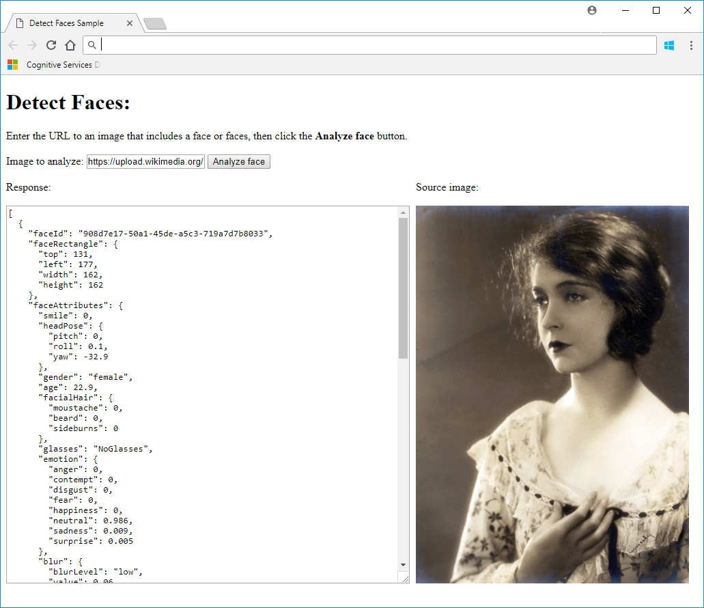

# Quickstart: Detect faces in an image using the REST API and JavaScript

In this quickstart, you will use the Azure Face REST API with JavaScript to detect human faces in an image.

## Prerequisites

- A Face API subscription key. You can get a free trial subscription key from [Try Cognitive Services](https://azure.microsoft.com/try/cognitive-services/?api=face-api). Or, follow the instructions in [Create a Cognitive Services account](https://docs.microsoft.com/azure/cognitive-services/cognitive-services-apis-create-account) to subscribe to the Face API service and get your key.
- A code editor such as [Visual Studio Code](https://code.visualstudio.com/download)

## Initialize the HTML file

Create a new HTML file, *detectFaces.html*, and add the following code.

```html
<!DOCTYPE html>
<html>
    <head>
        <title>Detect Faces Sample</title>
        <script src="https://ajax.googleapis.com/ajax/libs/jquery/1.9.0/jquery.min.js"></script>
    </head>
    <body></body>
</html>
```

Then add the following code inside the `body` element of the document. This code sets up a basic user interface with a URL field, an **Analyze face** button, a response pane, and an image display pane.

```html
<h1>Detect Faces:</h1>
Enter the URL to an image that includes a face or faces, then click
the <strong>Analyze face</strong> button.<br><br>
Image to analyze: <input type="text" name="inputImage" id="inputImage"
    value="https://upload.wikimedia.org/wikipedia/commons/c/c3/RH_Louise_Lillian_Gish.jpg" />
<button onclick="processImage()">Analyze face</button><br><br>
<div id="wrapper" style="width:1020px; display:table;">
    <div id="jsonOutput" style="width:600px; display:table-cell;">
        Response:<br><br>
        <textarea id="responseTextArea" class="UIInput"
            style="width:580px; height:400px;"></textarea>
    </div>
    <div id="imageDiv" style="width:420px; display:table-cell;">
        Source image:<br><br>
        
    </div>
</div>
```

## Write the JavaScript script

Add the following code immediately above the `h1` element in your document. This code sets up the JavaScript code that calls the Face API.

```html
<script type="text/javascript">
    function processImage() {
        // Replace <Subscription Key> with your valid subscription key.
        var subscriptionKey = "<Subscription Key>";
    
        var uriBase =
            "https://<My Endpoint String>.com/face/v1.0/detect";
    
        // Request parameters.
        var params = {
            "returnFaceId": "true",
            "returnFaceLandmarks": "false",
            "returnFaceAttributes":
                "age,gender,headPose,smile,facialHair,glasses,emotion," +
                "hair,makeup,occlusion,accessories,blur,exposure,noise"
        };
    
        // Display the image.
        var sourceImageUrl = document.getElementById("inputImage").value;
        document.querySelector("#sourceImage").src = sourceImageUrl;
    
        // Perform the REST API call.
        $.ajax({
            url: uriBase + "?" + $.param(params),
    
            // Request headers.
            beforeSend: function(xhrObj){
                xhrObj.setRequestHeader("Content-Type","application/json");
                xhrObj.setRequestHeader("Ocp-Apim-Subscription-Key", subscriptionKey);
            },
    
            type: "POST",
    
            // Request body.
            data: '{"url": ' + '"' + sourceImageUrl + '"}',
        })
    
        .done(function(data) {
            // Show formatted JSON on webpage.
            $("#responseTextArea").val(JSON.stringify(data, null, 2));
        })
    
        .fail(function(jqXHR, textStatus, errorThrown) {
            // Display error message.
            var errorString = (errorThrown === "") ?
                "Error. " : errorThrown + " (" + jqXHR.status + "): ";
            errorString += (jqXHR.responseText === "") ?
                "" : (jQuery.parseJSON(jqXHR.responseText).message) ?
                    jQuery.parseJSON(jqXHR.responseText).message :
                        jQuery.parseJSON(jqXHR.responseText).error.message;
            alert(errorString);
        });
    };
</script>
```

You'll need to update the `subscriptionKey` field with the value of your subscription key, and you need to change the `uriBase` string so that it contains the correct endpoint string. The `returnFaceAttributes` field specifies which face attributes to retrieve; you may wish to change this string depending on your intended use.

[!INCLUDE [subdomains-note](../../../../includes/cognitive-services-custom-subdomains-note.md)]

## Run the script

Open *detectFaces.html* in your browser. When you click the **Analyze face** button, the app should display the image from the given URL and print out a JSON string of face data.



The following text is an example of a successful JSON response.

```json
[
  {
    "faceId": "49d55c17-e018-4a42-ba7b-8cbbdfae7c6f",
    "faceRectangle": {
      "top": 131,
      "left": 177,
      "width": 162,
      "height": 162
    },
    "faceAttributes": {
      "smile": 0,
      "headPose": {
        "pitch": 0,
        "roll": 0.1,
        "yaw": -32.9
      },
      "gender": "female",
      "age": 22.9,
      "facialHair": {
        "moustache": 0,
        "beard": 0,
        "sideburns": 0
      },
      "glasses": "NoGlasses",
      "emotion": {
        "anger": 0,
        "contempt": 0,
        "disgust": 0,
        "fear": 0,
        "happiness": 0,
        "neutral": 0.986,
        "sadness": 0.009,
        "surprise": 0.005
      },
      "blur": {
        "blurLevel": "low",
        "value": 0.06
      },
      "exposure": {
        "exposureLevel": "goodExposure",
        "value": 0.67
      },
      "noise": {
        "noiseLevel": "low",
        "value": 0
      },
      "makeup": {
        "eyeMakeup": true,
        "lipMakeup": true
      },
      "accessories": [],
      "occlusion": {
        "foreheadOccluded": false,
        "eyeOccluded": false,
        "mouthOccluded": false
      },
      "hair": {
        "bald": 0,
        "invisible": false,
        "hairColor": [
          {
            "color": "brown",
            "confidence": 1
          },
          {
            "color": "black",
            "confidence": 0.87
          },
          {
            "color": "other",
            "confidence": 0.51
          },
          {
            "color": "blond",
            "confidence": 0.08
          },
          {
            "color": "red",
            "confidence": 0.08
          },
          {
            "color": "gray",
            "confidence": 0.02
          }
        ]
      }
    }
  }
]
```

## Next steps

In this quickstart, you wrote a JavaScript script that calls the Azure Face API to detect faces in an image and return their attributes. Next, explore the Face API reference documentation to learn more.

> [!div class="nextstepaction"]
> [Face API](https://westus.dev.cognitive.microsoft.com/docs/services/563879b61984550e40cbbe8d/operations/563879b61984550f30395236)
