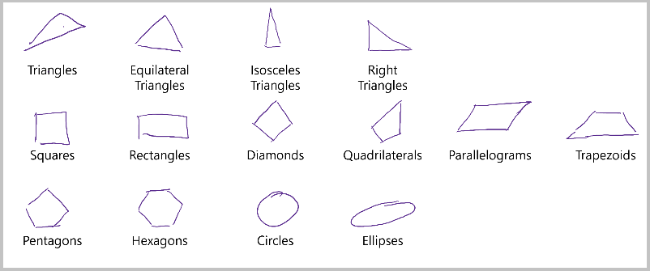

# Send ink data to the Ink Recognizer API 

Digital inking refers to the technologies that enable digital representations of input such as handwriting and drawings. This is typically achieved using a digitizer that captures the movements of input devices, such as a stylus. As devices continue to enable rich digital inking experiences, artificial intelligence and machine learning enables the recognition of written shapes and text in any context. The Ink Recognizer API enables you to send ink strokes and get detailed information about them. 

## The Ink recognizer API vs. OCR services

The Ink Recognizer API does not use Optical Character Recognition(OCR). OCR services process the pixel data from images to provide handwriting and text recognition. This is sometimes called offline recognition. Instead, The Ink Recognizer API requires digital ink stroke data that's captured as the input device is used. Processing digital ink data in this way can produce more accurate recognition results compared to OCR services. 

## Sending ink data

The Ink Recognizer API requires the X and Y coordinates that represent the ink strokes created by an input device, from the moment it touches the detection surface to when it's lifted. The points of each stroke must be a string of comma separated values, and be formatted in JSON like the example below. In addition, each ink stroke must have a unique ID in each request. If the ID is repeated within the same request, the API will return an error. For the most accurate recognition results, have at least eight digits after the decimal point. The origin (0,0) of the canvas is assumed to be the top left corner of the inking canvas.

> [!NOTE]
> The following example isn't valid JSON. You can find a full Ink Recognizer JSON request on [GitHub](https://go.microsoft.com/fwlink/?linkid=2089909).
 
```json
{
  "language": "en-US",
  "strokes": [
   {
    "id": 43,
    "points": 
        "5.1365, 12.3845,
        4.9534, 12.1301,
        4.8618, 12.1199,
        4.7906, 12.2217,
        4.7906, 12.5372,
        4.8211, 12.9849,
        4.9534, 13.6667,
        5.0958, 14.4503,
        5.3299, 15.2441,
        5.6555, 16.0480,
        ..."
   },
    ...
  ]
}
```

## Ink Recognizer response

The Ink Recognizer API returns an analysis response about the objects it recognized from the ink content. The response contains recognition units that describe the relationships between different ink strokes. For example, strokes that create distinct, separate shapes will be contained in different units. Each unit contains detailed information about its ink strokes including the recognized object, its coordinates, and other drawing attributes.

## Shapes recognized by the Ink Recognizer API

The Ink Recognizer API can identify the most commonly used shapes in note taking. The below image shows some basic examples. For a full list of shapes and other ink content recognized by the API, see the [API reference article](https://go.microsoft.com/fwlink/?linkid=2089907). 



## Recommended calling patterns

You can call the Ink Recognizer REST API in different patterns according to your application. 

### User initiated API calls

If you're building an app that takes user input (for example, a note taking or annotation app), you may want to give them control of when and which ink gets sent to the Ink Recognizer API. This functionality is especially useful when text and shapes are both present on the canvas, and users want to perform different actions for each. Consider adding selection features (like a lasso or other geometric selection tool) that enable users to choose what gets sent to the API.  

### App initiated API calls

You can also have your app call the Ink Recognizer API after a timeout. By sending the current ink strokes to the API routinely, you can store recognition results as they're created while improving the API's response time. For example, you can send a line of handwritten text to the API after detecting your user has completed it. 

Having the recognition results in advance gives you information about the characteristics of ink strokes as they relate to each other. For example, which strokes are grouped to form the same word, line, list, paragraph, or shape. This information can enhance your app's ink selection features by being able to select groups of strokes at once, for example.

## Integrate the Ink Recognizer API with Windows Ink

[Windows Ink](https://docs.microsoft.com/windows/uwp/design/input/pen-and-stylus-interactions) provides tools and technologies to enable digital inking experiences on a diverse range of devices. You can combine the Windows Ink platform with the Ink Recognizer API to create applications that display and interpret digital ink strokes.

## Next steps

* [What is the Ink Recognizer API?](../overview.md)
* [Ink Recognizer REST API reference](https://go.microsoft.com/fwlink/?linkid=2089907)

* Start sending digital ink stroke data using:
    * [C#](../quickstarts/csharp.md)
    * [Java](../quickstarts/java.md)
    * [JavaScript](../quickstarts/javascript.md)
