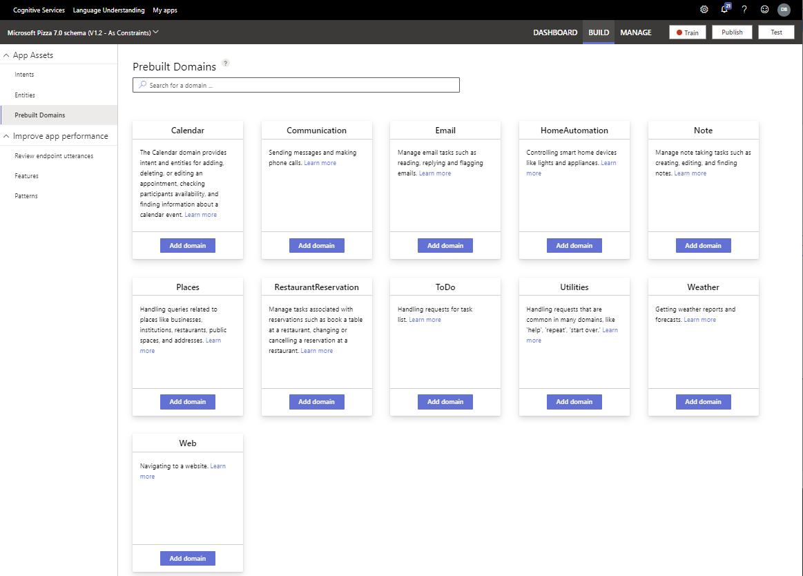
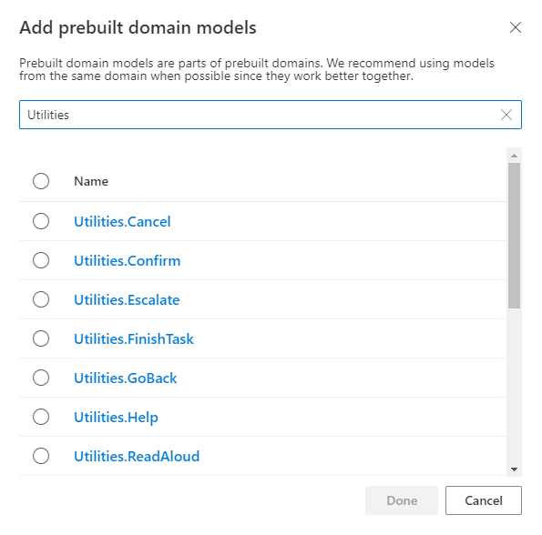
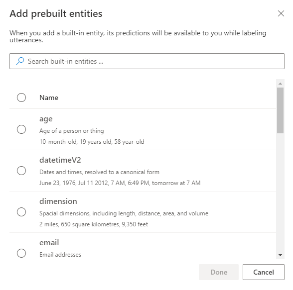

# Add prebuilt models for common usage scenarios

LUIS includes a set of prebuilt models for quickly adding common, conversational user scenarios. This is a quick and easy way to add abilities to your conversational client application without having to design the models for those abilities.

## Add a prebuilt domain

1. Sign in to the [LUIS portal](https://www.luis.ai), and select your **Subscription** and **Authoring resource** to see the apps assigned to that authoring resource.
1. Open your app by selecting its name on **My Apps** page.

1. Select **Prebuilt Domains** from the left toolbar.

1. Find the domain you want added to the app then select **Add domain** button.

    > [!div class="mx-imgBorder"]
    > 

## Add a prebuilt intent

1. Sign in to the [LUIS portal](https://www.luis.ai), and select your **Subscription** and **Authoring resource** to see the apps assigned to that authoring resource.
1. Open your app by selecting its name on **My Apps** page.

1. On the **Intents** page, select **Add prebuilt domain intent** from the toolbar above the intents list.

1. Select an intent from the pop-up dialog.

    > [!div class="mx-imgBorder"]
    > 

1. Select the **Done** button.

## Add a prebuilt entity
1. Sign in to the [LUIS portal](https://www.luis.ai), and select your **Subscription** and **Authoring resource** to see the apps assigned to that authoring resource.
1. Open your app by selecting its name on **My Apps** page.
1. Select **Entities** in the left side.

1. On the **Entities** page, select **Add prebuilt entity**.

1. In **Add prebuilt entities** dialog box, select the prebuilt entity.

    > [!div class="mx-imgBorder"]
    > 

1. Select **Done**. After the entity is added, you do not need to train the app.

## Add a prebuilt domain entity
1. Sign in to the [LUIS portal](https://www.luis.ai), and select your **Subscription** and **Authoring resource** to see the apps assigned to that authoring resource.
1. Open your app by selecting its name on **My Apps** page.
1. Select **Entities** in the left side.

1. On the **Entities** page, select **Add prebuilt domain entity**.

1. In **Add prebuilt domain models** dialog box, select the prebuilt domain entity.

1. Select **Done**. After the entity is added, you do not need to train the app.

## Publish to view prebuilt model from prediction endpoint

The easiest way to view the value of a prebuilt model is to query from the published endpoint.

## Entities containing a prebuilt entity token

If you have a machine-learning entity that needs a required feature of a prebuilt entity, add a subentity to the machine-learning entity, then add a _required_ feature of a prebuilt entity.

## Next steps
> [!div class="nextstepaction"]
> [Build model from .csv with REST APIs](./luis-tutorial-node-import-utterances-csv.md)
