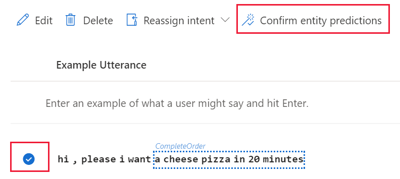
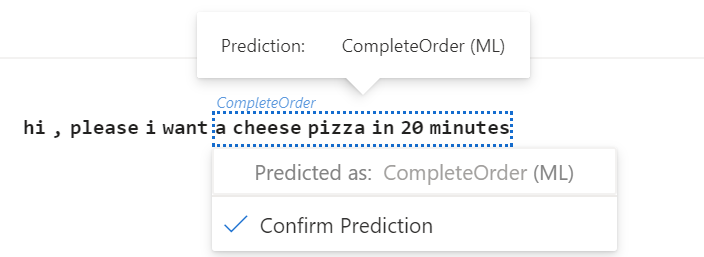
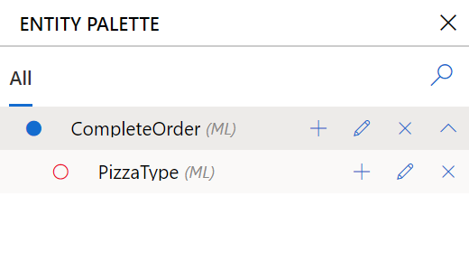
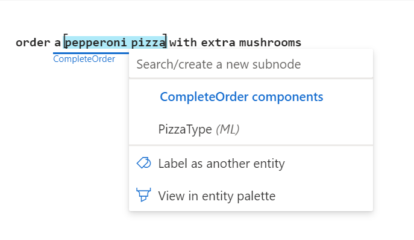

# Label machine-learned entity in an example utterance

Labeling an entity in an example utterance gives LUIS an example of what the entity is and where the entity can appear in the utterance. 

## Labeling machine-learned entity

Consider the phrase, `hi, please I want a cheese pizza in 20 minutes`. 

1. Select the left-most text, then select the right-most text of the entity, then pick the entity you want to label with, in this case Complete Order. The _complete order_ is labeled in the following image.

    > [!div class="mx-imgBorder"]
    > 

1. Select the entity from the pop-up window. The labeled complete pizza order entity includes all words (from left to right in English) that are labeled. 

## Review labeled text

After labeling, review the example utterance and ensure the selected span of text has been underlined with the chosen entity. The solid line indicates the text has been labeled. 

> [!div class="mx-imgBorder"]
> 

## Confirm predicted entity

If there is a dotted-lined box around the span of text and the entity name is above the utterance, it indicates the text is predicted but _not labeled yet_. To turn the prediction into a label, select the utterance row, then select **Confirm entity predictions**.

> [!div class="mx-imgBorder"]
> 

Alternatively, you could select the entity name above the text, then select **Confirm Prediction** from the menu that appears.

> [!div class="mx-imgBorder"]
> 

## Label entity by painting with entity palette cursor

The entity palette offers an alternative to the previous labeling experience. It allows you to brush over text to instantly label it with an entity.

1. Open the entity palette by selecting on the Highlighter icon at the top right of the utterance table. 

    > [!div class="mx-imgBorder"]
    > 

2. Select the entity component. This action is visually indicated with a new cursor. The cursor follows the mouse as you move in the portal. 

    > [!div class="mx-imgBorder"]
    > 

3. In the example utterance, _paint_ the entity with the cursor.

    > [!div class="mx-imgBorder"]
    > 

## Labeling subcomponents of a machine learned entity

Subcomponents in entities are labeled exactly the same way as top level entities. When selecting text, the entities available in the pop-up window are relative to the context in which the text appears. For example, if you have a 5-level machine-learned entity, and you are selecting text that has been labeled with the 1st and 2nd levels (indicated by a labeled entity name under the example utterance), the entities available in the pop-up window are limited to the context of components of the 3rd level. To label the text with other entities, select **Label as another entity** option.

> [!div class="mx-imgBorder"]
> 

Subcomponents can be labeled only if the parent is also labeled. 

## Unlabel entities

To unlabel an entity, select the entity name underneath the text and select **Unlabel**. If the entity you are trying to unlabel has labeled subcomponents, then the subcomponents must be unlabeled first. 

## Editing labels using the entity palette

If you make a mistake while labeling, the entity palette is an easy tool that allows for quick edits. For example, if an entity label spans an extra word by mistake, and it already has labeled subcomponents, then you can use the entity palette to brush over the required shorter span of words.

For example:

1. Pizza Type subcomponent spans "cheese pizza with" which includes an extra incorrect word -- "with"

    > [!div class="mx-imgBorder"]
    > 

2. Use the entity palette to pick Pizza Type and brush over "cheese pizza". The outcome is that only cheese pizza is labeled as Pizza Type now.

    > [!div class="mx-imgBorder"]
    > 

## Labels for matching-text entities

Matching-text entities include prebuilt entities, regular expression entities, list entities, and pattern.any entities. These are automatically labeled by LUIS so they are not required to be manually labeled by users.

## Entity prediction errors

Entity prediction errors indicate the predicted entity doesn't match the labeled entity. This is visualized with a caution indicator next to the utterance.

> [!div class="mx-imgBorder"]
> 

## Next steps

Use the [dashboard](luis-how-to-use-dashboard.md) and [review endpoint utterances](luis-how-to-review-endpoint-utterances.md) to improve the prediction quality of your app.