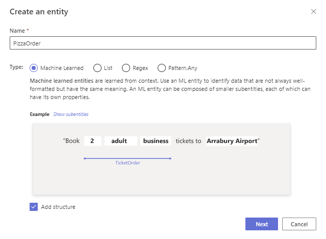
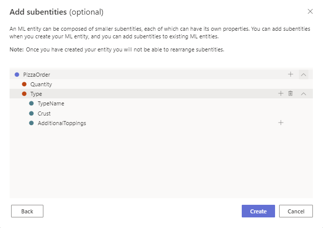
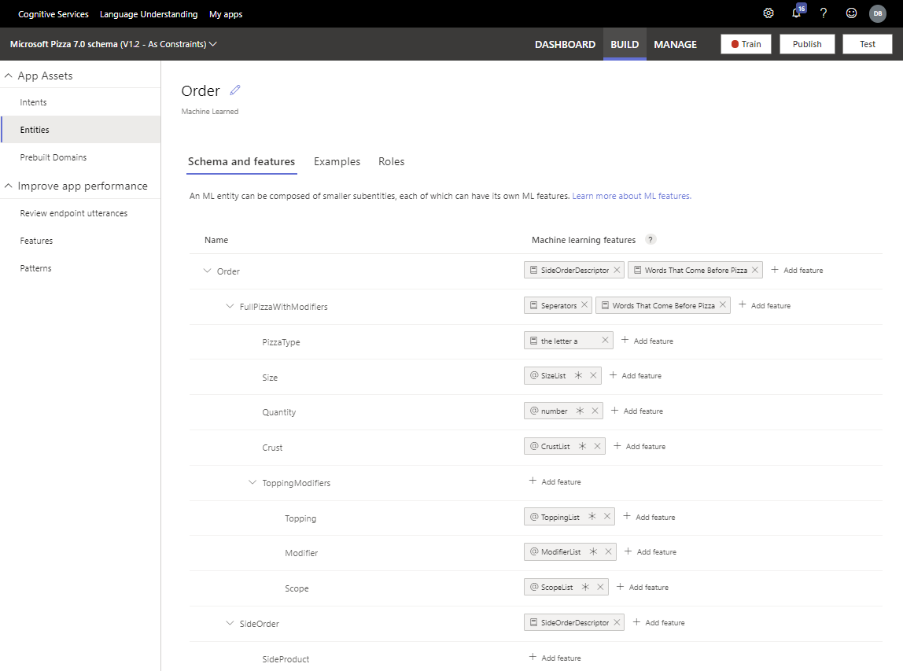
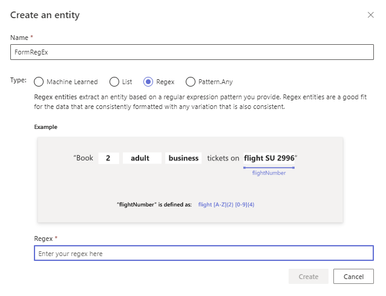
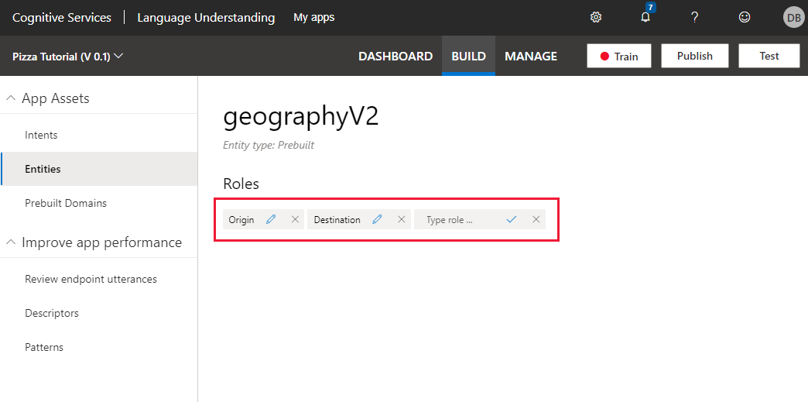
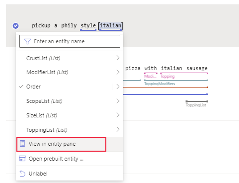
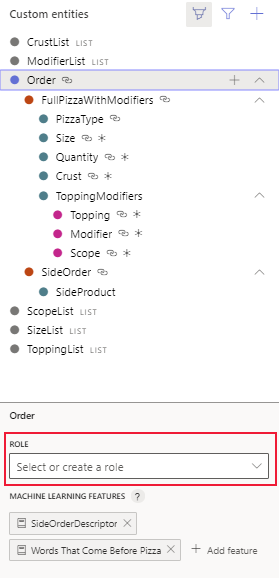

# Add entities to extract data

Create entities to extract key data from user utterances in Language Understanding (LUIS) apps. Extracted entity data is used by your client application to fullfil customer requests.

The entity represents a word or phrase inside the utterance that you want extracted. Entities describe information relevant to the intent, and sometimes they are essential for your app to perform its task. You can create entities when you add an example utterance to an intent or apart from (before or after) adding an example utterance to an intent.

## Plan entities, then create and label

machine-learning entities can be created from the example utterances or created from the **Entities** page.

In general, a best practice is to spend time planning the entities before creating a machine-learning entity in the portal. Then create the machine-learning entity from the example utterance with as much detail in the subentities and features you know at the time. The [decomposable entity tutorial](tutorial-machine-learned-entity.md) demonstrates how to use this method.

As part of planning the entities, you may know you need text-matching entities (such as prebuilt entities, regular expression entities, or list entities). You can create these from the **Entities** page before they are labeled in example utterances.

When labeling, you can either label individual entities then build up to a parent machine-learning entity. Or you can start with a parent machine-learning entity and decompose into child entities.

> [!TIP]
>Label all words that may indicate an entity, even if the words are not used when extracted in the client application.

## When to create an entity

After planning your entities, you should create your machine-learning entities and subentities. This may require adding prebuilt entities or text-matching entities to provide features for your machine-learning entities. These should all be done before labeling.

Once you begin labeling example utterances, you can create machine learned entities or extend list entities.

Use the following table to understand where to create or add each entity type to the app.

|Entity type|Where to create entity in the LUIS portal|
|--|--|
|machine-learning entity|Entities or Intent detail|
|List entity|Entities or Intent detail|
|Regular expression entity|Entities|
|Pattern.any entity|Entities|
|Prebuilt entity|Entities|
|Prebuilt domain entity|Entities|

You can create all the entities from the **Entities** page, or you can create a couple of the entities as part of labeling the entity in the example utterance on the **Intent detail** page. You can only _label_ an entity in an example utterance from the **Intent detail** page.

## How to create a new custom entity

This process works for machine learned entities, list entities, and regular expression entities.

1. Sign in to the [LUIS portal](https://www.luis.ai), and select your **Subscription** and **Authoring resource** to see the apps assigned to that authoring resource.
1. Open your app by selecting its name on **My Apps** page.
1. Select the **Entities** page.
1. Select **+ Create**, then select the entity type.
1. Continue configuring the entity then select **Create** when you are done.

## Create a machine learned entity

1. Sign in to the [LUIS portal](https://www.luis.ai), and select your **Subscription** and **Authoring resource** to see the apps assigned to that authoring resource.
1. Open your app by selecting its name on **My Apps** page.
1. From the **Build** section, select **Entities** in the left panel, and then select **+ Create**.
1. In the **Create an entity type** dialog box, enter the name of the entity and select **Machine learned**, select. To add subentities, select **Add structure**. Select **Create**.

    > [!div class="mx-imgBorder"]
    > 

1. In **Add subentities**, add a subentity by selecting the **+** on the parent entity row.

    > [!div class="mx-imgBorder"]
    > 

1. Select **Create** to finish the creation process.

## Add a feature to a machine learned entity

1. Sign in to the [LUIS portal](https://www.luis.ai), and select your **Subscription** and **Authoring resource** to see the apps assigned to that authoring resource.
1. Open your app by selecting its name on **My Apps** page.
1. From the **Build** section, select **Entities** in the left panel, and then select the machine learned entity.
1. Add a feature by selecting **+ Add feature** on the entity or subentity row.
1. Select from the existing entities and phrase lists.
1. If the entity should only be extracted if the feature is found, select the asterisk, `*` for that feature.

    > [!div class="mx-imgBorder"]
    > 

## Create a regular expression entity

1. Sign in to the [LUIS portal](https://www.luis.ai), and select your **Subscription** and **Authoring resource** to see the apps assigned to that authoring resource.
1. Open your app by selecting its name on **My Apps** page.
1. From the **Build** section, select **Entities** in the left panel, and then select **+ Create**.

1. In the **Create an entity type** dialog box, enter the name of the entity and select **RegEx**, enter the regular expression in the **Regex** field and select **Create**.

    > [!div class="mx-imgBorder"]
    > 

## Create a list entity

List entities represent a fixed, closed set of related words. While you, as the author, can change the list, LUIS won't grow or shrink the list. You can also import to an existing list entity using a [list entity .json format](reference-entity-list.md#example-json-to-import-into-list-entity).

The following list demonstrates the canonical name and the synonyms.

|Color - list item name|Color - synonyms|
|--|--|
|Red|crimson, blood, apple, fire-engine|
|Blue|sky, cobalt|
|Green|kelly, lime|

Use the procedure to create a list entity. Once the list entity is created, you don't need to label example utterances in an intent. List items and synonyms are matched using exact text.
1. Sign in to the [LUIS portal](https://www.luis.ai), and select your **Subscription** and **Authoring resource** to see the apps assigned to that authoring resource.
1. Open your app by selecting its name on **My Apps** page.
1. From the **Build** section, select **Entities** in the left panel, and then select **+ Create**.

1. In the **Create an entity type** dialog box, enter the name of the entity, such as `Colors` and select **List**.
1. In the **Create a list entity** dialog box, in the **Add new sublist....**, enter the list item name, such as `Green`, then add synonyms.

    > [!div class="mx-imgBorder"]
    > 

1. When you are finished adding list items and synonyms, select **Create**.

    When you are done with a group of changes to the app, remember to **Train** the app. Do not train the app after a single change.

    > [!NOTE]
    > This procedure demonstrates creating and labeling a list entity from an example utterance in the **Intent detail** page. You can also create the same entity from the **Entities** page.

## Add a role for an entity

A role is a named subtype of an entity, based on context.

### Add a role to distinguish different contexts

In the following utterance, there are two locations, and each is specified semantically by the words around it such as `to` and `from`:

`Pick up the package from Seattle and deliver to New York City.`

In this procedure, add `origin` and `destination` roles to a prebuilt geographyV2 entity.
1. Sign in to the [LUIS portal](https://www.luis.ai), and select your **Subscription** and **Authoring resource** to see the apps assigned to that authoring resource.
1. Open your app by selecting its name on **My Apps** page.
1. From the **Build** section, select **Entities** in the left panel.

1. Select **+ Add prebuilt entity**. Select **geographyV2** then select **Done**. This adds a prebuilt entity to the app.

    If you find that your pattern, when it includes a Pattern.any, extracts entities incorrectly, use an [explicit list](reference-pattern-syntax.md#explicit-lists) to correct this problem.

1. Select the newly added prebuilt geographyV2 entity from the **Entities** page list of entities.
1. To add a new role, select **+** next to **No roles added**.
1. In the **Type role...** textbox, enter the name of the role `Origin` then enter. Add a second role name of `Destination` then enter.

    > [!div class="mx-imgBorder"]
    > 

    The role is added to the prebuilt entity but isn't added to any utterances using that entity.

### Label text with a role in an example utterance

> [!TIP]
> Roles can be replaced by labeling with subentities of a machine-learning entities.

1. Sign in to the [LUIS portal](https://www.luis.ai), and select your **Subscription** and **Authoring resource** to see the apps assigned to that authoring resource.
1. Open your app by selecting its name on **My Apps** page.
1. Go to the Intent details page, which has example utterances that use the role.
1. To label with the role, select the entity label (solid line under text) in the example utterance, then select **View in entity pane** from the drop-down list.

    > [!div class="mx-imgBorder"]
    > 

    The entity palette opens to the right.

1. Select the entity, then go to the bottom of the palette and select the role.

    > [!div class="mx-imgBorder"]
    > 

## Create a pattern.any entity

The **Pattern.any** entity is only available with [Patterns](luis-how-to-model-intent-pattern.md).

## Do not change entity type

LUIS does not allow you to change the type of the entity because it doesn't know what to add or remove to construct that entity. In order to change the type, it is better to create a new entity of the correct type with a slightly different name. Once the entity is created, in each utterance, remove the old labeled entity name and add the new entity name. Once all the utterances have been relabeled, delete the old entity.

## Next steps

> [!div class="nextstepaction"]
> [Use prebuilt models](howto-add-prebuilt-models.md)

Learn more about:
* How to [train](luis-how-to-train.md)
* How to [test](luis-interactive-test.md)
* How to [publish](luis-how-to-publish-app.md)
* Patterns:
    * [Concepts](luis-concept-patterns.md)
    * [Syntax](reference-pattern-syntax.md)
* [Prebuilt entities GitHub repository](https://github.com/Microsoft/Recognizers-Text)
* [Data Extraction concepts](luis-concept-data-extraction.md)

