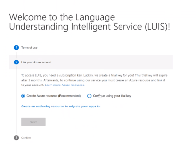
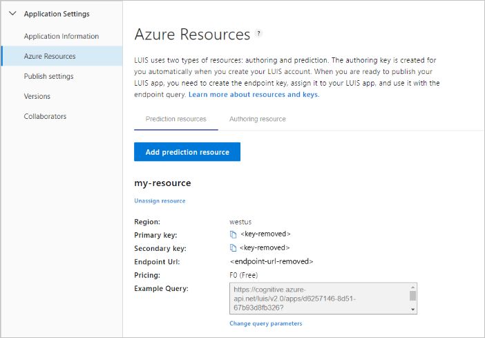
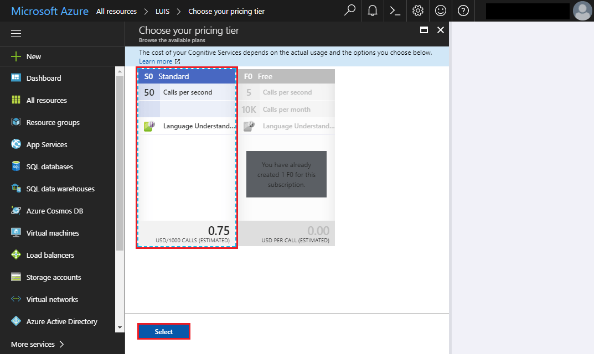

# Using authoring and runtime resource keys

Authoring and runtime resources provide authentication to your LUIS app and prediction endpoint.

<a name="create-luis-service"></a>
<a name="create-language-understanding-endpoint-key-in-the-azure-portal"></a>

When you sign in to the LUIS portal, you can choose to continue with:

* a free [trial key](#trial-key) - providing authoring and a few prediction endpoint queries.
* an Azure [LUIS authoring](https://ms.portal.azure.com/#create/Microsoft.CognitiveServicesLUISAllInOne) resource. 


<a name="starter-key"></a>

## Sign in to LUIS portal and begin authoring

1. Sign in to [LUIS portal](https://www.luis.ai) and agree to the terms of use.
1. Begin your LUIS app by choosing which type of LUIS authoring key you would like to use: free trial key, or new Azure LUIS authoring key. 

    

1. When you are done with your resource selection process, [create a new app](luis-how-to-start-new-app.md#create-new-app-in-luis). 

## Trial key

The trial (starter) key is provided for you. It is used as your authentication key to query the prediction endpoint runtime, up to 1000 queries a month. 

It is visible on both the **User Settings** page and the **Manage -> Azure resources** pages in the LUIS portal. 

When you are ready to publish your prediction endpoint, create and assign authoring and prediction runtime keys, to replace the starter key functionality. 

## Create resources in the Azure portal

1. Use [this link](https://ms.portal.azure.com/#create/Microsoft.CognitiveServicesLUISAllInOne) to open the Azure portal at for resource creation.
1. Select **Both** to create an authoring and a prediction endpoint runtime key. 
1. Enter the information required to create the resource then select **Create** to finish the process.

    

    |Name|Purpose|
    |--|--|
    |Resource name| A custom name you choose, used as part of the URL for your authoring and prediction endpoint queries.|
    |Subscription name| the subscription that will be billed for the resource.|
    |Resource group| A custom resource group name you choose or create. Resource groups allow you to group Azure resources for access and management in the same region.|
    |Authoring location|The region associated with your model.|
    |Authoring pricing tier|The pricing tier determines the maximum transaction per second and month.|
    |Runtime location|The region associated with your published prediction endpoint runtime.|
    |Runtime pricing tier|The pricing tier determines the maximum transaction per second and month.|

    Once both resources are created, assign the resources in the LUIS portal.

## Create resources in Azure CLI

Use the [Azure CLI](https://docs.microsoft.com/cli/azure/install-azure-cli?view=azure-cli-latest) to create each resource individually. 

Resource `kind`:

* Authoring: `LUIS.Authoring`
* Prediction: `LUIS` 

1. Sign in to the Azure CLI:

    ```console
    az login
    ```

    This opens a browser to allow you to select the correct account and provide authentication.

1. Create a **LUIS authoring resource**, of kind `LUIS.Authoring`, named `my-luis-authoring-resource` in the _existing_ resource group named `my-resource-group` for the `westus` region. 

    ```console
    az cognitiveservices account create -n my-luis-authoring-resource -g my-resource-group --kind LUIS.Authoring --sku F0 -l westus --yes
    ```

1. Create a **LUIS prediction endpoint resource**, of kind `LUIS`, named `my-luis-prediction-resource` in the _existing_ resource group named `my-resource-group` for the `westus` region. If you want a higher throughput than the free tier, change `F0` to `S0`. Learn more about [pricing tiers and throughput](luis-boundaries.md#key-limits).

    ```console
    az cognitiveservices account create -n my-luis-prediction-resource -g my-resource-group --kind LUIS --sku F0 -l westus --yes
    ```

    > [!Note] 
    > This keys are **not** used by the LUIS portal until they are assigned in the LUIS portal on the **Manage -> Azure resources**.

## Assign an authoring resource in the LUIS portal for all apps

You can assign an authoring resource for a single app or for all apps in LUIS. The following procedure assigns all apps to a single authoring resource.

1. Sign in to the [LUIS portal](https://www.luis.ai).
1. At the top navigation bar, to the far right, select your user account, then select **Settings**.
1. On the **User Settings** page, select **Add authoring resource** then select an existing authoring resource. Select **Save**. 

## Assign a resource to an app

You can assign a single resource, authoring or prediction endpoint runtime, to an app with the following procedure.

1. Sign in to the [LUIS portal](https://www.luis.ai), then select an app from the **My apps** list.
1. Navigate to the **Manage -> Azure resources** page.

    

1. Select the Prediction or Authoring resource tab then select the **Add prediction resource** or **Add authoring resource** button. 
1. Select the fields in the form to find the correct resource, then select **Save**.  

### Assign runtime resource without using LUIS portal

For automation purposes such as a CI/CD pipeline, you may want to automate the assignment of a LUIS runtime resource to a LUIS app. In order to do that, you need to perform the following steps:

1. Get an Azure Resource Manager token from this [website](https://resources.azure.com/api/token?plaintext=true). This token does expire so use it immediately. The request returns an Azure Resource Manager token.

    

1. Use the token to request the LUIS runtime resources across subscriptions, from the [Get LUIS azure accounts API](https://westus.dev.cognitive.microsoft.com/docs/services/5890b47c39e2bb17b84a55ff/operations/5be313cec181ae720aa2b26c), which your user account has access to. 

    This POST API requires the following settings:

    |Header|Value|
    |--|--|
    |`Authorization`|The value of `Authorization` is `Bearer {token}`. Notice that the token value must be preceded by the word `Bearer` and a space.| 
    |`Ocp-Apim-Subscription-Key`|Your authoring key.|

    This API returns an array of JSON objects of your LUIS subscriptions including subscription ID, resource group, and resource name, returned as account name. Find the one item in the array that is the LUIS resource to assign to the LUIS app. 

1. Assign the token to the LUIS resource with the [Assign a LUIS azure accounts to an application](https://westus.dev.cognitive.microsoft.com/docs/services/5890b47c39e2bb17b84a55ff/operations/5be32228e8473de116325515) API. 

    This POST API requires the following settings:

    |Type|Setting|Value|
    |--|--|--|
    |Header|`Authorization`|The value of `Authorization` is `Bearer {token}`. Notice that the token value must be preceded by the word `Bearer` and a space.|
    |Header|`Ocp-Apim-Subscription-Key`|Your authoring key.|
    |Header|`Content-type`|`application/json`|
    |Querystring|`appid`|The LUIS app ID. 
    |Body||{"AzureSubscriptionId":"ddda2925-af7f-4b05-9ba1-2155c5fe8a8e",<br>"ResourceGroup": "resourcegroup-2",<br>"AccountName": "luis-uswest-S0-2"}|

    When this API is successful, it returns a 201 - created status. 

## Unassign resource

1. Sign in to the [LUIS portal](https://www.luis.ai), then select an app from the **My apps** list.
1. Navigate to the **Manage -> Azure resources** page.
1. Select the Prediction or Authoring resource tab then select the **Unassign resource** button for the resource. 

When you unassign a resource, it is not deleted from Azure. It is only unlinked from LUIS. 

## Reset authoring key

**For [authoring resource migrated](luis-migration-authoring.md) apps**: if your authoring key is compromised, reset the key in the Azure portal on the **Keys** page for that authoring resource. 

**For apps that have not migrated yet**: the key is reset on all your apps in the LUIS portal. If you author your apps via the authoring APIs, you need to change the value of Ocp-Apim-Subscription-Key to the new key.

## Regenerate Azure key

Regenerate the Azure keys from the Azure portal, on the **Keys** page.

## Delete account

See [Data storage and removal](luis-concept-data-storage.md#accounts) for information about what data is deleted when you delete your account.

## Change pricing tier

1.  In [Azure](https://portal.azure.com), find your LUIS subscription. Select the LUIS subscription.
    
1.  Select **Pricing tier** in order to see the available pricing tiers. 
    
1.  Select the pricing tier and select **Select** to save your change. 
    
1.  When the pricing change is complete, a pop-up window verifies the new pricing tier. 
    
1. Remember to [assign this endpoint key](#assign-a-resource-to-an-app) on the **Publish** page and use it in all endpoint queries. 

## Viewing Azure resource metrics

### Viewing Azure resource summary usage
You can view LUIS usage information in Azure. The **Overview** page shows recent summary information including calls and errors. If you make a LUIS endpoint request, then immediately watch the **Overview page**, allow up to five minutes for the usage to show up.


### Customizing Azure resource usage charts
Metrics provides a more detailed view into the data.


You can configure your metrics charts for time period and metric type. 


### Total transactions threshold alert
If you would like to know when you have reached a certain transaction threshold, for example 10,000 transactions, you can create an alert. 


Add a metric alert for the **total calls** metric for a certain time period. Add email addresses of all people that should receive the alert. Add webhooks for all systems that should receive the alert. You can also run a logic app when the alert is triggered. 

## Next steps

* Learn [how to use versions](luis-how-to-manage-versions.md) to control your app life cycle.
* Understand the concepts including the [authoring resource](luis-concept-keys.md#authoring-key) and [contributors](luis-concept-keys.md#contributions-from-other-authors) on that resource.
* Learn [how to create](luis-how-to-azure-subscription.md) authoring and runtime resources
* Migrate to the new [authoring resource](luis-migration-authoring.md) 
