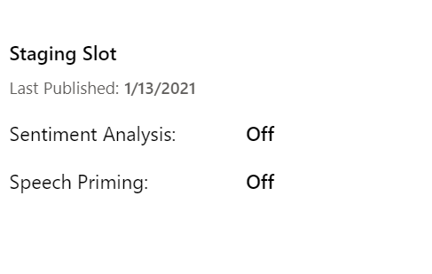

# Publish your active, trained app to a staging or production endpoint

When you finish building, training, and testing your active LUIS app, make it available to your client application by publishing it to the endpoint.

## Publishing
1. Sign in to the [LUIS portal](https://www.luis.ai), and select your **Subscription** and **Authoring resource** to see the apps assigned to that authoring resource.
1. Open your app by selecting its name on **My Apps** page.
1. To publish to the endpoint, select **Publish** in the top, right panel.

    

1. Select your settings for the published prediction endpoint, then select **Publish**.

    

### Publishing slots

Select the correct slot when the pop-up window displays:

* Staging
* Production

By using both publishing slots, this allows you to have two different versions of your app available at the published endpoints or the same version on two different endpoints.

### Publishing regions

The app is published to all regions associated with the LUIS prediction endpoint resources added in the LUIS portal from the **Manage** -> **[Azure Resources](luis-how-to-azure-subscription.md#assign-a-resource-to-an-app)** page.

For example, for an app created on [www.luis.ai](https://www.luis.ai), if you create a LUIS resource in two regions, **westus** and **eastus**, and add these to the app as resources, the app is published in both regions. For more information about LUIS regions, see [Regions](luis-reference-regions.md).

> [!TIP]
> There are 3 authoring regions. You must author in the region you intend to publish to. If you need to publish to all regions, you need to manage your authoring process and the resulting trained model in all 3 authoring regions.

## Configuring publish settings

After you select the slot, configure the publish settings for:

* Sentiment analysis
* [Spelling correction](luis-tutorial-bing-spellcheck.md) - v2 prediction endpoint only
* Speech priming

After you publish, these settings are available for review from the **Manage** section's **Publish settings** page. You can change the settings with every publish. If you cancel a publish, any changes you made during the publish are also canceled.

### When your app is published

When your app is successfully published, a success notification appears at the top of the browser. The notification also includes a link to the endpoints.

If you need the endpoint URL, select the link. You can also get to the endpoint URLs by selecting **Manage** in the top menu, then select **Azure Resources** in the left menu.

## Sentiment analysis

Sentiment analysis allows LUIS to integrate with [Text Analytics](https://azure.microsoft.com/services/cognitive-services/text-analytics/) to provide sentiment and key phrase analysis.

You do not have to provide a Text Analytics key and there is no billing charge for this service to your Azure account.

Sentiment data is a score between 1 and 0 indicating the positive (closer to 1) or negative (closer to 0) sentiment of the data. The sentiment label of `positive`, `neutral`, and `negative` is per supported culture. Currently, only English supports sentiment labels.

For more information about the JSON endpoint response with sentiment analysis, see [Sentiment analysis](luis-reference-prebuilt-sentiment.md)

## Spelling correction

[!INCLUDE [Not supported in V3 API prediction endpoint](./includes/v2-support-only.md)]

Corrections to spelling are made before the LUIS user utterance prediction. You can see any changes to the original utterance, including spelling, in the response.

## Speech priming

Speech priming is the process of using sending the LUIS model to Speech services prior to conversion of text to speech. This allows the speech service to provide speech conversion more accurately for your model. This allows bot Speech and LUIS requests and responses in one call by making one speech call and getting back a LUIS response. It provides less latency overall.

## Next steps

* See [Manage keys](./luis-how-to-azure-subscription.md) to add keys to Azure subscription key to LUIS and how to set the Bing Spell Check key and include all intents in results.
* See [Train and test your app](luis-interactive-test.md) for instructions on how to test your published app in the test console.

