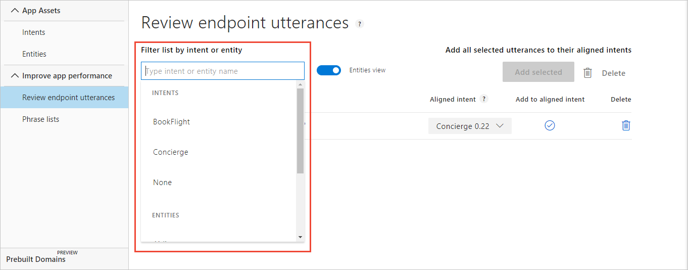
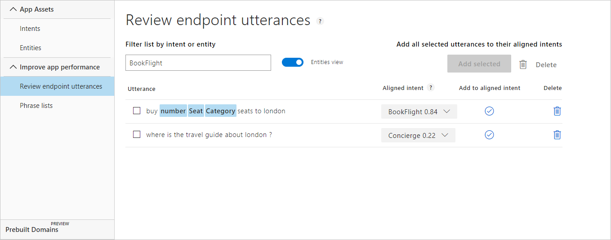
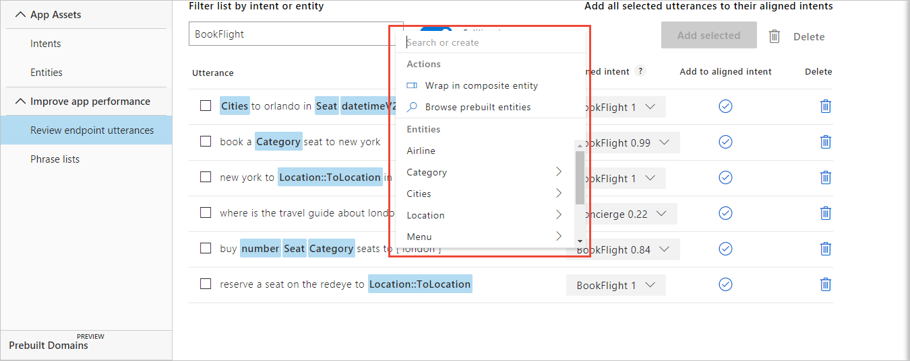
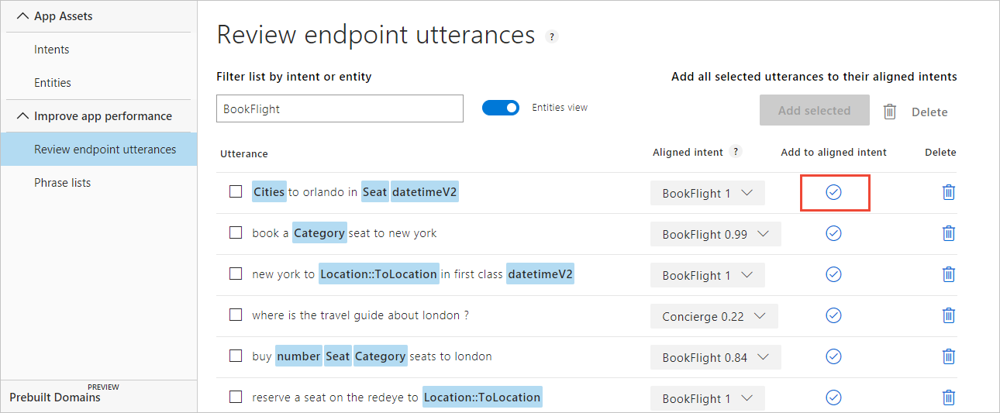
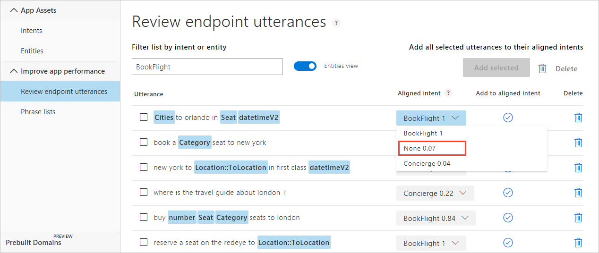
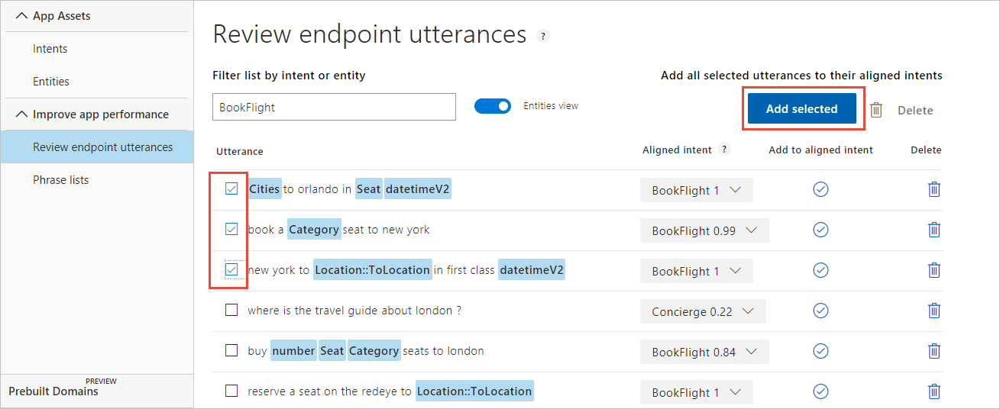
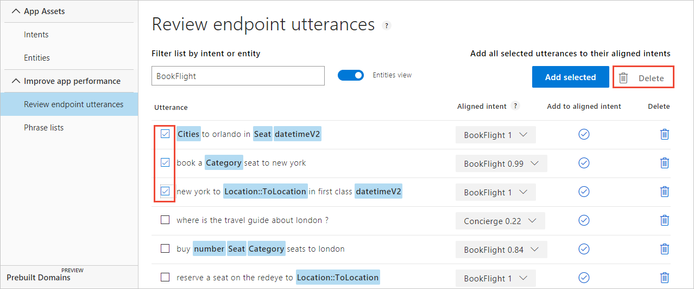

# How to review endpoint utterances in LUIS portal for active learning

[Active learning](luis-concept-review-endpoint-utterances.md) captures endpoint queries and selects user's endpoint utterances that it is unsure of. You review these utterances to select the intent and mark entities for these read-world utterances. Accept these changes into your example utterances then train and publish. LUIS then identifies utterances more accurately.

## Enable active learning

To enable active learning, log user queries. This is accomplished by setting the [endpoint query](luis-get-started-create-app.md#query-the-v2-api-prediction-endpoint) with the `log=true` querystring parameter and value.

## Disable active learning

To disable active learning, don't log user queries. This is accomplished by setting the [endpoint query](luis-get-started-create-app.md#query-the-v2-api-prediction-endpoint) with the `log=false` querystring parameter and value.

## Filter utterances

1. Open your app (for example, TravelAgent) by selecting its name on **My Apps** page, then select **Build** in the top bar.

1. Under the **Improve app performance**, select **Review endpoint utterances**.

1. On the **Review endpoint utterances** page, select in the **Filter list by intent or entity** text box. This drop-down list includes all intents under **INTENTS** and all entities under **ENTITIES**.

    

1. Select a category (intents or entities) in the drop-down list and review the utterances.

    

## Label entities
LUIS replaces entity tokens (words) with entity names highlighted in blue. If an utterance has unlabeled entities, label them in the utterance. 

1. Select on the word(s) in the utterance. 

1. Select an entity from the list.

    

## Align single utterance

Each utterance has a suggested intent displayed in the **Aligned intent** column. 

1. If you agree with that suggestion, select on the check mark.

    

1. If you disagree with the suggestion, select the correct intent from the aligned intent drop-down list, then select on the check mark to the right of the aligned intent. 

    

1. After you select on the check mark, the utterance is removed from the list. 

## Align several utterances

To align several utterances, check the box to the left of the utterances, then select on the **Add selected** button. 

## Verify aligned intent

You can verify the utterance was aligned with the correct intent by going to the **Intents** page, select the intent name, and reviewing the utterances. The utterance from **Review endpoint utterances** is in the list.

## Delete utterance

Each utterance can be deleted from the review list. Once deleted, it will not appear in the list again. This is true even if the user enters the same utterance from the endpoint. 

If you are unsure if you should delete the utterance, either move it to the None intent, or create a new intent such as "miscellaneous" and move the utterance to that intent. 

## Delete several utterances

To delete several utterances, select each item and select on the trash bin to the right of the **Add selected** button.

## Next steps

To test how performance improves after you label suggested utterances, you can access the test console by selecting **Test** in the top panel. For instructions on how to test your app using the test console, see [Train and test your app](luis-interactive-test.md).
