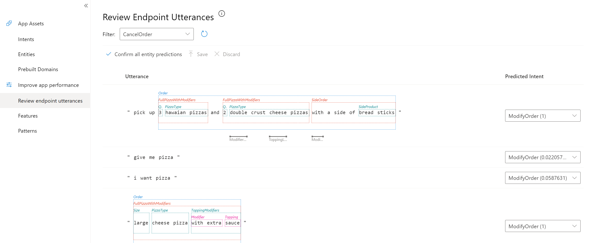

# How to improve the LUIS app by reviewing endpoint utterances

The process of reviewing endpoint utterances for correct predictions is called [Active learning](luis-concept-review-endpoint-utterances.md). Active learning captures endpoint queries and selects user's endpoint utterances that it is unsure of. You review these utterances to select the intent and mark entities for these read-world utterances. Accept these changes into your example utterances then train and publish. LUIS then identifies utterances more accurately.

[!INCLUDE [Uses preview portal](includes/uses-portal-preview.md)]

## Enable active learning

To enable active learning, you must log user queries. This is accomplished by calling the [endpoint query](luis-get-started-create-app.md#query-the-v3-api-prediction-endpoint) with the `log=true` querystring parameter and value.

## Correct intent predictions to align utterances

Each utterance has a suggested intent displayed in the **Aligned intent** column.

> [!div class="mx-imgBorder"]
> 

If you agree with that intent, select the check mark. If you disagree with the suggestion, select the correct intent from the aligned intent drop-down list, then select on the check mark to the right of the aligned intent. After you select on the check mark, the utterance is moved to the intent and removed from the **Review Endpoint Utterances** list.

> [!TIP]
> It is important to go to the Intent details page to review and correct the entity predictions from all example utterances from the **Review Endpoint Utterances** list.

## Delete utterance

Each utterance can be deleted from the review list. Once deleted, it will not appear in the list again. This is true even if the user enters the same utterance from the endpoint.

If you are unsure if you should delete the utterance, either move it to the None intent, or create a new intent such as `miscellaneous` and move the utterance to that intent.

## Disable active learning

To disable active learning, don't log user queries. This is accomplished by setting the [endpoint query](luis-get-started-create-app.md#query-the-v2-api-prediction-endpoint) with the `log=false` querystring parameter and value or not using the querystring value because the default value is false.

## Next steps

To test how performance improves after you label suggested utterances, you can access the test console by selecting **Test** in the top panel. For instructions on how to test your app using the test console, see [Train and test your app](luis-interactive-test.md).
