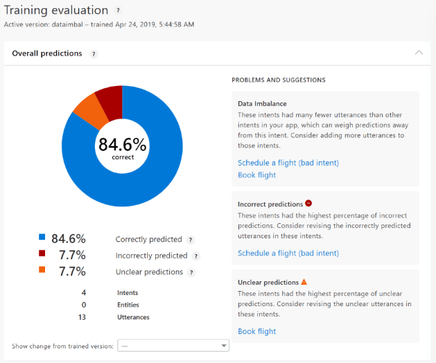
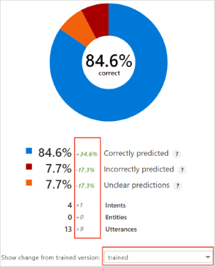
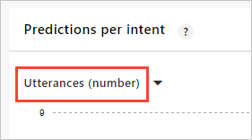
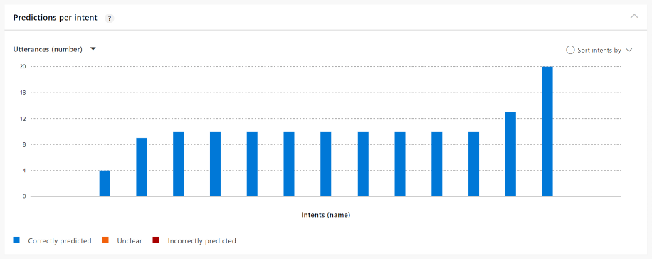
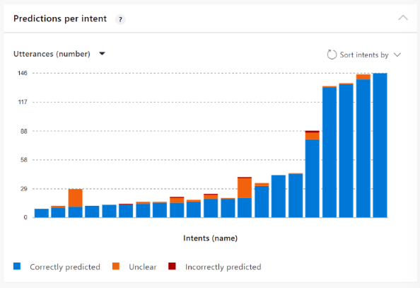
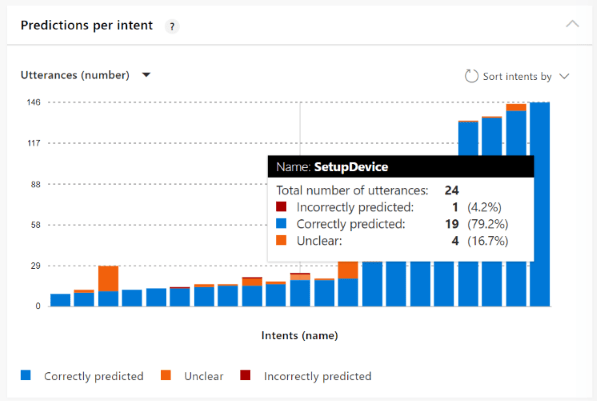
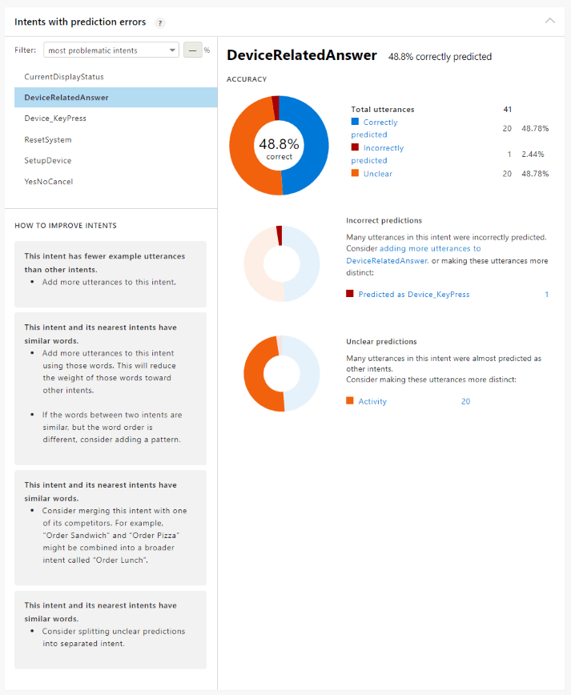

# How to use the Dashboard to improve your app

Find and fix problems with your trained app's intents when you are using example utterances. The dashboard displays overall app information, with highlights of intents that should be fixed. 

Review Dashboard analysis is an iterative process, repeat as you change and improve your model.

This page will not have relevant analysis for apps that do not have any example utterances in the intents, known as _pattern-only_ apps. 

## What issues can be fixed from dashboard?

The three problems addressed in the dashboard are:

|Issue|Chart color|Explanation|
|--|--|--|
|Data imbalance|-|This occurs when the quantity of example utterances varies significantly. All intents need to have _roughly_ the same number of example utterances - except the None intent. It should only have 10%-15% of the total quantity of utterances in the app.   If the data is imbalanced but the intent accuracy is above certain threshold, this imbalance is not reported as an issue.  **Start with this issue - it may be the root cause of the other issues.**|
|Unclear predictions|Orange|This occurs when the top intent and the next intent's scores are close enough that they may flip on the next training, due to [negative sampling](luis-how-to-train.md#train-with-all-data) or more example utterances added to intent. |
|Incorrect predictions|Red|This occurs when an example utterance is not predicted for the labeled intent (the intent it is in).|

Correct predictions are represented with the color blue.

The dashboard shows these issues and tells you which intents are affected and suggests what you should do to improve the app. 

## Before app is trained 

Before you train the app, the dashboard does not contain any suggestions for fixes. Train your app to see these suggestions.  

## Check your publishing status

The **Publishing status** card contains information about the active version's last publish. 

Check that the active version is the version you want to fix. 

This also shows any external services, published regions, and aggregated endpoint hits. 

## Review training evaluation

The **Training evaluation** card contains the aggregated summary of your app's overall accuracy by area. The score indicates intent quality. 

The chart indicates the correctly predicted intents and the problem areas with different colors. As you improve the app with the suggestions, this score increases. 

The suggested fixes are separated out by problem type and are the most significant for your app. If you would prefer to review and fix issues per intent, use the **[Intents with errors](#intents-with-errors)** card at the bottom of the page. 

Each problem area has intents that need to be fixed. When you select the intent name, the **Intent** page opens with a filter applied to the utterances. This filter allows you to focus on the utterances that are causing the problem.

### Compare changes across versions

Create a new version before making changes to the app. In the new version, make the suggested changes to the intent's example utterances, then train again. On the Dashboard page's **Training evaluation** card, use the **Show change from trained version** to compare the changes. 

### Fix version by adding or editing example utterances and retraining

The primary method of fixing your app will be to add or edit example utterances and retrain. The new or changed utterances need to follow guidelines for [varied utterances](luis-concept-utterance.md).

Adding example utterances should be done by someone who:

* has a high degree of understanding of what utterances are in the different intents.
* knows how utterances in one intent may be confused with another intent.
* is able to decide if two intents, which are frequently confused with each other, should be collapsed into a single intent. If this is the case, the different data must be pulled out with entities.

### Patterns and phrase lists

The analytics page doesn’t indicate when to use [patterns](luis-concept-patterns.md) or [phrase lists](luis-concept-feature.md). If you do add them, it can help with incorrect or unclear predictions but won’t help with data imbalance. 

### Review data imbalance

Start with this issue - it may be the root cause of the other issues.

The **data imbalance** intent list shows intents that need more utterances in order to correct the data imbalance. 

**To fix this issue**:

* Add more utterances to the intent then train again. 

Do not add utterances to the None intent unless that is suggested on the dashboard.

> [!Tip]
> Use the third section on the page, **Utterances per intent** with the **Utterances (number)** setting, as a quick visual guide of which intents need more utterances.  
    

### Review incorrect predictions

The **incorrect prediction** intent list shows intents that have utterances, which are used as examples for a specific intent, but are predicted for different intents. 

**To fix this issue**:

* Edit utterances to be more specific to the intent and train again.
* Combine intents if utterances are too closely aligned and train again.

### Review unclear predictions

The **unclear prediction** intent list shows intents with utterances with prediction scores that are not far enough way from their nearest rival, that the top intent for the utterance may change on the next training, due to [negative sampling](luis-how-to-train.md#train-with-all-data).

**To fix this issue**;

* Edit utterances to be more specific to the intent and train again.
* Combine intents if utterances are too closely aligned and train again.

## Utterances per intent

This card shows the overall app health across the intents. As you fix intents and retrain, continue to glance at this card for issues.

The following chart shows a well-balanced app with almost no issues to fix.

The following chart shows a poorly balanced app with many issues to fix.

Hover over each intent's bar to get information about the intent. 

Use the **Sort by** feature to arrange the intents by issue type so you can focus on the most problematic intents with that issue. 

## Intents with errors

This card allows you to review issues for a specific intent. The default view of this card is the most problematic intents so you know where to focus your efforts.

The top donut chart shows the issues with the intent across the three problem types. If there are issues in the three problem types, each type has its own chart below, along with any rival intents. 

### Filter intents by issue and percentage

This section of the card allows you to find example utterances that are falling outside your error threshold. Ideally you want correct predictions to be significant. That percentage is business and customer driven. 

Determine the threshold percentages that you are comfortable with for your business. 

The filter allows you to find intents with specific issue:

|Filter|Suggested percentage|Purpose|
|--|--|--|
|Most problematic intents|-|**Start here** - Fixing the utterances in this intent will improve the app more than other fixes.|
|Correct predictions below|60%|This is the percentage of utterances in the selected intent that are correct but have a confidence score below the threshold. |
|Unclear predictions above|15%|This is the percentage of utterances in the selected intent that are confused with the nearest rival intent.|
|Incorrect predictions above|15%|This is the percentage of utterances in the selected intent that are incorrectly predicted. |

### Correct prediction threshold

What is a confident prediction confidence score to you? At the beginning of app development, 60% may be your target. Use the **Correct predictions below** with the percentage of 60% to find any utterances in the selected intent that need to be fixed.

### Unclear or incorrect prediction threshold

These two filters allow you to find utterances in the selected intent beyond your threshold. You can think of these two percentages as error percentages. If you are comfortable with a 10-15% error rate for predictions, set the filter threshold to 15% to find all utterances above this value. 

## Next steps

* [Manage your Azure resources](luis-how-to-azure-subscription.md)
