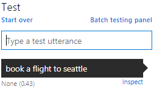
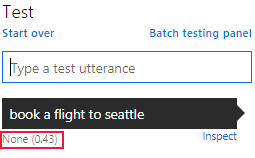
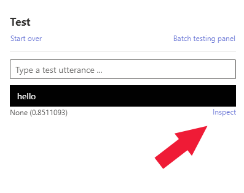
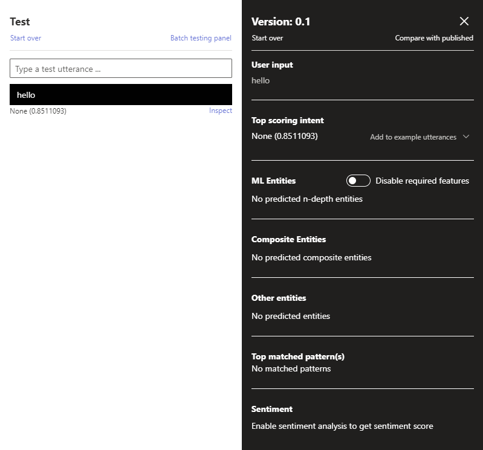
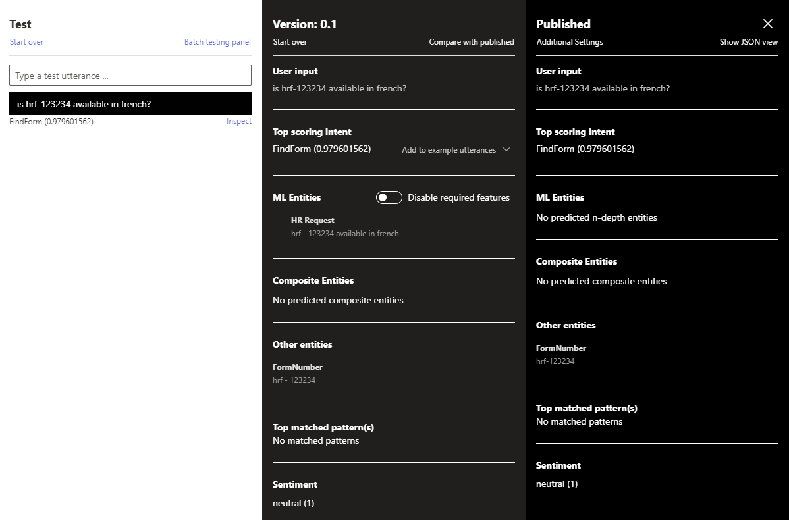
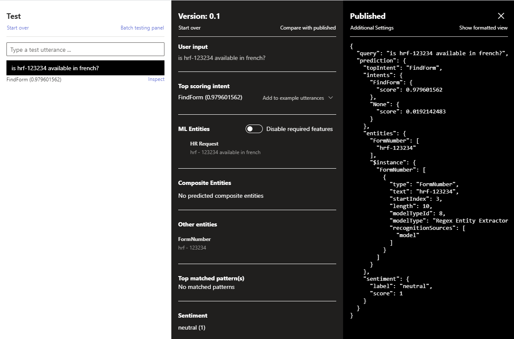
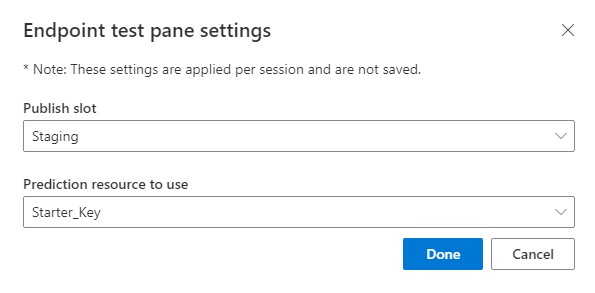

# Test your LUIS app in the LUIS portal

[Testing](luis-concept-test.md) an app is an iterative process. After training your LUIS app, test it with sample utterances to see if the intents and entities are recognized correctly. If they're not, make updates to the LUIS app, train, and test again.

<!-- anchors for H2 name changes -->

## Train before testing

1. Sign in to the [LUIS portal](https://www.luis.ai), and select your **Subscription** and **Authoring resource** to see the apps assigned to that authoring resource.
1. Open your app by selecting its name on **My Apps** page.
1. In order to test against the most recent version of the active app, select **Train** from the top menu, before testing.

## Test an utterance

The test utterance should not be exactly the same as any example utterances in the app. The test utterance should include word choice, phrase length, and entity usage you expect for a user.

1. Sign in to the [LUIS portal](https://www.luis.ai), and select your **Subscription** and **Authoring resource** to see the apps assigned to that authoring resource.
1. Open your app by selecting its name on **My Apps** page.

1. To access the **Test** slide-out panel, select **Test** in your application's top panel.

    > [!div class="mx-imgBorder"]
    > 

1. Enter an utterance in the text box and select Enter. You can type as many test utterances as you want in the **Test**, but only one utterance at a time.

1. The utterance, its top intent, and score are added to the list of utterances under the text box.

    > [!div class="mx-imgBorder"]
    > 

## Inspect the prediction

You inspect details of the test result in the **Inspect** panel.

1. With the **Test** slide-out panel open, select **Inspect** for an utterance you want to compare.

    > [!div class="mx-imgBorder"]
    > 

1. The **Inspection** panel appears. The panel includes the top scoring intent as well as any identified entities. The panel shows the prediction of the selected utterance.

    > [!div class="mx-imgBorder"]
    > 

## Add to example utterances

From the inspection panel, you can add the test utterance to an intent by selecting **Add to example utterances**.

## Disable required features

This toggle helps you determine if the trained app is correctly predicting your entities based on required features. The default setting is to apply the feature as required during prediction. Select this toggle to see what the prediction would be if the subentity’s feature was not required.

### When to disable required features

The trained app may mispredict a machine-learned entity based on one of the following:
* Incorrect labeling of example utterances.
* The required feature doesn't match the text.

An example is a machine-learned entity with a subentity of a person's name.

:::image type="content" source="media/luis-how-to-interactive-test/disable-required-feature.png" alt-text="Screenshot of LUIS portal machine-learned entity schema with required feature":::

An example utterance for this machine-learned entity is: `Assign Bob Jones to work on the new security feature`.

The extraction should be `security feature` as the ticket description and `Bob Jones` as the engineer, two subentities of `Assign ticket` entity.

In order to help the subentity successfully predict, add the prebuilt entity [PersonName](luis-reference-prebuilt-person.md) aa a feature to the `engineer` subentity. If you make the feature required, that means the subentity will only be extracted if the PersonName prebuilt entity is predicted for the text. This means that any name in the text that doesn't predict with PersonName subentity, will not be returned as a labeled subentity, `engineer`.

When you use the interactive test pane, and see a subentity, with a required feature, isn't predicting, toggle this setting, to see if the subentity would be predicted without the feature being required. The subentity may be able to be correctly predicted without the feature as required due to correct labeling of example utterances.

## View sentiment results

If **Sentiment analysis** is configured on the **[Publish](luis-how-to-publish-app.md#enable-sentiment-analysis)** page, the test results include the sentiment found in the utterance.

## Correct matched pattern's intent

If you are using [Patterns](luis-concept-patterns.md) and the utterance matched a pattern, but the wrong intent was predicted, select the **Edit** link by the pattern, then select the correct intent.

## Compare with published version

You can test the active version of your app with the published [endpoint](luis-glossary.md#endpoint) version. In the **Inspect** panel, select **Compare with published**. Any testing against the published model is deducted from your Azure subscription quota balance.

> [!div class="mx-imgBorder"]
> 

## View endpoint JSON in test panel
You can view the endpoint JSON returned for the comparison by selecting the **Show JSON view**.

> [!div class="mx-imgBorder"]
> 

## Additional settings in test panel

### LUIS endpoint

If you have several LUIS endpoints, use the **Additional Settings** link on the Test's Published pane to change the endpoint used for testing. If you are not sure which endpoint to use, select the default **Starter_Key**.

> [!div class="mx-imgBorder"]
> 

## Batch testing
See batch testing [concepts](luis-concept-batch-test.md) and learn [how to](luis-how-to-batch-test.md) test a batch of utterances.

## Next steps

If testing indicates that your LUIS app doesn't recognize the correct intents and entities, you can work to improve your LUIS app's accuracy by labeling more utterances or adding features.

* [Label suggested utterances with LUIS](luis-how-to-review-endpoint-utterances.md)
* [Use features to improve your LUIS app's performance](luis-how-to-add-features.md)
