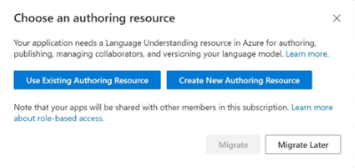
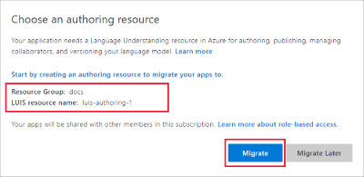
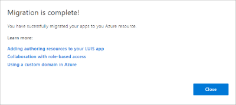

# Steps to migrate to the Azure authoring resource

From the Language Understanding (LUIS) portal, migrate all the apps you own to use the Azure authoring resource.

## Prerequisites

* **Optionally**, backup the apps from the LUIS portal's apps list by exporting each app or use the export [API](https://westus.dev.cognitive.microsoft.com/docs/services/5890b47c39e2bb17b84a55ff/operations/5890b47c39e2bb052c5b9c40).
* **Optionally**, save each app's collaborator's list. All collaborators can be sent an email as part of the migration process.
* **Required**, you need to have an [Azure subscription](https://azure.microsoft.com/free/). A part of the subscription process does require billing information. However, you can use Free (F0) pricing tiers when you use LUIS. You may eventually find you need a paid tier, as your usage increases.

If you do not have an Azure subscription, [sign up](https://azure.microsoft.com/free/).

## Access the migration process

On a weekly basis, you are prompted to migrate your apps. You can cancel this window without migrating. If you want to migrate before the next scheduled period, you can begin the migration process from the **Azure** icon on the top tool bar of the LUIS portal.

> [!div class="mx-imgBorder"]
> 

## App owner begins the migration process

The migration process is available if you are the owner of any LUIS apps.

1. Sign in to [LUIS portal](https://www.luis.ai) and agree to the terms of use.
1. The migration pop-up window allows you to continue the migration or migrate later. Select **Migrate now**. If you choose to migrate later, you have 9 months to migrate to the new authoring key in Azure.

    

1. Optionally, if any of your apps have collaborators, you are prompted to **send them an email** letting them know about the migration. This is an optional step.

    Once you have migrated your account to Azure, your apps will no longer be available to collaborators.

    For each collaborator and app, the default email application opens with a lightly formatted email. You can edit the email before sending it.

    The email template includes the exact app ID and app name.

    ```html
    Dear Sir/Madam,

    I will be migrating my LUIS account to Azure. Consequently, you will no longer have access to the following app:

    App Id: <app-ID-omitted>
    App name: Human Resources

    Thank you
    ```

1. Choose to create a LUIS authoring resource by selecting to use an existing authoring resource or to create a new authoring resource.

    > [!div class="mx-imgBorder"]
    > 

1. In the next window, enter your resource key information. After you enter the information, select **Create resource**. You can have 10 free authoring resources per region, per subscription.

    

    When **creating a new authoring resource**, provide the following information:

    * **Resource name** - a custom name you choose, used as part of the URL for your authoring and prediction endpoint queries.
    * **Tenant** - the tenant your Azure subscription is associated with.
    * **Subscription name** - the subscription that will be billed for the resource.
    * **Resource group** - a custom resource group name you choose or create. Resource groups allow you to group Azure resources for access and management.
    * **Location** - the location choice is based on the **resource group** selection.
    * **Pricing tier** - the pricing tier determines the maximum transaction per second and month.

1. Validate your authoring resource and **Migrate now**.

    

1. When the authoring resource is created, the success message is shown. Select **Close** to close the pop-up window.

    

    The **My apps** list shows the apps migrated to the new authoring resource.

    You don't need to know the authoring resource's key to continue editing your apps in the LUIS portal. If you plan to edit your apps programmatically, you need the authoring key values. These values are displayed on the **Manage -> Azure resources** page in the LUIS portal and are also available in the Azure portal on the resource's **Keys** page.

1. Before accessing your apps, select the subscription and LUIS authoring resource to see the apps you can author.

    > [!div class="mx-imgBorder"]
    > 

## App contributor begins the migration process

Follow the same steps as the app owner for migration. The process creates a new authoring resource of kind `LUIS.Authoring`.

You need to migrate your account in order to be added as a contributor to migrated apps owned by others.

## After the migration process, add contributors to your authoring resource

[!INCLUDE [Manage contributors for the Azure authoring resource for language understanding](./includes/manage-contributors-authoring-resource.md)]

Learn [how to add contributors](luis-how-to-collaborate.md).

## Troubleshooting errors with the migration process

If you receive a `MissingSubscriptionRegistration` error in the LUIS portal with a red notification bar during the migration process, create a Cognitive Service resource in the [Azure portal](luis-how-to-azure-subscription.md#create-resources-in-the-azure-portal) or [Azure CLI](luis-how-to-azure-subscription.md#create-resources-in-azure-cli). Learn more about [causes of this error](../../azure-resource-manager/templates/error-register-resource-provider.md#cause).

## Next steps


* Review [concepts](luis-concept-keys.md) about authoring and runtime keys
* Review [how to assign keys](luis-how-to-azure-subscription.md) and add [contributors](luis-how-to-collaborate.md)
