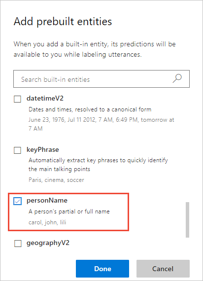
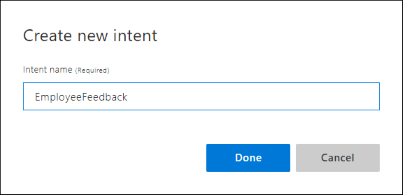

# Tutorial:  Get sentiment of utterance

In this tutorial, create an app that demonstrates how to determine positive, negative, and neutral sentiment from utterances. Sentiment is determined from the entire utterance.

**In this tutorial, you learn how to:**

<!-- green checkmark -->
> [!div class="checklist"]
> * Create a new app
> * Add sentiment analysis as publish setting
> * Train app
> * Publish app
> * Get sentiment of utterance from endpoint

[!INCLUDE [LUIS Free account](../../../includes/cognitive-services-luis-free-key-short.md)]

## Sentiment analysis is a publish setting

The following utterances show examples of sentiment:

|Sentiment|Score|Utterance|
|:--|:--|:--|
|positive|0.91 |John W. Smith did a great job on the presentation in Paris.|
|positive|0.84 |The Seattle engineers did fabulous work on the Parker sales pitch.|

Sentiment analysis is a publish setting that applies to every utterance. You do not have to find the words indicating sentiment in the utterance and mark them. 

Because it is a publish setting, you do not see it on the intents or entities pages. You can see it in the [interactive test](luis-interactive-test.md#view-sentiment-results) pane or when testing at the endpoint URL. 


## Create a new app

[!INCLUDE [Follow these steps to create a new LUIS app](../../../includes/cognitive-services-luis-create-new-app-steps.md)]

## Add PersonName prebuilt entity 


1. Select **Entities** from the left navigation menu.

1. Select **Add prebuilt entity** button.

1. Select the following entity from the list of prebuilt entities then select **Done**:

   * **[PersonName](luis-reference-prebuilt-person.md)** 

     

## Create an intent to determine employee feedback

Add a new intent to capture employee feedback from members of the company. 

1. [!INCLUDE [Start in Build section](../../../includes/cognitive-services-luis-tutorial-build-section.md)]

2. Select **Create new intent**.

3. Name the new intent  name `EmployeeFeedback`.

    

4. Add several utterances that indicate an employee doing something well or an area that needs improvement:

    |Utterances|
    |--|
    |John Smith did a nice job of welcoming back a co-worker from maternity leave|
    |Jill Jones did a great job of comforting a co-worker in her time of grief.|
    |Bob Barnes didn't have all the required invoices for the paperwork.|
    |Todd Thomas turned in the required forms a month late with no signatures|
    |Katherine Kelly didn't make it to the important marketing off-site meeting.|
    |Denise Dillard missed the meeting for June reviews.|
    |Mark Mathews rocked the sales pitch at Harvard|
    |Walter Williams did a great job on the presentation at Stanford|

    Select the **View options**, select **Show entity values** to see the names.

    [](./media/luis-quickstart-intent-and-sentiment-analysis/hr-utterance-examples.png#lightbox)

## Add example utterances to the None intent 

[!INCLUDE [Follow these steps to add the None intent to the app](../../../includes/cognitive-services-luis-create-the-none-intent.md)]

## Train the app so the changes to the intent can be tested 

[!INCLUDE [LUIS How to Train steps](../../../includes/cognitive-services-luis-tutorial-how-to-train.md)]

## Configure app to include sentiment analysis

1. Select **Manage** in the top right navigation, then select **Publish settings** from the left menu.

1. Select **Sentiment Analysis** to enable this setting. 

    

## Publish the app so the trained model is queryable from the endpoint

[!INCLUDE [LUIS How to Publish steps](../../../includes/cognitive-services-luis-tutorial-how-to-publish.md)]

## Get the sentiment of an utterance from the endpoint

1. [!INCLUDE [LUIS How to get endpoint first step](../../../includes/cognitive-services-luis-tutorial-how-to-get-endpoint.md)]

1. Go to the end of the URL in the address and enter `Jill Jones work with the media team on the public portal was amazing`. The last querystring parameter is `q`, the utterance **query**. This utterance is not the same as any of the labeled utterances so it is a good test and should return the `EmployeeFeedback` intent with the sentiment analysis extracted.
    
    ```json
    {
      "query": "Jill Jones work with the media team on the public portal was amazing",
      "topScoringIntent": {
        "intent": "EmployeeFeedback",
        "score": 0.9616192
      },
      "intents": [
        {
          "intent": "EmployeeFeedback",
          "score": 0.9616192
        },
        {
          "intent": "None",
          "score": 0.09347677
        }
      ],
      "entities": [
        {
          "entity": "jill jones",
          "type": "builtin.personName",
          "startIndex": 0,
          "endIndex": 9
        }
      ],
      "sentimentAnalysis": {
        "label": "positive",
        "score": 0.8694164
      }
    }
    ```

    The sentimentAnalysis is positive with a score of 86%. 

## Clean up resources

[!INCLUDE [LUIS How to clean up resources](../../../includes/cognitive-services-luis-tutorial-how-to-clean-up-resources.md)]

## Related information

* Sentiment analysis is provided by Cognitive Service [Text Analytics](../Text-Analytics/index.yml). The feature is restricted to Text Analytics [supported languages](luis-language-support.md##languages-supported).
* [How to train](luis-how-to-train.md)
* [How to publish](luis-how-to-publish-app.md)
* [How to test in LUIS portal](luis-interactive-test.md)


## Next steps
This tutorial adds sentiment analysis as a publish setting to extract sentiment values from the utterance as a whole.

> [!div class="nextstepaction"] 
> [Review endpoint utterances in the HR app](luis-tutorial-review-endpoint-utterances.md) 

