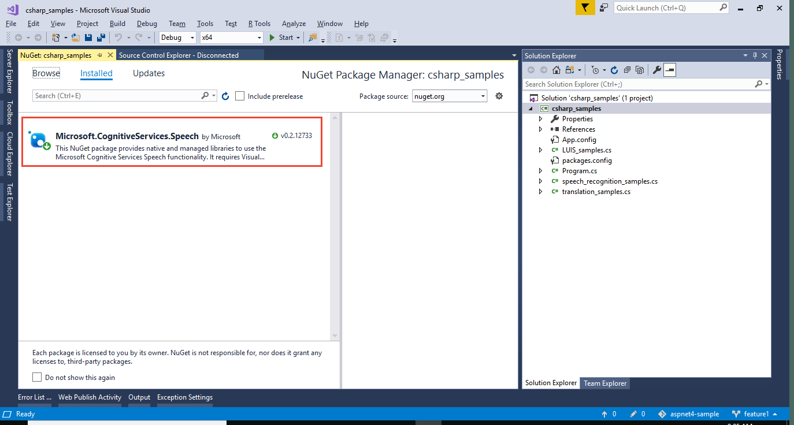

# Integrate Speech service with your Language Understanding app
The [Speech service](https://docs.microsoft.com/azure/cognitive-services/Speech-Service/) allows you to use a single request to receive audio and return LUIS prediction JSON objects. In this article, you download and use a C# project in Visual Studio to speak an utterance into a microphone and receive LUIS prediction information. The project uses the Speech [NuGet](https://www.nuget.org/packages/Microsoft.CognitiveServices.Speech/) package, already included as a reference. 

For this article, you need a free [LUIS][LUIS] website account in order to import the application.

## Create LUIS endpoint key
In the Azure portal, [create](luis-how-to-azure-subscription.md) a **Cognitive Service** (LUIS) key for your LUIS app.  

## Import Human Resources LUIS app
The intents, and utterances for this article are from the Human Resources LUIS app available from the [Azure-Samples](https://github.com/Azure-Samples/cognitive-services-language-understanding) GitHub repository. Download the [HumanResources.json](https://github.com/Azure-Samples/cognitive-services-language-understanding/blob/master/documentation-samples/tutorials/HumanResources.json) file, save it with the `.json` extension, and [import](luis-how-to-start-new-app.md#import-new-app) it into LUIS. 

This app has intents, entities, and utterances related to the Human Resources domain. Example utterances include:

|Example utterances|
|--|
|Who is John Smith's manager?|
|Who does John Smith manage?|
|Where is Form 123456?|
|Do I have any paid time off?|

## Add KeyPhrase prebuilt entity
After importing the app, select **Entities**, then **Add prebuilt entity**. Add the **KeyPhrase** entity. The KeyPhrase entity extracts key subject matter from the utterance.

## Train and publish the app
1. In the top, right navigation bar, select the **Train** button to train the LUIS app.

2. Select **Manage** in the top right bar, then select **Keys and endpoints** in the left navigation. 

3. On the **Keys and endpoints** page, assign the LUIS key created in the [Create LUIS endpoint key](#create-luis-endpoint-key) section.

   On this page, collect the app ID, publish region, and subscription ID of the LUIS key created in the  [Create LUIS endpoint key](#create-luis-endpoint-key) section. You need to modify the code to use these values later in this article. 
  
   Do **not** use the free starter key for this exercise. Only a **Language Understanding** key created in the Azure portal will work for this exercise. 

   https://**REGION**.api.cognitive.microsoft.com/luis/v2.0/apps/**APPID**?subscription-key=**LUISKEY**&q=

4. Publish the LUIS app by selecting the **Publish** button in the top right bar. 

## Audio device
This article uses the audio device on your computer. That can be a headset with microphone or a built-in audio device. Check the audio input levels to see if you should speak louder than you normally would to have your speech detected by the audio device. 

## Download the LUIS Sample project
 Clone or download the [Azure-Samples](https://github.com/Azure-Samples/cognitive-services-language-understanding) repository. Open the [Speech to intent project](https://github.com/Azure-Samples/cognitive-services-language-understanding/tree/master/documentation-samples/tutorial-speech-intent-recognition) with Visual Studio and restore the NuGet packages. The VS solution file is documentation-samples\tutorial-speech-intent-recognition\csharp\csharp_samples.sln.

The Speech SDK is already included as a reference. 

## Modify the C# code
Open the `Program.cs` file and change the following variables:

|Variable name|Purpose|
|--|--|
|LUIS_assigned_endpoint_key|Corresponds to endpoint URL's assigned subscription-key value from Publish page|
|LUIS_endpoint_key_region|Corresponds to endpoint URL's first subdomain, for example `westus`|
|LUIS_app_ID|Corresponds to endpoint URL's route following **apps/**|

The `Program.cs` file already has the Human Resources intents mapped.

Build and run the app. 

## Test code with utterance
Speak into the microphone "Who are the approved dentists in Redmond?".

[!code-console[Command line response from spoken utterance](~/samples-luis/documentation-samples/tutorial-speech-intent-recognition/console-output.txt "Command line response from spoken utterance")]

The correct intent, **GetEmployeeBenefits**, was found with a 85% confidence. The keyPhrase entity was returned. 

The Speech SDK returns the entire LUIS response. 

## Clean up resources
When no longer needed, delete the LUIS HumanResources app. To do so, select the app, then in the contextual toolbar above the list, select **Delete**. On the pop-up dialog **Delete app?**, select **Ok**.

Remember to delete the directory when you are done using the sample code.

## Next steps

> [!div class="nextstepaction"]
> [Integrate LUIS with a BOT](luis-csharp-tutorial-build-bot-framework-sample.md)

[LUIS]: https://docs.microsoft.com/azure/cognitive-services/luis/luis-reference-regions#luis-website
