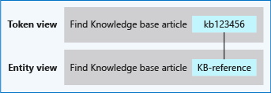

# Regular expression entity

A regular expression entity extracts an entity based on a regular expression pattern you provide.

A regular expression is best for raw utterance text. It ignores case and ignores cultural variant.  Regular expression matching is applied after spell-check alterations at the character level, not the token level. If the regular expression is too complex, such as using many brackets, you're not able to add the expression to the model. Uses part but not all of the [.NET Regex](/dotnet/standard/base-types/regular-expressions) library.

**The entity is a good fit when:**

* The data are consistently formatted with any variation that is also consistent.
* The regular expression does not need more than 2 levels of nesting.



## Usage considerations

Regular expressions may match more than you expect to match. An example of this is numeric word matching such as `one` and `two`. An example is the following regex, which matches the number `one` along with other numbers:

```javascript
(plus )?(zero|one|two|three|four|five|six|seven|eight|nine)(\s+(zero|one|two|three|four|five|six|seven|eight|nine))*
```

This regex expression also matches any words that end with these numbers, such as `phone`. In order to fix issues like this, make sure the regex matches takes into account word boundaries. The regex to use word boundaries for this example is used in the following regex:

```javascript
\b(plus )?(zero|one|two|three|four|five|six|seven|eight|nine)(\s+(zero|one|two|three|four|five|six|seven|eight|nine))*\b
```

### Example JSON

When using `kb[0-9]{6}`, as the regular expression entity definition, the following JSON response is an example utterance with the returned regular expression entities for the query:

`When was kb123456 published?`:

#### [V2 prediction endpoint response](#tab/V2)

```JSON
"entities": [
  {
    "entity": "kb123456",
    "type": "KB number",
    "startIndex": 9,
    "endIndex": 16
  }
]
```


#### [V3 prediction endpoint response](#tab/V3)


This is the JSON if `verbose=false` is set in the query string:

```json
"entities": {
    "KB number": [
        "kb123456"
    ]
}
```

This is the JSON if `verbose=true` is set in the query string:

```json
"entities": {
    "KB number": [
        "kb123456"
    ],
    "$instance": {
        "KB number": [
            {
                "type": "KB number",
                "text": "kb123456",
                "startIndex": 9,
                "length": 8,
                "modelTypeId": 8,
                "modelType": "Regex Entity Extractor",
                "recognitionSources": [
                    "model"
                ]
            }
        ]
    }
}
```

* * *

## Next steps

Learn more about entities:

* [Concepts](luis-concept-entity-types.md)
* [How to create](luis-how-to-add-entities.md)