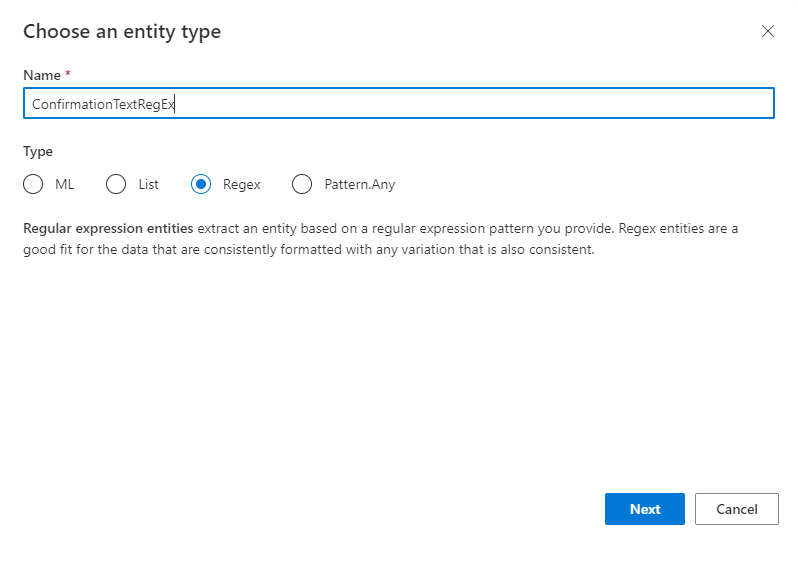
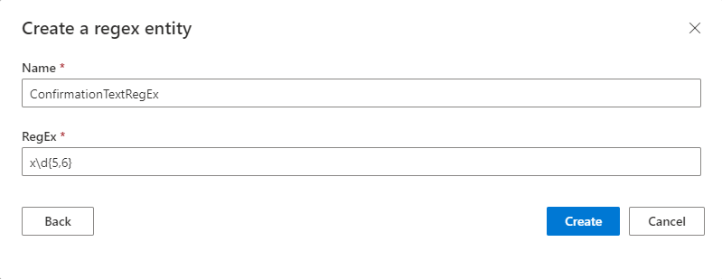
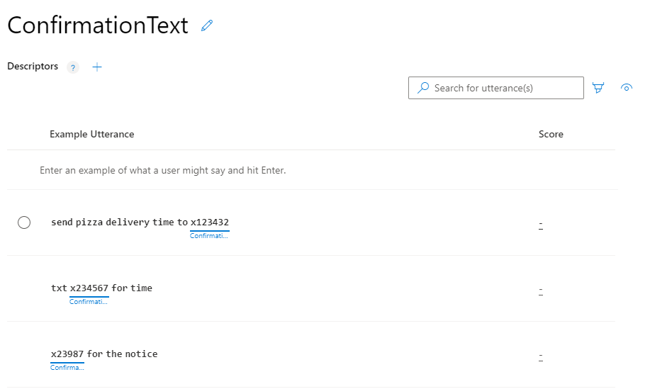

# Tutorial: Get well-formatted data from the utterance
In this tutorial, create a regular expression entity to extract consistently formatted data from an utterance.

**In this tutorial, you learn how to:**

<!-- green checkmark -->
> [!div class="checklist"]
> * Import app
> * Add intent
> * Add regular expression entity
> * Train, publish, and query app to get extracted data

[!INCLUDE [LUIS Free account](../../../includes/cognitive-services-luis-free-key-short.md)]

## Regular expression entities

Use the regular expression entity to pull out well-formatted text from an utterance. While the utterance's intent is always determined with machine-learning, this specific entity type is not machine-learned. A good use for the regular expression entity is any text that can consistently be represented by a [regular expression](https://docs.microsoft.com/dotnet/standard/base-types/regular-expression-language-quick-reference).

`Send pizza delivery time to x123432`

This example uses a _short code_ for sending text messages. This short code is a 5 or 6-digit numeric code, prefixed with an x, and can be described with the regular expression `x\d{5,6}`.

When you add a regular expression entity to a LUIS app, you don't need to [label](label-entity-example-utterance.md) the text with the regular express entity. It is applied to all utterances in all intents.

## Import example .json to begin app

1.  Download and save the [app JSON file](https://raw.githubusercontent.com/Azure-Samples/cognitive-services-language-understanding/master/documentation-samples/tutorials/machine-learned-entity/pizza-tutorial-with-entities.json).

[!INCLUDE [Import app steps](includes/import-app-steps.md)]

## Create intent for sending confirmation text messages

1. Select **+ Create** to create a new intent to classify an utterance's intent for sending a confirmation text.

1. Enter `ConfirmationText` in the pop-up dialog box then select **Done**.

1. Add example utterances to the intent.

    |Example utterances|
    |--|
    |Send pizza delivery time to x123432|
    |Txt x234567 for time|
    |x23987 for the notice|

    To extract machine-learned entities, you should provide examples that include the entity in a variety of utterances but with this non-machine-learned entity, the variation is not important. As long as text matches the regular expression, it will be extracted.

## Use the regular expression entity for well-formatted data
Create a regular expression entity to match the text number. This regular expression matches text but ignores case and culture variants.

1. Select **Entities** in the left panel.

1. Select **+ Create** on the Entities list page.

1. In the pop-up dialog, enter the new entity name `ConfirmationTextRegEx`, select **RegEx** as the entity type, then select **Next**.

    > [!div class="mx-imgBorder"]
    > 

1. On the **Create a regex entity**, enter `x\d{5,6}` as the **Regex** value, and then select **Create**.

    > [!div class="mx-imgBorder"]
    > 

1. Select **Intents** from the left menu, then the **ConfirmationText** intent to see the regular expression labeled in the utterances.

    > [!div class="mx-imgBorder"]
    > 

    Because the entity is not a machine-learned entity, the entity is applied to the utterances and displayed in the LUIS portal as soon as it is created.

## Train the app before testing or publishing

[!INCLUDE [LUIS How to Train steps](includes/howto-train.md)]

## Publish the app to query from the endpoint

[!INCLUDE [LUIS How to Publish steps](includes/howto-publish.md)]

## Get intent and entity prediction from endpoint

1. [!INCLUDE [LUIS How to get endpoint first step](includes/howto-get-endpoint.md)]

2. Go to the end of the URL in the address and enter the following utterance:

    `Text my pizza delivery to x23456 x234567 x12345`

    The last querystring parameter is `query`, the utterance **query**.

    ```json
    {
        "query": "Text my pizza delivery to x23456 x234567 x12345",
        "prediction": {
            "topIntent": "ConfirmationText",
            "intents": {
                "ConfirmationText": {
                    "score": 0.7061845
                },
                "ModifyOrder": {
                    "score": 0.196021989
                },
                "None": {
                    "score": 0.02342912
                },
                "Test-Pizza": {
                    "score": 0.01213586
                },
                "CancelOrder": {
                    "score": 0.0063042324
                },
                "Confirmation": {
                    "score": 0.0058615827
                },
                "Greetings": {
                    "score": 0.00398947531
                }
            },
            "entities": {
                "ConfirmationTextRegEx": [
                    "x23456",
                    "x234567",
                    "x12345"
                ],
                "$instance": {
                    "ConfirmationTextRegEx": [
                        {
                            "type": "ConfirmationTextRegEx",
                            "text": "x23456",
                            "startIndex": 26,
                            "length": 6,
                            "modelTypeId": 8,
                            "modelType": "Regex Entity Extractor",
                            "recognitionSources": [
                                "model"
                            ]
                        },
                        {
                            "type": "ConfirmationTextRegEx",
                            "text": "x234567",
                            "startIndex": 33,
                            "length": 7,
                            "modelTypeId": 8,
                            "modelType": "Regex Entity Extractor",
                            "recognitionSources": [
                                "model"
                            ]
                        },
                        {
                            "type": "ConfirmationTextRegEx",
                            "text": "x12345",
                            "startIndex": 41,
                            "length": 6,
                            "modelTypeId": 8,
                            "modelType": "Regex Entity Extractor",
                            "recognitionSources": [
                                "model"
                            ]
                        }
                    ]
                }
            }
        }
    }
    ```

    By using a regular expression entity, LUIS extracts named data, which is more programmatically helpful to the client application receiving the JSON response.


[!INCLUDE [LUIS How to clean up resources](includes/quickstart-tutorial-cleanup-resources.md)]

## Related information

* [Concept - entities](luis-concept-entity-types.md)
* [JSON reference of regular expression entity](reference-entity-regular-expression.md?tabs=V3)
* [How to add entities to extract data](luis-how-to-add-entities.md)

## Next steps
This tutorial created a new intent, added example utterances, then created a regular expression entity to extract well-formatted data from the utterances. After training, and publishing the app, a query to the endpoint identified the intention and returned the extracted data.

> [!div class="nextstepaction"]
> [Learn about the list entity](tutorial-list-entity.md)

