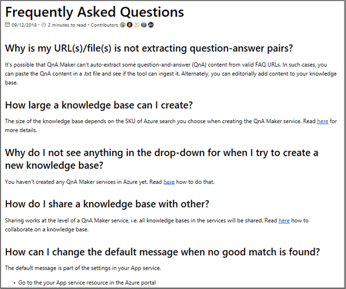
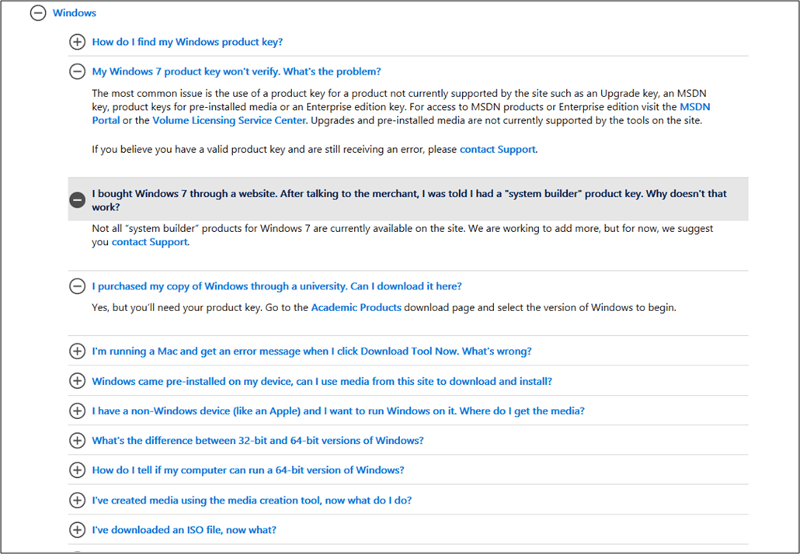
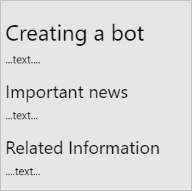
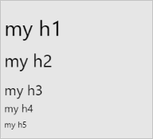
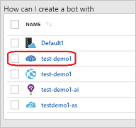

# Data sources for QnA Maker content

QnA Maker automatically extracts question-answer pairs from  semi-structured content such as FAQs, product manuals, guidelines, support documents, and policies stored as web pages, PDF files, or MS Word doc files    . Content can also be added to the knowledge base from structured QnA content files. 

<a name="data-types"></a>

## File and URL data types

The table below summarizes the types of content and file formats that are supported by QnA Maker.

|Source Type|Content Type| Examples|
|--|--|--|
|URL|FAQs<br> (Flat, with sections or with a topics homepage)<br>Support pages <br> (Single page how-to articles, troubleshooting articles etc.)|[Plain FAQ](https://docs.microsoft.com/azure/cognitive-services/qnamaker/faqs), <br>[FAQ with links](https://www.microsoft.com/en-us/software-download/faq),<br> [FAQ with topics homepage](https://www.microsoft.com/Licensing/servicecenter/Help/Faq.aspx)<br>[Support article](https://docs.microsoft.com/azure/cognitive-services/qnamaker/concepts/best-practices)|
|PDF / DOC|FAQs,<br> Product Manual,<br> Brochures,<br> Paper,<br> Flyer Policy,<br> Support guide,<br> Structured QnA,<br> etc.|[Structured QnA.doc](https://github.com/Azure-Samples/cognitive-services-sample-data-files/blob/master/qna-maker/data-source-formats/structured.docx),<br> [Sample Product Manual.pdf](https://github.com/Azure-Samples/cognitive-services-sample-data-files/blob/master/qna-maker/data-source-formats/product-manual.pdf),<br> [Sample semi-structured.doc](https://github.com/Azure-Samples/cognitive-services-sample-data-files/blob/master/qna-maker/data-source-formats/semi-structured.docx),<br> [Sample white paper.pdf](https://github.com/Azure-Samples/cognitive-services-sample-data-files/blob/master/qna-maker/data-source-formats/white-paper.pdf),<br>[Sample multi-turn.docx](https://github.com/Azure-Samples/cognitive-services-sample-data-files/blob/master/qna-maker/data-source-formats/multi-turn.docx)|
|*Excel|Structured QnA file<br> (including RTF, HTML support)|[Sample QnA FAQ.xls](https://github.com/Azure-Samples/cognitive-services-sample-data-files/blob/master/qna-maker/data-source-formats/QnA%20Maker%20Sample%20FAQ.xlsx)|
|*TXT/TSV|Structured QnA file|[Sample chit-chat.tsv](https://github.com/Azure-Samples/cognitive-services-sample-data-files/blob/master/qna-maker/data-source-formats/Scenario_Responses_Friendly.tsv)|

### Import and export knowledge base

**TSV and XLS files**, from exported knowledge bases, can only be used by importing the files from the **Settings** page in the QnA Maker portal. They can't be used as data sources during knowledge base creation or from the **+ Add file** or **+ Add URL** feature on the **Settings** page. 

## Data source locations

Data source locations are **public URLs or files**, which do not require authentication. 

If you need authentication for your data source, consider the following methods to get that data into QnA Maker:

* [Download file manually](#download-file-from-authenticated-data-source-location) and import into QnA Maker
* Import file for authenticated [Sharepoint location](#import-file-from-authenticated-sharepoint) 

### Download file from authenticated data source location

If you have an authenticated file (not on an authenticated Sharepoint location) or URL, an alternative option is to download the file from the authenticated site to your local computer, then add the file from your local computer to the knowledge base.

### Import file from authenticated Sharepoint 

[Sharepoint data source locations](../How-to/add-sharepoint-datasources.md) are allowed to provide authenticated **files**. Sharepoint resources must be files, not web pages. If the URL ends with a web extension, such as **.ASPX**, it will not import into QnA Maker from Sharepoint.


## FAQ URLs

QnA Maker can support FAQ web pages in 3 different forms: Plain FAQ pages, FAQ pages with links, FAQ pages with a Topics Homepage.

### Plain FAQ pages

This is the most common type of FAQ page, in which the answers immediately follow the questions in the same page. 

Below is an example of a plain FAQ page:

 

 
### FAQ pages with links 

In this type of FAQ page, questions are aggregated together and are linked to answers that are either in different sections of the same page, or in different pages.

Below is an example of an FAQ page with links in sections that are on the same page:

  


### FAQ pages with a Topics homepage

This type of FAQ has a home page with the Topics where each Topic is a link to its relevant QnAs in a different page. Here, QnA Maker crawls all the linked pages to extract the corresponding questions & answers.

Below is an example of an FAQ page where a topics homepage has links to FAQ sections in different pages. 

  


### Support Urls

QnA Maker can process semi-structured support web pages, such as web articles that would describe how to perform a given task, how to diagnose and resolve a given problem, and what are the best practices for a given process. Extraction works best on content that has a clear structure with hierarchical headings.

> [!NOTE]
> Extraction for support articles is a new feature and is in early stages. It works best for simple pages, that are well structured, and do not contain complex headers/footers.


## PDF/ DOC files

QnA Maker can process semi-structured content in a PDF or DOC file, and convert it into QnAs. A good file that can be extracted well is one where content is organized in some structured form, and is represented in well-defined sections. The sections can further be broken inTO subsections, or subtopics. Extraction works best on documents that have a clear structure with hierarchical headings.

QnA Maker identifies sections and subsections and relationships in the file based on visual clues like font size, font style, numbering, colors, etc. Semi-structured PDF or DOC files could be Manuals, FAQs, Guidelines, Policies, Brochures, Flyers, and many other types of files. Below are some example types of these files.

### Product manuals

A manual is typically guidance material that accompanies a product. It helps the user to set up, use, maintain, and troubleshoot the product. When QnA Maker processes a manual, it extracts the headings and subheadings as questions and the subsequent content as answers. See an example [here](https://download.microsoft.com/download/2/9/B/29B20383-302C-4517-A006-B0186F04BE28/surface-pro-4-user-guide-EN.pdf).

Below is an example of a manual with an index page, and hierarchical content

  

> [!NOTE]
> Extraction works best on manuals that have a table of contents and/or an index page, and a clear structure with hierarchical headings.

### Brochures, guidelines, papers, and other files

Many other types of documents can also be processed to generate QA pairs, provided they have a clear structure and layout. These include: Brochures, guidelines, reports, white papers, scientific papers, policies, books, etc. See an example [here](https://qnamakerstore.blob.core.windows.net/qnamakerdata/docs/Manage%20Azure%20Blob%20Storage.docx).

Below is an example of a semi-structured doc, without an index:

  

### Structured QnA Document

The format for structured Question-Answers in DOC files, is in the form of alternating Questions and Answers per line, one question per line followed by its answer in the following line, as shown below: 

```text
Question1

Answer1

Question2

Answer2
```

Below is an example of a structured QnA word document:

  

## Structured *TXT*, *TSV* and *XLS* Files

QnAs in the form of structured *.txt*, *.tsv* or *.xls* files can also be uploaded to QnA Maker to create or augment a knowledge base.  These can either be plain text, or can have content in RTF or HTML. 

| Question  | Answer  | Metadata (1 key: 1 value) |
|-----------|---------|-------------------------|
| Question1 | Answer1 | <code>Key1:Value1 &#124; Key2:Value2</code> |
| Question2 | Answer2 |      `Key:Value`           |

Any additional columns in the source file are ignored.

### Example of structured Excel file

Below is an example of a structured QnA *.xls* file, with HTML content:

 

### Example of alternate questions for single answer in Excel file

Below is an example of a structured QnA *.xls* file, with several alternate questions for a single answer:

 

After the file is imported, the question-and-answer pair is in the knowledge base as shown below:

 

## Structured data format through import

Importing a knowledge base replaces the content of the existing knowledge base. Import requires a structured .tsv file that contains data source information. This information helps QnA Maker group the question-answer pairs and attribute them to a particular data source.

| Question  | Answer  | Source| Metadata (1 key: 1 value) |          
|-----------|---------|----|---------------------|
| Question1 | Answer1 | Url1 | <code>Key1:Value1 &#124; Key2:Value2</code> |
| Question2 | Answer2 | Editorial|    `Key:Value`       |

## Editorially add to knowledge base

If you do not have pre-existing content to populate the knowledge base, you can add QnAs editorially in QnA Maker Knowledge base. Learn how to update your knowledge base [here](../How-To/edit-knowledge-base.md).

<a href="#formatting-considerations"></a>

## Formatting considerations

After importing a file or URL, QnA Maker converts and stores your content in the [markdown format](https://en.wikipedia.org/wiki/Markdown). The conversion process adds new lines in the text, such as `\n\n`. A knowledge of the markdown format helps you to understand the converted content and manage your knowledge base content. 

If you add or edit your content directly in your knowledge base, use **markdown formatting** to create rich text content or change the markdown format content that is already in the answer. QnA Maker supports much of the markdown format to bring rich text capabilities to your content. However, the client application, such as a chat bot may not support the same set of markdown formats. It is important to test the client application's display of answers. 

Following is the list of markdown formats that you can use in QnA Maker: 

|Purpose|Format|Example markdown|Rendering<br>as displayed in Chat bot|
|--|--|--|--|
A new line between 2 sentences.|`\n\n`|`How can I create a bot with \n\n QnA Maker?`||
|Headers from h1 to h6, the number of `#` denotes which header. 1 `#` is the h1.|`\n# text \n## text \n### text \n####text \n#####text` |`## Creating a bot \n ...text.... \n### Important news\n ...text... \n### Related Information\n ....text...`<br><br>`\n# my h1 \n## my h2\n### my h3 \n#### my h4 \n##### my h5`|<br>|
|Italics |`*text*`|`How do I create a bot with *QnA Maker*?`||
|String (bold)|`**text**`|`How do I create a bot with **QnA Maker**?`||
|URL for link|`[text](https://www.my.com)`|`How do I create a bot with [QnA Maker](https://www.qnamaker.ai)?`||
|*URL for public image|``|`How can I create a bot with `||
|Strikethrough|`~~text~~`|`some ~~questoins~~ questions need to be asked`||
|Bold and italics|`***text***`|`How can I create a ***QnA Maker*** bot?`||
|Bold URL for link|`[**text**](https://www.my.com)`|`How do I create a bot with [**QnA Maker**](https://www.qnamaker.ai)?`||
|Italics URL for link|`[*text*](https://www.my.com)`|`How do I create a bot with [*QnA Maker*](https://www.qnamaker.ai)?`||
|Escape markdown symbols|`\*text\*`|`How do I create a bot with \*QnA Maker\*?`||
|Ordered list|`\n 1. item1 \n 1. item2`|`This is an ordered list: \n 1. List item 1 \n 1. List item 2`<br>The preceding example uses automatic numbering built into markdown.<br>`This is an ordered list: \n 1. List item 1 \n 2. List item 2`<br>The preceding example uses explicit numbering.||
|Unordered list|`\n * item1 \n * item2`<br>or<br>`\n - item1 \n - item2`|`This is an ordered list: \n * List item 1 \n * List item 2`||
|Nested lists|`\n * Parent1 \n\t * Child1 \n\t * Child2 \n * Parent2`<br><br>`\n * Parent1 \n\t 1. Child1 \n\t * Child2 \n 1. Parent2`<br><br>You can nest ordered and unordered lists together. The tab, `\t`, indicates the indentation level of the child element.|`This is an unordered list: \n * List item 1 \n\t * Child1 \n\t * Child2 \n * List item 2`<br><br>`This is an ordered nested list: \n 1. Parent1 \n\t 1. Child1 \n\t 1. Child2 \n 1. Parent2`|<br>|

*QnA Maker doesn't process the image in any way. It is the client application's role to render the image. 

If you want to add content using update/replace knowledgebase APIs and the content/file contains html tags, you can preserve the HTML in your file by ensuring that opening and closing of the tags are converted in the encoded format.

| Preserve HTML  | Representation in the API request  | Representation in KB |
|-----------|---------|-------------------------|
| Yes | \&lt;br\&gt; | &lt;br&gt; |
| Yes | \&lt;h3\&gt;header\&lt;/h3\&gt; | &lt;h3&gt;header&lt;/h3&gt; |

Additionally, CR LF(\r\n) are converted to \n in the KB. LF(\n) is kept as is. If you want to escape any escape sequence like a \t or \n you can use backslash, for example: '\\\\r\\\\n' and '\\\\t'

## Editing your knowledge base locally

Once a knowledge base is created, it is recommended that you make edits to the knowledge base text in the [QnA Maker portal](https://qnamaker.ai), rather than exporting and reimporting through local files. However, there may be times that you need to edit a knowledge base locally. 

Export the knowledge base from the **Settings** page, then edit the knowledge base with Microsoft Excel. If you choose to use another application to edit your exported TSV file, the application may introduce syntax errors because it is not fully TSV compliant. Microsoft Excel's TSV files generally don't introduce any formatting errors. 

Once you are done with your edits, reimport the TSV file from the **Settings** page. This will completely replace the current knowledge base with the imported knowledge base. 

## Testing your Markdown

Use the **[CommonMark](https://commonmark.org/help/tutorial/index.html)** tutorial to validate your Markdown. The tutorial has a **Try it** feature for quick copy/paste validation. 

## Version control for data in your knowledge base

Version control for data is provided through the [import/export feature](development-lifecycle-knowledge-base.md#version-control-of-a-knowledge-base) on the **Settings** page. 

## Next steps

> [!div class="nextstepaction"]
> [Set up a QnA Maker service](../How-To/set-up-qnamaker-service-azure.md)

## See also 

[QnA Maker overview](../Overview/overview.md)
