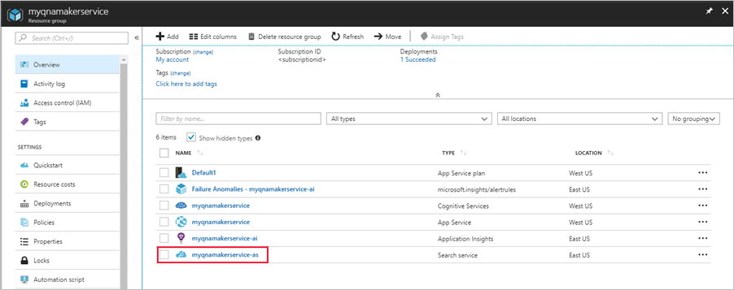
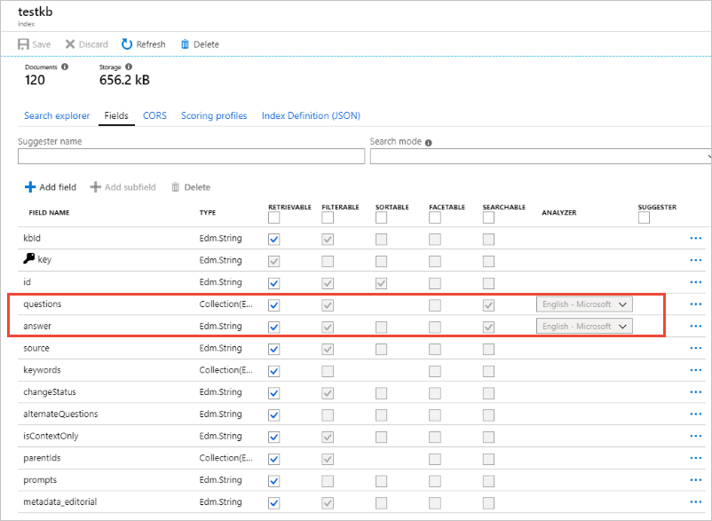

# Language support of knowledge base content for QnA Maker

QnA Maker supports knowledge base content in many languages. However, each QnA Maker service should be reserved for a single language. The first knowledge base created targeting a particular QnA Maker service sets the language of that service. See [here](../Overview/languages-supported.md) for the list of supported languages.

The language is automatically recognized from the content of the data sources being extracted. Once you create a new QnA Maker Service and a new Knowledge Base in that service, you can verify that the language has been set correctly.

1. Navigate to the [Azure portal](https://portal.azure.com/).

1. Select **resource groups** and navigate to the resource group where the QnA Maker service is deployed and select the **Azure Search** resource.

    

1. Select **Indexes**, then select the **testkb** index. This is the first Azure Search index created and it contains the saved content of all the knowledge bases in that service. 

1. Select **Fields** to see the fields in the index.

1. The _Analyzer_ column of the `questions` and `answer` fields is set to a specific language. This language was automatically detected during the knowledge base creation step from the imported files and URLs. This language cannot be changed once the resource is created.

    

## Next steps

> [!div class="nextstepaction"]
> [Create a QnA bot with Azure Bot Service](../Tutorials/create-qna-bot.md)
