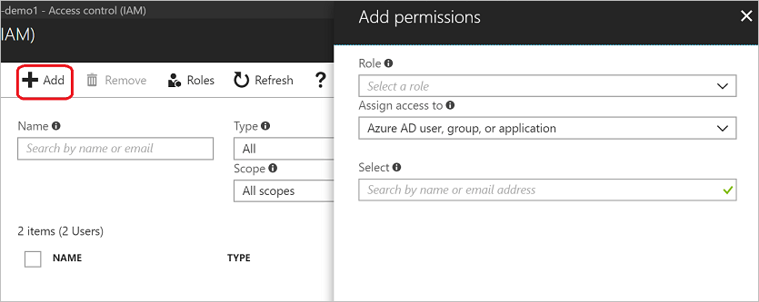

# Manage QnA Maker app

QnA Maker allows you to collaborate with different authors and content editors by offering a capability to restrict collaborator access based on the collaborator's role.
Learn more about [QnA Maker collaborator authentication concepts](../Concepts/role-based-access-control.md).

You can also improve the quality of your knowledge base by suggesting alternative questions through [active learning](../Concepts/active-learning-suggestions.md). User-submissions are taken into consideration and appear as suggestions in the alternate questions list. You have the flexibility to either add those suggestions as alternate questions or reject them.

Your knowledge base doesn't change automatically. In order for any change to take effect, you must accept the suggestions. These suggestions add questions but don't change or remove existing questions.

## Add Azure role-based access control (Azure RBAC)

QnA Maker allows multiple people to collaborate on all knowledge bases in the same QnA Maker resource. This feature is provided with [Azure role-based access control (Azure RBAC)](../../../active-directory/role-based-access-control-configure.md).

## Access at the QnA Maker resource level

You cannot share a particular knowledge base in a QnA Maker service. If you want more granular access control, consider distributing your knowledge bases across different QnA Maker resources, then add roles to each resource.

## Add a role to a resource

### Add a user account to the QnA Maker resource

The following steps use the collaborator role but any of the [roles](../reference-role-based-access-control.md) can be added using these steps

1. Sign in to the [Azure](https://portal.azure.com/) portal, and go to your QnA Maker resource.

    

1. Go to the **Access Control (IAM)** tab.

    

1. Select **Add**.

    

1. Select a role from the following list:

    |Role|
    |--|
    |Owner|
    |Contributor|
    |Cognitive Services QnA Maker Reader|
    |Cognitive Services QnA Maker Editor|
    |Cognitive Services User|

    :::image type="content" source="../media/qnamaker-how-to-collaborate-knowledge-base/qnamaker-add-role-iam.png" alt-text="QnA Maker IAM add role.":::

1. Enter the user's email address and press **Save**.

    

### View QnA Maker knowledge bases

When the person you shared your QnA Maker service with logs into the [QnA Maker portal](https://qnamaker.ai), they can see all the knowledge bases in that service based on their role.

When they select a knowledge base, their current role on that QnA Maker resource is visible next to the knowledge base name.

:::image type="content" source="../media/qnamaker-how-to-collaborate-knowledge-base/qnamaker-knowledge-base-role-name.png" alt-text="Screenshot of knowledge base in Edit mode with role name in parentheses next to knowledge base name in top-left corner of web page.":::

## Upgrade runtime version to use active learning

Active Learning is supported in runtime version 4.4.0 and above. If your knowledge base was created on an earlier version, [upgrade your runtime](set-up-qnamaker-service-azure.md#get-the-latest-runtime-updates) to use this feature.

## Turn on active learning for alternate questions

Active learning is off by default. Turn it on to see suggested questions. After you turn on active learning, you need to send information from the client app to QnA Maker. For more information, see [Architectural flow for using GenerateAnswer and Train APIs from a bot](improve-knowledge-base.md#architectural-flow-for-using-generateanswer-and-train-apis-from-a-bot).

1. Select **Publish** to publish the knowledge base. Active learning queries are collected from the GenerateAnswer API prediction endpoint only. The queries to the Test pane in the QnA Maker portal do not impact active learning.

1. To turn active learning on in the QnA Maker portal, go to the top-right corner, select your **Name**, go to [**Service Settings**](https://www.qnamaker.ai/UserSettings).

    

1. Find the QnA Maker service then toggle **Active Learning**.

    > [!div class="mx-imgBorder"]
    > 
    > [!Note]
    > The exact version on the preceding image is shown as an example only. Your version may be different.
    Once **Active Learning** is enabled, the knowledge base suggests new questions at regular intervals based on user-submitted questions. You can disable **Active Learning** by toggling the setting again.

## Review suggested alternate questions

[Review alternate suggested questions](improve-knowledge-base.md) on the **Edit** page of each knowledge base.

## Next steps

> [!div class="nextstepaction"]
> [Create a knowledge base](./manage-knowledge-bases.md)