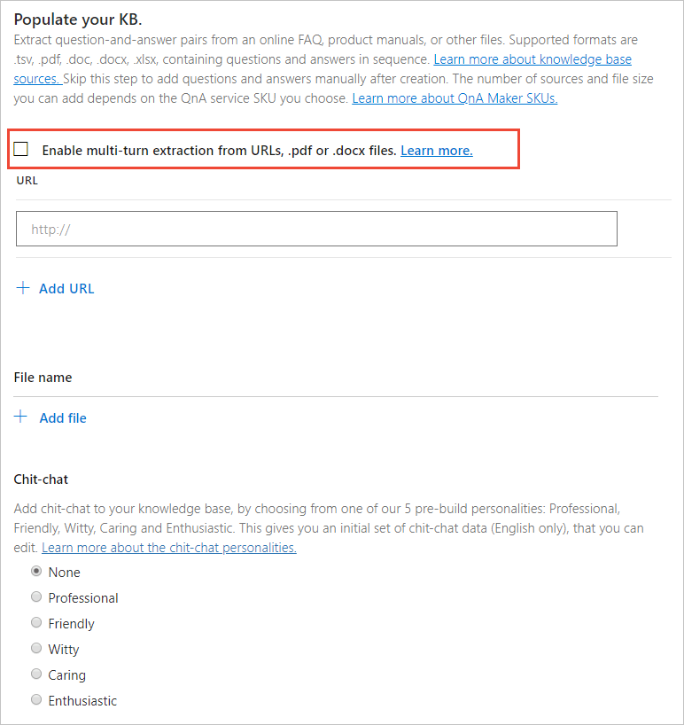
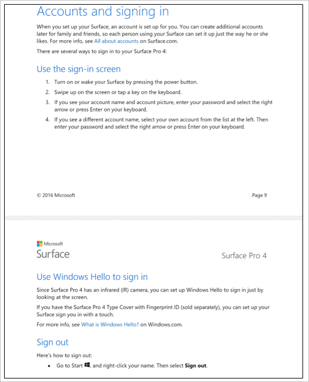
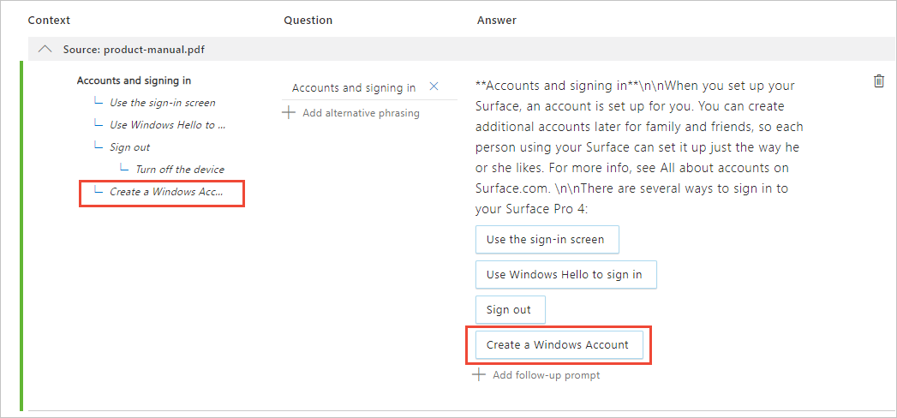

# Use follow-up prompts to create multiple turns of a conversation

Use follow-up prompts and context to manage the multiple turns, known as _multi-turn_, for your bot from one question to another.

To see how multi-turn works, view the following demonstration video:

[](https://aka.ms/multiturnexample)

## What is a multi-turn conversation?

Some questions can't be answered in a single turn. When you design your client application (chat bot) conversations, a user might ask a question that needs to be filtered or refined to determine the correct answer. You make this flow through the questions possible by presenting the user with *follow-up prompts*.

When a user asks a question, QnA Maker returns the answer _and_ any follow-up prompts. This response allows you to present the follow-up questions as choices.

> [!CAUTION]
> Multi-turn prompts are not extracted from FAQ documents. If you need multi-turn extraction, remove the question marks that designate the QnA pairs as FAQs.

## Example multi-turn conversation with chat bot

With multi-turn, a chat bot manages a conversation with a user to determine the final answer, as shown in the following image:


In the preceding image, a user has started a conversation by entering **My account**. The knowledge base has three linked question-and-answer pairs. To refine the answer, the user selects one of the three choices in the knowledge base. The question (#1), has three follow-up prompts, which are presented in the chat bot as three options (#2).

When the user selects an option (#3), the next list of refining options (#4) is presented. This sequence continues (#5) until the user determines the correct, final answer (#6).


### Use multi-turn in a bot

After publishing your KB, you can select the **Create Bot** button to deploy your QnA Maker bot to Azure bot service. The prompts will appear in the chat clients that you have enabled for your bot.

## Create a multi-turn conversation from a document's structure

When you create a knowledge base, the **Populate your KB** section displays an **Enable multi-turn extraction from URLs, .pdf or .docx files** check box.



When you select this option, QnA Maker extracts the hierarchy present in the document structure. The hierarchy is converted in to follow up prompts and the root of the hierarchy serves as the parent QnA. In some documents the root of the hierarchy does not have content which could serve as an answer, you can provide the 'Default Answer Text' to be used as a substitute answer text to extract such hierarchies.

Multi-turn structure can be inferred only from URLs, PDF files, or DOCX files. For an example of structure, view an image of a [Microsoft Surface user manual PDF file](https://github.com/Azure-Samples/cognitive-services-sample-data-files/blob/master/qna-maker/data-source-formats/product-manual.pdf).

](../media/conversational-context/import-file-with-conversational-structure.png#lightbox)

### Building your own multi-turn document

If you are creating a multi-turn document, please keep in mind the following guidelines:

* Use headings and sub-headings to denote hierarchy. For example You can h1 to denote the parent QnA and h2 to denote the QnA that should be taken as prompt. Use small heading size to denote subsequent hierarchy. Don't use style, color, or some other mechanism to imply structure in your document, QnA Maker will not extract the multi-turn prompts.

* First character of heading must be capitalized.

* Do not end a heading with a question mark, `?`.

* You can use the [sample document](https://github.com/Azure-Samples/cognitive-services-sample-data-files/blob/master/qna-maker/data-source-formats/multi-turn.docx) as an example to create your own multi-turn document.

### Adding files to a multi-turn KB

When you add a hierarchical document, QnA Maker determines follow-up prompts from the structure to create conversational flow.

1. In QnA Maker, select an existing knowledge base which was created with **Enable multi-turn extraction from URLs, .pdf or .docx files.** enabled.
1. Go to the **Settings** page, select the file or URL to add.
1. **Save and train** the knowledge base.

> [!Caution]
> Support for using an exported TSV or XLS multi-turn knowledge base file as a data source for a new or empty knowledge base isn't supported. You need to **Import** that file type, from the **Settings** page of the QnA Maker portal, in order to add exported multi-turn prompts to a knowledge base.


## Create knowledge base with multi-turn prompts with the Create API

You can create a knowledge case with multi-turn prompts using the [QnA Maker Create API](https://docs.microsoft.com/rest/api/cognitiveservices/qnamaker/knowledgebase/create). The prompts are adding in the `context` property's `prompts` array.

## Show questions and answers with context

Reduce the displayed question-and-answer pairs to only those with contextual conversations.

Select **View options**, and then select **Show context**. The list displays question-and-answer pairs that contain follow-up prompts.


The multi-turn context is displayed in the first column.

](../media/conversational-context/surface-manual-pdf-follow-up-prompt.png#lightbox)

In the preceding image, **#1** indicates bold text in the column, which signifies the current question. The parent question is the top item in the row. Any questions below it are the linked question-and-answer pairs. These items are selectable, so that you can immediately go to the other context items.

## Add an existing question-and-answer pair as a follow-up prompt

The original question, **My account**, has follow-up prompts, such as **Accounts and signing in**.


Add a follow-up prompt to an existing question-and-answer pair that isn't currently linked. Because the question isn't linked to any question-and-answer pair, the current view setting needs to be changed.

1. To link an existing question-and-answer pair as a follow-up prompt, select the row for the question-and-answer pair. For the Surface manual, search for **Sign out** to reduce the list.
1. In the row for **Signout**, in the **Answer** column, select **Add follow-up prompt**.
1. In the fields in the **Follow-up prompt** pop-up window, enter the following values:

    |Field|Value|
    |--|--|
    |Display text|Enter **Turn off the device**. This is custom text to display in the follow-up prompt.|
    |Context-only| Select this check box. An answer is returned only if the question specifies context.|
    |Link to answer|Enter **Use the sign-in screen** to find the existing question-and-answer pair.|


1.  One match is returned. Select this answer as the follow-up, and then select **Save**.

    

1. After you've added the follow-up prompt, select **Save and train** in the top navigation.

### Edit the display text

When a follow-up prompt is created, and an existing question-and-answer pair is entered as the **Link to Answer**, you can enter new **Display text**. This text doesn't replace the existing question, and it doesn't add a new alternate question. It is separate from those values.

1. To edit the display text, search for and select the question in the **Context** field.
1. In the row for that question, select the follow-up prompt in the answer column.
1. Select the display text you want to edit, and then select **Edit**.

    

1. In the **Follow-up prompt** pop-up window, change the existing display text.
1. When you're done editing the display text, select **Save**.
1. In the top navigation bar, **Save and train**.


## Add a new question-and-answer pair as a follow-up prompt

When you add a new question-and-answer pair to the knowledge base, each pair should be linked to an existing question as a follow-up prompt.

1. On the knowledge base toolbar, search for and select the existing question-and-answer pair for **Accounts and signing in**.

1. In the **Answer** column for this question, select **Add follow-up prompt**.
1. Under **Follow-up prompt (PREVIEW)**, create a new follow-up prompt by entering the following values:

    |Field|Value|
    |--|--|
    |Display text|*Create a Windows Account*. The custom text to display in the follow-up prompt.|
    |Context-only|Select this check box. This answer is returned only if the question specifies context.|
    |Link to answer|Enter the following text as the answer:<br>*[Create](https://account.microsoft.com/) a Windows account with a new or existing email account*.<br>When you save and train the database, this text will be converted. |
    |||

    


1. Select **Create new**, and then select **Save**.

    This action creates a new question-and-answer pair and links the selected question as a follow-up prompt. The **Context** column, for both questions, indicates a follow-up prompt relationship.

1. Select **View options**, and then select [**Show context (PREVIEW)**](#show-questions-and-answers-with-context).

    The new question shows how it's linked.

    

    The parent question displays a new question as one of its choices.

    ](../media/conversational-context/child-prompt-created.png#lightbox)

1. After you've added the follow-up prompt, select **Save and train** in the top navigation bar.

## Enable multi-turn during testing of follow-up prompts

When you test the question with follow-up prompts in the **Test** pane, select **Enable multi-turn**, and then enter your question. The response includes the follow-up prompts.


If you don't enable multi-turn, the answer is returned but follow-up prompts are not returned.

## A JSON request to return an initial answer and follow-up prompts

Use the empty `context` object to request the answer to the user's question and include follow-up prompts.

```JSON
{
  "question": "accounts and signing in",
  "top": 10,
  "userId": "Default",
  "isTest": false,
  "context": {}
}
```

## A JSON response to return an initial answer and follow-up prompts

The preceding section requested an answer and any follow-up prompts to **Accounts and signing in**. The response includes the prompt information, which is located at *answers[0].context*, and the text to display to the user.

```JSON
{
    "answers": [
        {
            "questions": [
                "Accounts and signing in"
            ],
            "answer": "**Accounts and signing in**\n\nWhen you set up your Surface, an account is set up for you. You can create additional accounts later for family and friends, so each person using your Surface can set it up just the way he or she likes. For more info, see All about accounts on Surface.com. \n\nThere are several ways to sign in to your Surface Pro 4: ",
            "score": 100.0,
            "id": 15,
            "source": "product-manual.pdf",
            "metadata": [],
            "context": {
                "isContextOnly": true,
                "prompts": [
                    {
                        "displayOrder": 0,
                        "qnaId": 16,
                        "qna": null,
                        "displayText": "Use the sign-in screen"
                    }
                ]
            }
        },
        {
            "questions": [
                "Sign out"
            ],
            "answer": "**Sign out**\n\nHere's how to sign out: \n\n Go to Start, and right-click your name. Then select Sign out. ",
            "score": 38.01,
            "id": 18,
            "source": "product-manual.pdf",
            "metadata": [],
            "context": {
                "isContextOnly": true,
                "prompts": [
                    {
                        "displayOrder": 0,
                        "qnaId": 16,
                        "qna": null,
                        "displayText": "Turn off the device"
                    }
                ]
            }
        },
        {
            "questions": [
                "Use the sign-in screen"
            ],
            "answer": "**Use the sign-in screen**\n\n1.  \n\nTurn on or wake your Surface by pressing the power button. \n\n2.  \n\nSwipe up on the screen or tap a key on the keyboard. \n\n3.  \n\nIf you see your account name and account picture, enter your password and select the right arrow or press Enter on your keyboard. \n\n4.  \n\nIf you see a different account name, select your own account from the list at the left. Then enter your password and select the right arrow or press Enter on your keyboard. ",
            "score": 27.53,
            "id": 16,
            "source": "product-manual.pdf",
            "metadata": [],
            "context": {
                "isContextOnly": true,
                "prompts": []
            }
        }
    ]
}
```

The `prompts` array provides text in the `displayText` property and the `qnaId` value. You can show these answers as the next displayed choices in the conversation flow and then send the selected `qnaId` back to QnA Maker in the following request.

<!--

The `promptsToDelete` array provides the ...

-->

## A JSON request to return a non-initial answer and follow-up prompts

Fill the `context` object to include the previous context.

In the following JSON request, the current question is *Use Windows Hello to sign in* and the previous question was *accounts and signing in*.

```JSON
{
  "question": "Use Windows Hello to sign in",
  "top": 10,
  "userId": "Default",
  "isTest": false,
  "qnaId": 17,
  "context": {
    "previousQnAId": 15,
    "previousUserQuery": "accounts and signing in"
  }
}
```

##  A JSON response to return a non-initial answer and follow-up prompts

The QnA Maker _GenerateAnswer_ JSON response includes the follow-up prompts in the `context` property of the first item in the `answers` object:

```JSON
{
    "answers": [
        {
            "questions": [
                "Use Windows Hello to sign in"
            ],
            "answer": "**Use Windows Hello to sign in**\n\nSince Surface Pro 4 has an infrared (IR) camera, you can set up Windows Hello to sign in just by looking at the screen. \n\nIf you have the Surface Pro 4 Type Cover with Fingerprint ID (sold separately), you can set up your Surface sign you in with a touch. \n\nFor more info, see What is Windows Hello? on Windows.com. ",
            "score": 100.0,
            "id": 17,
            "source": "product-manual.pdf",
            "metadata": [],
            "context": {
                "isContextOnly": true,
                "prompts": []
            }
        },
        {
            "questions": [
                "Meet Surface Pro 4"
            ],
            "answer": "**Meet Surface Pro 4**\n\nGet acquainted with the features built in to your Surface Pro 4. \n\nHere’s a quick overview of Surface Pro 4 features: \n\n\n\n\n\n\n\nPower button \n\n\n\n\n\nPress the power button to turn your Surface Pro 4 on. You can also use the power button to put it to sleep and wake it when you’re ready to start working again. \n\n\n\n\n\n\n\nTouchscreen \n\n\n\n\n\nUse the 12.3” display, with its 3:2 aspect ratio and 2736 x 1824 resolution, to watch HD movies, browse the web, and use your favorite apps. \n\nThe new Surface G5 touch processor provides up to twice the touch accuracy of Surface Pro 3 and lets you use your fingers to select items, zoom in, and move things around. For more info, see Surface touchscreen on Surface.com. \n\n\n\n\n\n\n\nSurface Pen \n\n\n\n\n\nEnjoy a natural writing experience with a pen that feels like an actual pen. Use Surface Pen to launch Cortana in Windows or open OneNote and quickly jot down notes or take screenshots. \n\nSee Using Surface Pen (Surface Pro 4 version) on Surface.com for more info. \n\n\n\n\n\n\n\nKickstand \n\n\n\n\n\nFlip out the kickstand and work or play comfortably at your desk, on the couch, or while giving a hands-free presentation. \n\n\n\n\n\n\n\nWi-Fi and Bluetooth® \n\n\n\n\n\nSurface Pro 4 supports standard Wi-Fi protocols (802.11a/b/g/n/ac) and Bluetooth 4.0. Connect to a wireless network and use Bluetooth devices like mice, printers, and headsets. \n\nFor more info, see Add a Bluetooth device and Connect Surface to a wireless network on Surface.com. \n\n\n\n\n\n\n\nCameras \n\n\n\n\n\nSurface Pro 4 has two cameras for taking photos and recording video: an 8-megapixel rear-facing camera with autofocus and a 5-megapixel, high-resolution, front-facing camera. Both cameras record video in 1080p, with a 16:9 aspect ratio. Privacy lights are located on the right side of both cameras. \n\nSurface Pro 4 also has an infrared (IR) face-detection camera so you can sign in to Windows without typing a password. For more info, see Windows Hello on Surface.com. \n\nFor more camera info, see Take photos and videos with Surface and Using autofocus on Surface 3, Surface Pro 4, and Surface Book on Surface.com. \n\n\n\n\n\n\n\nMicrophones \n\n\n\n\n\nSurface Pro 4 has both a front and a back microphone. Use the front microphone for calls and recordings. Its noise-canceling feature is optimized for use with Skype and Cortana. \n\n\n\n\n\n\n\nStereo speakers \n\n\n\n\n\nStereo front speakers provide an immersive music and movie playback experience. To learn more, see Surface sound, volume, and audio accessories on Surface.com. \n\n\n\n\n",
            "score": 21.92,
            "id": 3,
            "source": "product-manual.pdf",
            "metadata": [],
            "context": {
                "isContextOnly": true,
                "prompts": [
                    {
                        "displayOrder": 0,
                        "qnaId": 4,
                        "qna": null,
                        "displayText": "Ports and connectors"
                    }
                ]
            }
        },
        {
            "questions": [
                "Use the sign-in screen"
            ],
            "answer": "**Use the sign-in screen**\n\n1.  \n\nTurn on or wake your Surface by pressing the power button. \n\n2.  \n\nSwipe up on the screen or tap a key on the keyboard. \n\n3.  \n\nIf you see your account name and account picture, enter your password and select the right arrow or press Enter on your keyboard. \n\n4.  \n\nIf you see a different account name, select your own account from the list at the left. Then enter your password and select the right arrow or press Enter on your keyboard. ",
            "score": 19.04,
            "id": 16,
            "source": "product-manual.pdf",
            "metadata": [],
            "context": {
                "isContextOnly": true,
                "prompts": []
            }
        }
    ]
}
```

## Query the knowledge base with the QnA Maker ID

If you are building a custom application using multi-turn feature. In the initial question's response, any follow-up prompts and its associated `qnaId` is returned. Now that you have the ID, you can pass this in the follow-up prompt's request body. If the request body contains the `qnaId`, and the context object (which contains the previous QnA Maker properties), then GenerateAnswer will return the exact question by ID, instead of using the ranking algorithm to find the answer by the question text.


## Display order is supported in the Update API

The [display text and display order](https://docs.microsoft.com/rest/api/cognitiveservices/qnamaker/knowledgebase/update#promptdto), returned in the JSON response, is supported for editing by the [Update API](https://docs.microsoft.com/rest/api/cognitiveservices/qnamaker/knowledgebase/update).

## Add or delete multi-turn prompts with the Update API

You can add or delete multi-turn prompts using the [QnA Maker Update API](https://docs.microsoft.com/rest/api/cognitiveservices/qnamaker/knowledgebase/update).  The prompts are adding in the `context` property's `promptsToAdd` array and the `promptsToDelete` array.

## Export knowledge base for version control

QnA Maker supports version control by including multi-turn conversation steps in the exported file.

## Next steps

Learn more about contextual conversations from this [dialog sample](https://aka.ms/qnamakermultiturnsample) or learn more about [conceptual bot design for multi-turn conversations](https://docs.microsoft.com/azure/bot-service/bot-builder-conversations?view=azure-bot-service-4.0).

> [!div class="nextstepaction"]
> [Migrate a knowledge base](../Tutorials/migrate-knowledge-base.md)
