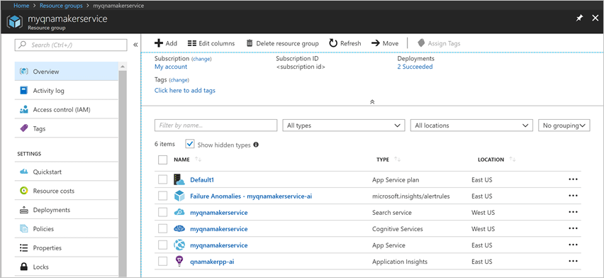
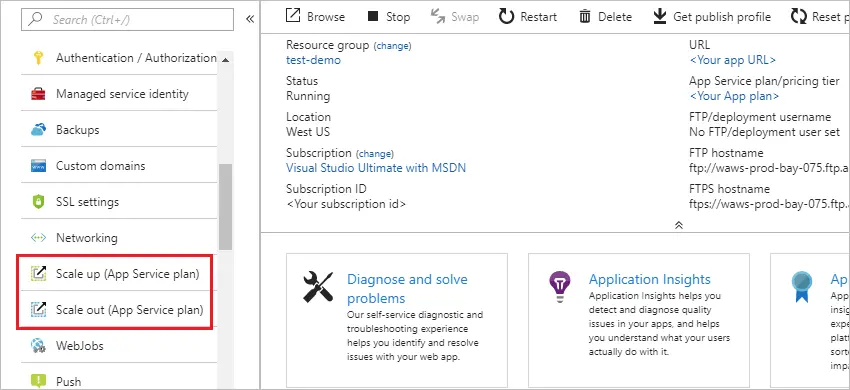
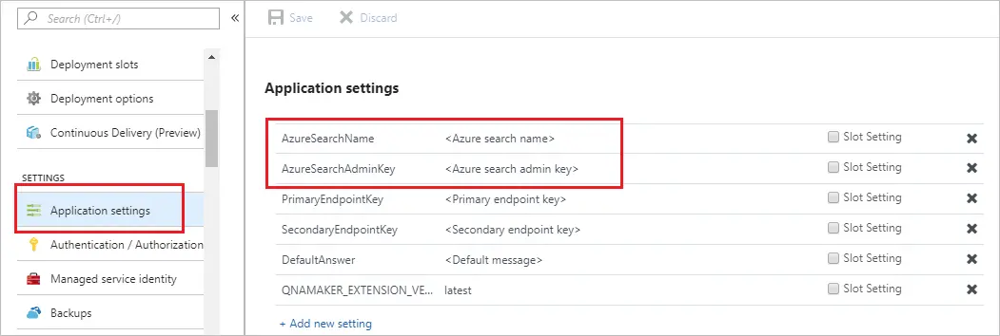

# Manage QnA Maker resources

Before you can create any QnA Maker knowledge bases, you must first set up a QnA Maker service in Azure. Anyone with authorization to create new resources in a subscription can set up a QnA Maker service.

A solid understanding of the following concepts is helpful before creating your resource:

* [QnA Maker resources](../Concepts/azure-resources.md)
* [Authoring and publishing keys](../Concepts/azure-resources.md#keys-in-qna-maker)

## Create a new QnA Maker service

This procedure creates the Azure resources needed to manage the knowledge base content. After you complete these steps, you'll find the _subscription_ keys on the **Keys** page for the resource in the Azure portal.

1. Sign in to the Azure portal and [create a QnA Maker](https://ms.portal.azure.com/#create/Microsoft.CognitiveServicesQnAMaker) resource.

1. Select **Create** after you read the terms and conditions:

    

1. In **QnA Maker**, select the appropriate tiers and regions:

    

    * In the **Name** field, enter a unique name to identify this QnA Maker service. This name also identifies the QnA Maker endpoint that your knowledge bases will be associated with.
    * Choose the **Subscription** under which the QnA Maker resource will be deployed.
    * Select the **Pricing tier** for the QnA Maker management services (portal and management APIs). See [more details about SKU pricing](https://aka.ms/qnamaker-pricing).
    * Create a new **Resource group** (recommended) or use an existing one in which to deploy this QnA Maker resource. QnA Maker creates several Azure resources. When you create a resource group to hold these resources, you can easily find, manage, and delete these resources by the resource group name.
    * Select a **Resource group location**.
    * Choose the **Search pricing tier** of the Azure Cognitive Search service. If the Free tier option is unavailable (appears dimmed), it means you already have a free service deployed through your subscription. In that case, you'll need to start with the Basic tier. See [Azure Cognitive Search pricing details](https://azure.microsoft.com/pricing/details/search/).
    * Choose the **Search location** where you want Azure Cognitive Search indexes to be deployed. Restrictions on where customer data must be stored will help determine the location you choose for Azure Cognitive Search.
    * In the **App name** field, enter a name for your Azure App Service instance.
    * By default, App Service defaults to the standard (S1) tier. You can change the plan after creation. Learn more about [App Service pricing](https://azure.microsoft.com/pricing/details/app-service/).
    * Choose the **Website location** where App Service will be deployed.

        > [!NOTE]
        > The **Search Location** can differ from the **Website Location**.

    * Choose whether or not you want to enable **Application Insights**. If **Application Insights** is enabled, QnA Maker collects telemetry on traffic, chat logs, and errors.
    * Choose the **App insights location** where the Application Insights resource will be deployed.
    * For cost savings measures, you can [share](#configure-qna-maker-to-use-different-cognitive-search-resource) some but not all Azure resources created for QnA Maker.

1. After all the fields are validated, select **Create**. The process can take a few minutes to complete.

1. After deployment is completed, you'll see the following resources created in your subscription:

   

    The resource with the _Cognitive Services_ type has your _subscription_ keys.

## Find subscription keys in the Azure portal

You can view and reset your subscription keys from the Azure portal, where you created the QnA Maker resource.

1. Go to the QnA Maker resource in the Azure portal and select the resource that has the _Cognitive Services_ type:

    

2. Go to **Keys**:

    

## Find endpoint keys in the QnA Maker portal

The endpoint is in the same region as the resource because the endpoint keys are used to make a call to the knowledge base.

Endpoint keys can be managed from the [QnA Maker portal](https://qnamaker.ai).

1. Sign in to the [QnA Maker portal](https://qnamaker.ai), go to your profile, and then select **Service settings**:

    

2. View or reset your keys:

    > [!div class="mx-imgBorder"]
    > 

    >[!NOTE]
    >Refresh your keys if you think they've been compromised. This may require corresponding changes to your client application or bot code.

### Upgrade QnA Maker SKU

When you want to have more questions and answers in your knowledge base, beyond your current tier, upgrade your QnA Maker service pricing tier.

To upgrade the QnA Maker management SKU:

1. Go to your QnA Maker resource in the Azure portal, and select **Pricing tier**.

    

1. Choose the appropriate SKU and press **Select**.

    

### Upgrade App Service

 When your knowledge base needs to serve more requests from your client app, upgrade your App Service pricing tier.

You can [scale up](https://docs.microsoft.com/azure/app-service/manage-scale-up) or scale out App Service.

Go to the App Service resource in the Azure portal, and select the **Scale up** or **Scale out** option as required.

### Upgrade the Azure Cognitive Search service

If you plan to have many knowledge bases, upgrade your Azure Cognitive Search service pricing tier.

Currently, you can't perform an in-place upgrade of the Azure search SKU. However, you can create a new Azure search resource with the desired SKU, restore the data to the new resource, and then link it to the QnA Maker stack. To do this, follow these steps:

1. Create a new Azure search resource in the Azure portal, and select the desired SKU.

    

1. Restore the indexes from your original Azure search resource to the new one. See the [backup restore sample code](https://github.com/pchoudhari/QnAMakerBackupRestore).

1. After the data is restored, go to your new Azure search resource, select **Keys**, and write down the **Name** and the **Admin key**:

    

1. To link the new Azure search resource to the QnA Maker stack, go to the QnA Maker App Service instance.

    

1. Select **Application settings** and modify the settings in the **AzureSearchName** and **AzureSearchAdminKey** fields from step 3.

    

1. Restart the App Service instance.

    

## Get the latest runtime updates

The QnAMaker runtime is part of the Azure App Service instance that's deployed when you [create a QnAMaker service](./set-up-qnamaker-service-azure.md) in the Azure portal. Updates are made periodically to the runtime. The QnA Maker App Service instance is in auto-update mode after the April 2019 site extension release (version 5+). This update is designed to take care of ZERO downtime during upgrades.

You can check your current version at https://www.qnamaker.ai/UserSettings. If your version is older than version 5.x, you must restart App Service to apply the latest updates:

1. Go to your QnAMaker service (resource group) in the [Azure portal](https://portal.azure.com).

    > [!div class="mx-imgBorder"]
    > 

1. Select the App Service instance and open the **Overview** section.

    > [!div class="mx-imgBorder"]
    > 

1. Restart App Service. The update process should finish in a couple of seconds. Any dependent applications or bots that use this QnAMaker service will be unavailable to end users during this restart period.

    

## Configure QnA Maker to use different Cognitive Search resource

If you create a QnA service and its dependencies (such as Search) through the portal, a Search service is created for you and linked to the QnA Maker service. After these resources are created, you can update the App Service setting to use a previously existing Search service and remove the one you just created.

QnA Maker's **App Service** resource uses the Cognitive Search resource. In order to change the Cognitive Search resource used by QnA Maker, you need to change the setting in the Azure portal.

1. Get the **Admin key** and **Name** of the Cognitive Search resource you want QnA Maker to use.

1. Sign in to the [Azure portal](https://portal.azure.com) and find the **App Service** associated with your QnA Maker resource. Both with have the same name.

1. Select **Settings**, then **Configuration**. This will display all existing settings for the QnA Maker's App Service.

    > [!div class="mx-imgBorder"]
    > 

1. Change the values for the following keys:

    * **AzureSearchAdminKey**
    * **AzureSearchName**

1. To use the new settings, you need to restart the App service. Select **Overview**, then select **Restart**.

    > [!div class="mx-imgBorder"]
    > 

If you create a QnA service through Azure Resource Manager templates, you can create all resources and control the App Service creation to use an existing Search service.

Learn more about how to configure the App Service [Application settings](../../../app-service/configure-common.md#configure-app-settings).

## Configure App service idle setting to avoid timeout

The app service, which serves the QnA Maker prediction runtime for a published knowledge base, has an idle timeout configuration, which defaults to automatically timeout if the service is idle. For QnA Maker, this means your prediction runtime generateAnswer API occasionally times out after periods of no traffic.

In order to keep the prediction endpoint app loaded even when there is no traffic, set the idle to always on.

1. Sign in to the [Azure portal](https://portal.azure.com).
1. Search for and select your QnA Maker resource's app service. It will have the same name as the QnA Maker resource but it will have a different **type** of App Service.
1. Find **Settings** then select **Configuration**.
1. On the Configuration pane, select **General settings**, then find **Always on**, and select **On** as the value.

    > [!div class="mx-imgBorder"]
    > 

1. Select **Save** to save the configuration.
1. You are asked if you want to restart the app to use the new setting. Select **Continue**.

Learn more about how to configure the App Service [General settings](../../../app-service/configure-common.md#configure-general-settings).

## Delete Azure resources

If you delete any of the Azure resources used for your QnA Maker knowledge bases, the knowledge bases will no longer function. Before deleting any resources, make sure you export your knowledge bases from the **Settings** page.

## Next steps

Learn more about the [App service](../../../app-service/index.yml) and [Search service](../../../search/index.yml).

> [!div class="nextstepaction"]
> [Create and publish a knowledge base](../Quickstarts/create-publish-knowledge-base.md)