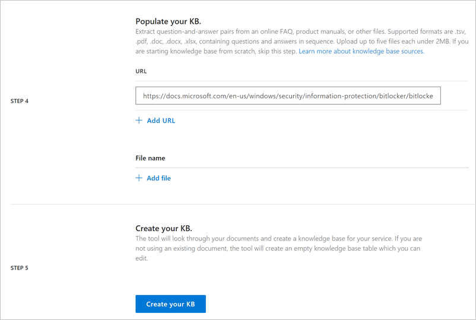
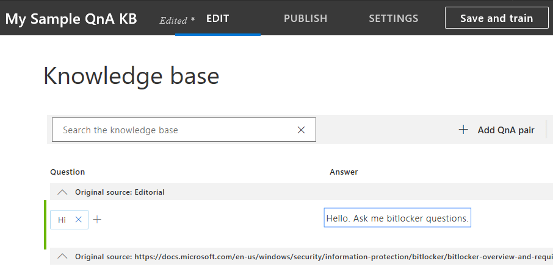
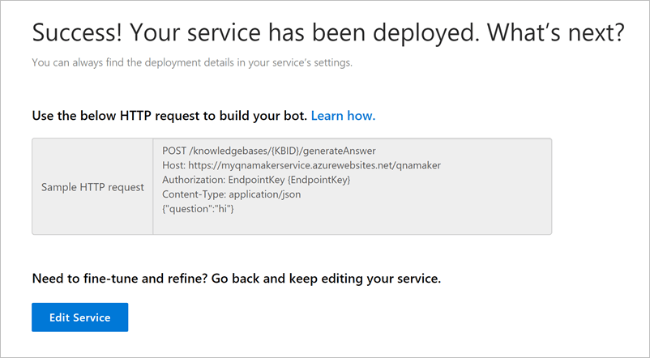

# Create, train, and publish your QnA Maker knowledge base

You can create a QnA Maker knowledge base (KB) from your own content, such as FAQs or product manuals. This article includes an example of creating a QnA Maker knowledge base from a simple FAQ webpage, to answer questions on BitLocker key recovery.

## Prerequisite

> [!div class="checklist"]
> * If you don't have an Azure subscription, create a [free account](https://azure.microsoft.com/free/?WT.mc_id=A261C142F) before you begin.

## Create a QnA Maker knowledge base

1. Sign in to the [QnAMaker.ai](https://QnAMaker.ai) portal with your Azure credentials.

1. On the QnA Maker portal, select **Create a knowledge base**.

   

1. On the **Create** page, in step 1, select **Create a QnA service**. You are directed to the [Azure portal](https://ms.portal.azure.com/#create/Microsoft.CognitiveServicesQnAMaker) to set up a QnA Maker service in your subscription. If the Azure portal times out, select **Try again** on the site. After you connect, your Azure dashboard appears.

1. After you successfully create a new QnA Maker service in Azure, return to qnamaker.ai/create. Select your QnA Maker service from the drop-down lists in step 2. If you created a new QnA Maker service, be sure to refresh the page.

   

1. In step 3, name your knowledge base **My Sample QnA KB**.

1. To add content to your knowledge base, select three types of data sources. In step 4, under **Populate your KB**, add the 
   [BitLocker Recovery FAQ](https://docs.microsoft.com/windows/security/information-protection/bitlocker/bitlocker-overview-and-requirements-faq) URL in the **URL** box.

   

1. In step 5, select **Create your KB**.

1. While QnA Maker creates the knowledge base, a pop-up window appears. The extraction process takes a few minutes to read the HTML page and identify questions and answers.

1. After QnA Maker successfully creates the knowledge base, the **Knowledge base** page opens. You can edit the contents of the knowledge base on this page.

## Edit the knowledge base

1. In the QnA Maker portal, on the **Edit** section, select **Add QnA pair** to add a new row to the knowledge base. Under **Question**, enter **Hi.** Under **Answer**, enter **Hello. Ask me BitLocker questions.**

    

1. In the upper right, select **Save and train** to save your edits and train the QnA Maker model. Edits aren't kept unless they're saved.

## Test the knowledge base

1. In the QnA Maker portal, in the upper right, select **Test** to test that the changes you made took effect. Enter `hi there` in the box, and select Enter. You should see the answer you created as a response.

1. Select **Inspect** to examine the response in more detail. The test window is used to test your changes to the knowledge base before they're published.

    

1. Select **Test** again to close the **Test** pop-up.

## Publish the knowledge base

When you publish a knowledge base, the question and answer contents of your knowledge base moves from the test index to a production index in Azure search.

1. In the QnA Maker portal, in the menu next to **Edit**, select **Publish**. Then to confirm, select **Publish** on the page.

1. The QnA Maker service is now successfully published. You can use the endpoint in your application or bot code.

    

## Create a bot

After publishing, you can create a bot from the **Publish** page: 

* You can create several bots quickly, all pointing to the same knowledge base for different regions or pricing plans for the individual bots. 
* If you want only one bot for the knowledge base, use the **View all your bots on the Azure portal** link to view a list of your current bots. 

When you make changes to the knowledge base and republish, you don't need to take further action with the bot. It's already configured to work with the knowledge base, and works with all future changes to the knowledge base. Every time you publish a knowledge base, all the bots connected to it are automatically updated.

1. In the QnA Maker portal, on the **Publish** page, select **Create bot**. This button appears only after you've published the knowledge base.

    

1. A new browser tab opens for the Azure portal, with the Azure Bot Service's creation page. Configure the Azure bot service. For more information on these configuration settings, see [Create a QnA Bot with Azure Bot Service v4](../tutorials/create-qna-bot.md).
    
    * Don't change the following settings in the Azure portal when creating the bot. They are pre-populated for your existing knowledge base: 
        * QnA Auth Key
        * App service plan and location
        * Azure Storage
    * The bot and QnA Maker can share the web app service plan, but can't share the web app. This means the **app name** must be different from the app name you used when you created the QnA Maker service. 

## Next steps

> [!div class="nextstepaction"]
> [Create a knowledge base](../How-To/create-knowledge-base.md)
