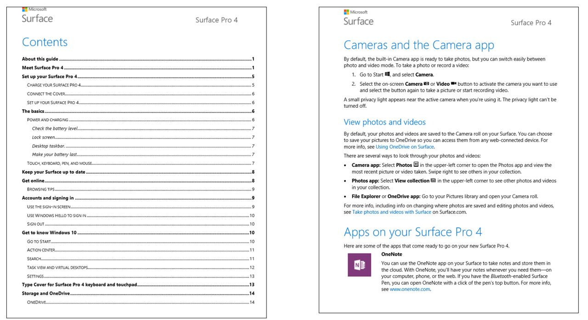
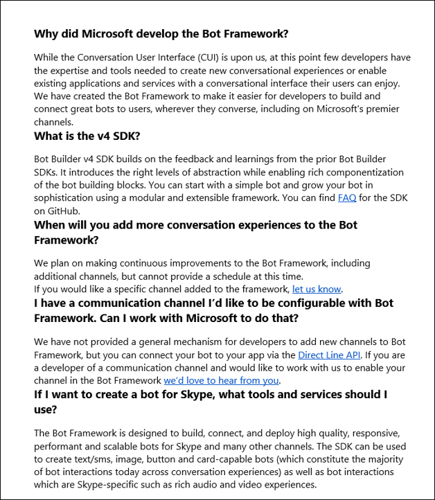
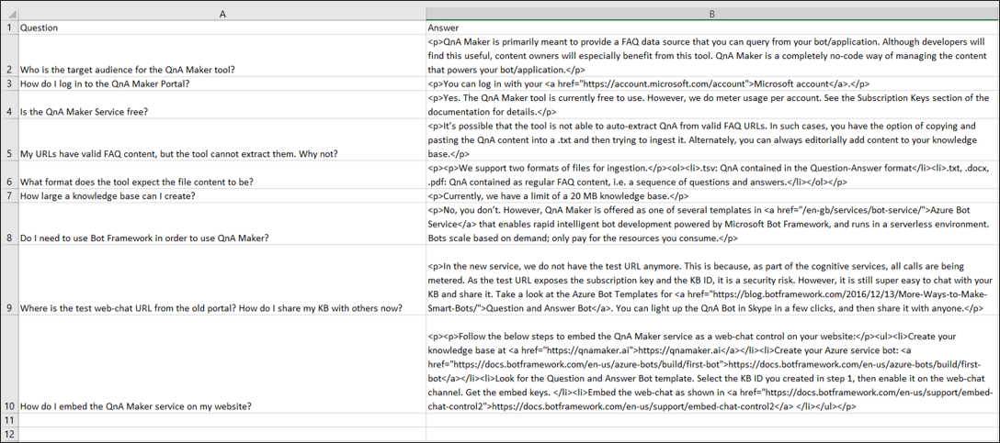
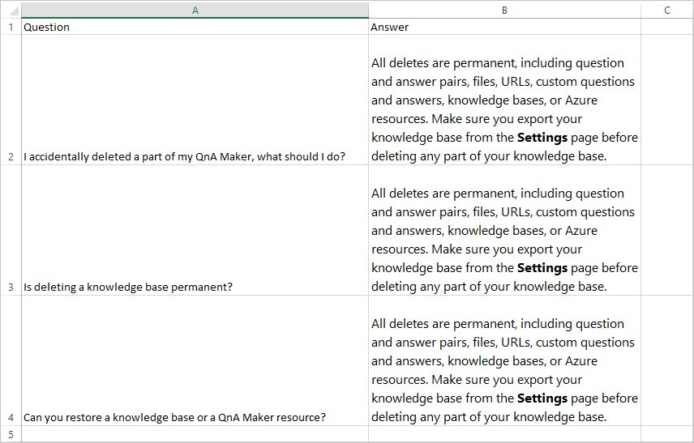
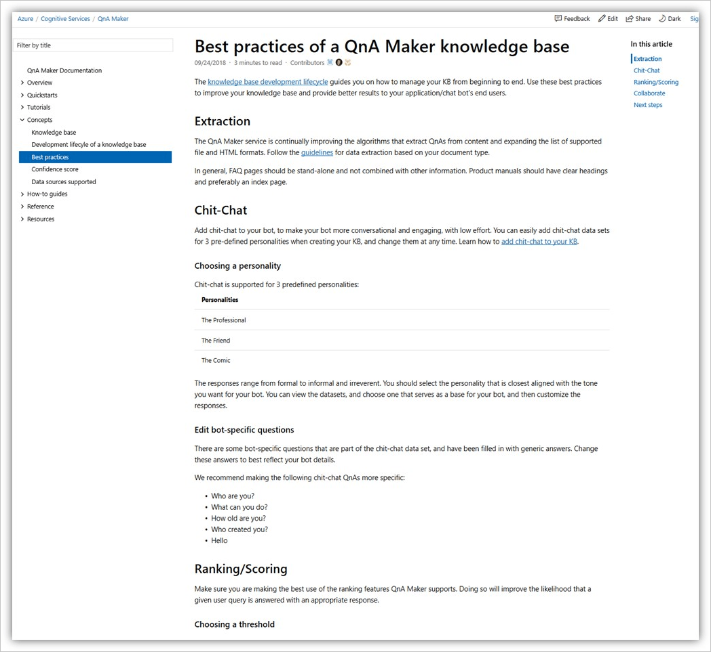

# Format guidelines for imported documents and URLs

Review these formatting guidelines to get the best results for your content.

## Formatting considerations

After importing a file or URL, QnA Maker converts and stores your content in the [markdown format](https://en.wikipedia.org/wiki/Markdown). The conversion process adds new lines in the text, such as `\n\n`. A knowledge of the markdown format helps you to understand the converted content and manage your knowledge base content.

If you add or edit your content directly in your knowledge base, use **markdown formatting** to create rich text content or change the markdown format content that is already in the answer. QnA Maker supports much of the markdown format to bring rich text capabilities to your content. However, the client application, such as a chat bot may not support the same set of markdown formats. It is important to test the client application's display of answers.

See a full list of [content types and examples](./concepts/data-sources-and-content.md#content-types-of-documents-you-can-add-to-a-knowledge-base).

## Basic document formatting

QnA Maker identifies sections and subsections and relationships in the file based on visual clues like:

* font size
* font style
* numbering
* colors

> [!NOTE]
> We don't support extraction of images from uploaded documents currently.

### Product manuals

A manual is typically guidance material that accompanies a product. It helps the user to set up, use, maintain, and troubleshoot the product. When QnA Maker processes a manual, it extracts the headings and subheadings as questions and the subsequent content as answers. See an example [here](https://download.microsoft.com/download/2/9/B/29B20383-302C-4517-A006-B0186F04BE28/surface-pro-4-user-guide-EN.pdf).

Below is an example of a manual with an index page, and hierarchical content

 

> [!NOTE]
> Extraction works best on manuals that have a table of contents and/or an index page, and a clear structure with hierarchical headings.

### Brochures, guidelines, papers, and other files

Many other types of documents can also be processed to generate QA pairs, provided they have a clear structure and layout. These include: Brochures, guidelines, reports, white papers, scientific papers, policies, books, etc. See an example [here](https://qnamakerstore.blob.core.windows.net/qnamakerdata/docs/Manage%20Azure%20Blob%20Storage.docx).

Below is an example of a semi-structured doc, without an index:

 

### Structured QnA Document

The format for structured Question-Answers in DOC files, is in the form of alternating Questions and Answers per line, one question per line followed by its answer in the following line, as shown below:

```text
Question1

Answer1

Question2

Answer2
```

Below is an example of a structured QnA word document:

 

### Structured *TXT*, *TSV* and *XLS* Files

QnAs in the form of structured *.txt*, *.tsv* or *.xls* files can also be uploaded to QnA Maker to create or augment a knowledge base.  These can either be plain text, or can have content in RTF or HTML.

| Question  | Answer  | Metadata (1 key: 1 value) |
|-----------|---------|-------------------------|
| Question1 | Answer1 | <code>Key1:Value1 &#124; Key2:Value2</code> |
| Question2 | Answer2 |      `Key:Value`           |

Any additional columns in the source file are ignored.

#### Example of structured Excel file

Below is an example of a structured QnA *.xls* file, with HTML content:

 

#### Example of alternate questions for single answer in Excel file

Below is an example of a structured QnA *.xls* file, with several alternate questions for a single answer:

 

After the file is imported, the question-and-answer pair is in the knowledge base as shown below:

 

### Structured data format through import

Importing a knowledge base replaces the content of the existing knowledge base. Import requires a structured .tsv file that contains data source information. This information helps QnA Maker group the question-answer pairs and attribute them to a particular data source.

| Question  | Answer  | Source| Metadata (1 key: 1 value) |
|-----------|---------|----|---------------------|
| Question1 | Answer1 | Url1 | <code>Key1:Value1 &#124; Key2:Value2</code> |
| Question2 | Answer2 | Editorial|    `Key:Value`       |

<a href="#formatting-considerations"></a>

### Multi-turn document formatting

* Use headings and sub-headings to denote hierarchy. For example You can h1 to denote the parent QnA and h2 to denote the QnA that should be taken as prompt. Use small heading size to denote subsequent hierarchy. Don't use style, color, or some other mechanism to imply structure in your document, QnA Maker will not extract the multi-turn prompts.
* First character of heading must be capitalized.
* Do not end a heading with a question mark, `?`.

**Sample documents**:<br>[Surface Pro (docx)](https://github.com/Azure-Samples/cognitive-services-sample-data-files/blob/master/qna-maker/data-source-formats/multi-turn.docx)<br>[Contoso Benefits (docx)](https://github.com/Azure-Samples/cognitive-services-sample-data-files/blob/master/qna-maker/data-source-formats/Multiturn-ContosoBenefits.docx)<br>[Contoso Benefits (pdf)](https://github.com/Azure-Samples/cognitive-services-sample-data-files/blob/master/qna-maker/data-source-formats/Multiturn-ContosoBenefits.pdf)

## FAQ URLs

QnA Maker can support FAQ web pages in 3 different forms:

* Plain FAQ pages
* FAQ pages with links
* FAQ pages with a Topics Homepage

### Plain FAQ pages

This is the most common type of FAQ page, in which the answers immediately follow the questions in the same page.

Below is an example of a plain FAQ page:


### FAQ pages with links

In this type of FAQ page, questions are aggregated together and are linked to answers that are either in different sections of the same page, or in different pages.

Below is an example of an FAQ page with links in sections that are on the same page:

 


### Parent Topics page links to child answers pages

This type of FAQ has a Topics page where each topic is linked to a corresponding set of questions and answers on a different page. QnA Maker crawls all the linked pages to extract the corresponding questions & answers.

Below is an example of a Topics page with links to FAQ sections in different pages.

 

### Support URLs

QnA Maker can process semi-structured support web pages, such as web articles that would describe how to perform a given task, how to diagnose and resolve a given problem, and what are the best practices for a given process. Extraction works best on content that has a clear structure with hierarchical headings.

> [!NOTE]
> Extraction for support articles is a new feature and is in early stages. It works best for simple pages, that are well structured, and do not contain complex headers/footers.



## Import and export knowledge base

**TSV and XLS files**, from exported knowledge bases, can only be used by importing the files from the **Settings** page in the QnA Maker portal. They can't be used as data sources during knowledge base creation or from the **+ Add file** or **+ Add URL** feature on the **Settings** page. 

When you import the Knowledge base through these **TSV and XLS files**, the QnA pairs get added to the editorial source and not the sources from which the QnAs were extracted in the exported Knowledge Base. 


## Next steps

See a full list of [content types and examples](./concepts/data-sources-and-content.md#content-types-of-documents-you-can-add-to-a-knowledge-base)
