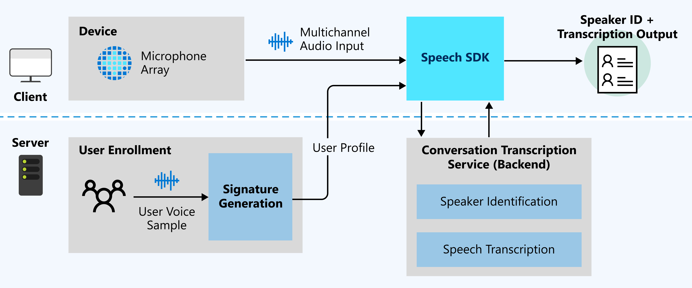

# What is Conversation Transcription?

Conversation Transcription is an advanced feature of the Speech Services that combines real-time speech recognition, speaker identification, and diarization. Conversation Transcription is perfect for transcribing in-person meetings, with the ability to distinguish speakers, it lets you know who said what and when, allowing participants to focus on the meeting and quickly follow up on next steps. This feature also improves accessibility. With transcription, you can actively engage participants with hearing impairments.   

Conversation Transcription delivers accurate recognition with customizable speech models that you can tailor to understand industry and company-specific vocabulary. Additionally, you can pair Conversation Transcription with the Speech Devices SDK to optimize the experience for multi-microphone devices.

>[!NOTE]
> Currently, Conversation Transcription is recommended for small meetings. If you'd like to extend the Conversation Transcription for large meetings at scale, please contact us.

This diagram illustrates the hardware, software, and services that work together with Conversation Transcription.

>[!IMPORTANT]
> A circular seven microphone array with specific geometry configuration is required. For specification and design details, see [Microsoft Speech Device SDK Microphone](https://aka.ms/cts/microphone). To learn more or purchase a development kit, see [Get Microsoft Speech Device SDK](https://aka.ms/cts/getsdk).

## Get started with Conversation Transcription

There are three steps that you need to take to get started with Conversation Transcription.

1. Collect voice samples from users.
2. Generate user profiles using the user voice samples
3. Use the Speech SDK to identify users (speakers) and transcribe speech

## Collect user voice samples

The first step is to collect audio recordings from each user. User speech should be recorded in a quiet environment without background noise. The recommended length for each audio sample is between 30 seconds and two minutes. Longer audio samples will result in improved accuracy when identifying speakers. Audio must be mono channel with a 16 KHz sample rate.

Beyond the aforementioned guidance, how audio is recorded and stored is up to you -- a secure database is recommended. In the next section, we'll review how this audio is used to generate user profiles that are used with the Speech SDK to recognize speakers.

## Generate user profiles

Next, you'll need to send the audio recordings you've collected to the Signature Generation Service to validate the audio and generate user profiles. The [Signature Generation Service](https://aka.ms/cts/signaturegenservice) is a set of REST APIs, that allow you generate and retrieve user profiles.

To create a user profile, you'll need to use the `GenerateVoiceSignature` API. Specification details and sample code are available:

> [!NOTE]
> Conversation Transcription is currently available in "en-US" and "zh-CN" in the following regions: `centralus` and `eastasia`.

* [REST specification](https://aka.ms/cts/signaturegenservice)
* [How to use Conversation Transcription](https://aka.ms/cts/howto)

## Transcribe and identify speakers

Conversation Transcription expects multichannel audio streams and user profiles as inputs to generate transcriptions and identify speakers. Audio and user profile data are sent to Conversation Transcription service using the Speech Devices SDK. As previously mentioned, a circular seven microphone array and the Speech Devices SDK are required to use Conversation Transcription.

>[!NOTE]
> For specification and design details, see [Microsoft Speech Device SDK Microphone](https://aka.ms/cts/microphone). To learn more or purchase a development kit, see [Get Microsoft Speech Device SDK](https://aka.ms/cts/getsdk).

To learn how to use Conversation Transcription with the Speech Devices SDK, see [How to use conversation transcription](https://aka.ms/cts/howto).

## Quick Start with a sample app

Microsoft Speech Device SDK has a quick start sample app for all device related samples. Conversation Transcription is one of them. You can find it in [Speech Device SDK android quickstart](https://aka.ms/sdsdk-quickstart) with sample app and its source code for your reference.

## Next steps

> [!div class="nextstepaction"]
> [Learn more about the Speech Devices SDK](speech-devices-sdk.md)
