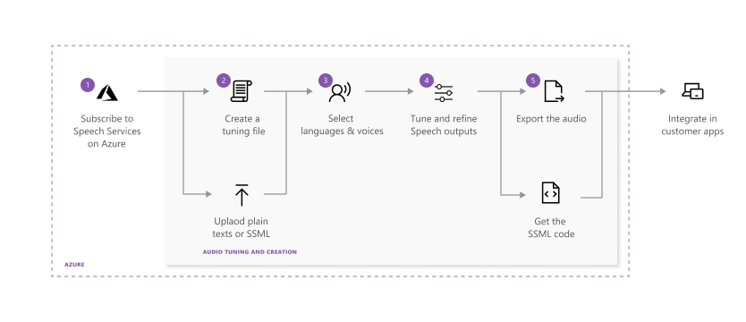

# Improve synthesis with the Audio Content Creation tool

[Audio Content Creation](https://aka.ms/audiocontentcreation) is an online tool that allows you to customize and fine-tune Microsoft's text-to-speech output for your apps and products. You can use this tool to fine-tune public and custom voices for more accurate natural expressions, and manage your output in the cloud.

The Audio Content Creation tool is based on [Speech Synthesis Markup Language (SSML)](speech-synthesis-markup.md). To simplify customization and tuning, Audio Content Creation allows you to visually inspect your text-to-speech outputs in real time.

See the [video tutorial](https://www.youtube.com/watch?v=O1wIJ7mts_w) for Audio Content Creation.

## How does it work?

This diagram shows the steps it takes to fine-tune text-to-speech outputs. Use the links below to learn more about each step.



1. [Set up your Azure account and Speech resource](#set-up-your-azure-account-and-speech-resource) to get started.
2. [Create an audio tuning file](#create-an-audio-tuning-file) using plain text or SSML scripts.
3. Choose the voice and the language for your script content. Audio Content Creation includes all of the [Microsoft text-to-speech voices](language-support.md#text-to-speech). You can use standard, neural, or your own custom voice.
   >[!NOTE]
   > Gated access is available for Custom Neural Voices, which allow you to create high-definition voices similar to natural-sounding speech. For additional details, see [Gating process](https://aka.ms/ignite2019/speech/ethics).

4. Review the default synthesis output. Then improve the output by adjusting pronunciation, break, pitch, rate, intonation, voice style, and more. For a complete list of options, see [Speech Synthesis Markup Language](speech-synthesis-markup.md). Here is a [video](https://youtu.be/mUvf2NbfuYU) to show how to fine-tune speech output with Audio Content Creation. 
5. Save and [export your tuned audio](#export-tuned-audio). When you save the tuning track in the system, you can continue to work and iterate on the output. When you're satisfied with the output, you can create an audio creation task with the export feature. You can observe the status of the export task, and download the output for use with your apps and products.

## Set up your Azure account and Speech resource

1. To work with Audio Content Creation, you must have an Azure account. You can create an Azure account by using your Microsoft Account. Follow these instructions to [set up an Azure account](get-started.md#new-resource). 
2. [Create a Speech resource](https://docs.microsoft.com/azure/cognitive-services/speech-service/get-started#create-the-resource) to your Azure account. Make sure that your pricing tier is set to **S0**. If you are using one of the Neural voices, make sure that you create your resource in a [supported region](regions.md#standard-and-neural-voices).
2. After you get the Azure account and the speech resource, you can use speech services and access [Audio Content Creation](https://aka.ms/audiocontentcreation).
3. Select the Speech resource you need to work on. You can also create a new Speech resource here. 
4. You can modify your Speech resource at any time with the **Settings** option, located in the top nav.

## Create an audio tuning file

There are two ways to get your content into the Audio Content Creation tool.

**Option 1:**

1. Click **New file** to create a new audio tuning file.
2. Type or paste your content into the editing window. The characters for each file is up to 20,000. If your script is longer than 20,000 characters, you can use Option 2 to automatically split your content into multiple files. 
3. Don't forget to save.

**Option 2:**

1. Click **Upload** to import one or more text files. Both plain text and SSML are supported.
2. If your script file is more than 20,000 characters, please split the file by paragraphs, by character or by regular expressions. 
3. When you upload your text files, make sure that the file meets these requirements.

   | Property | Value / Notes |
   |----------|---------------|
   | File format | Plain text (.txt)<br/> SSML text (.txt)<br/> Zip files aren't supported |
   | Encoding format | UTF-8 |
   | File name | Each file must have a unique name. Duplicates aren't supported. |
   | Text length | Text files must not exceed 20,000 characters. |
   | SSML restrictions | Each SSML file can only contain a single piece of SSML. |

### Plain text example

```txt
Welcome to use Audio Content Creation to customize audio output for your products.
```

### SSML text example

```xml
<speak xmlns="http://www.w3.org/2001/10/synthesis" xmlns:mstts="http://www.w3.org/2001/mstts" version="1.0" xml:lang="en-US">
    <voice name="Microsoft Server Speech Text to Speech Voice (en-US, AriaNeural)">
    Welcome to use Audio Content Creation <break time="10ms" />to customize audio output for your products.
    </voice>
</speak>
```

## Export tuned audio

After you've reviewed your audio output and are satisfied with your tuning and adjustment, you can export the audio.

1. Click **Export** to create an audio creation task. **Export to Audio Library** is recommended as it supports the long audio output and the full audio output experience. You can also download the audio to your local disk directly, but only the first 10 minutes are available. 
2. Choose the output format for your tuned audio. A list of supported formats and sample rates is available below.
3. You can view the status of the task on the **Export task** tab. If the task fails, see the detailed information page for a full report.
4. When the task is complete, your audio is available for download on the **Audio Library** tab.
5. Click **Download**. Now you're ready to use your custom tuned audio in your apps or products.

### Supported audio formats

| Format | 16 kHz sample rate | 24 kHz sample rate |
|--------|--------------------|--------------------|
| wav | riff-16khz-16bit-mono-pcm | riff-24khz-16bit-mono-pcm |
| mp3 | audio-16khz-128kbitrate-mono-mp3 | audio-24khz-160kbitrate-mono-mp3 |

## See also

* [Long Audio API](https://aka.ms/long-audio-api)

## Next steps

> [!div class="nextstepaction"]
> [Speech Studio](https://speech.microsoft.com)
