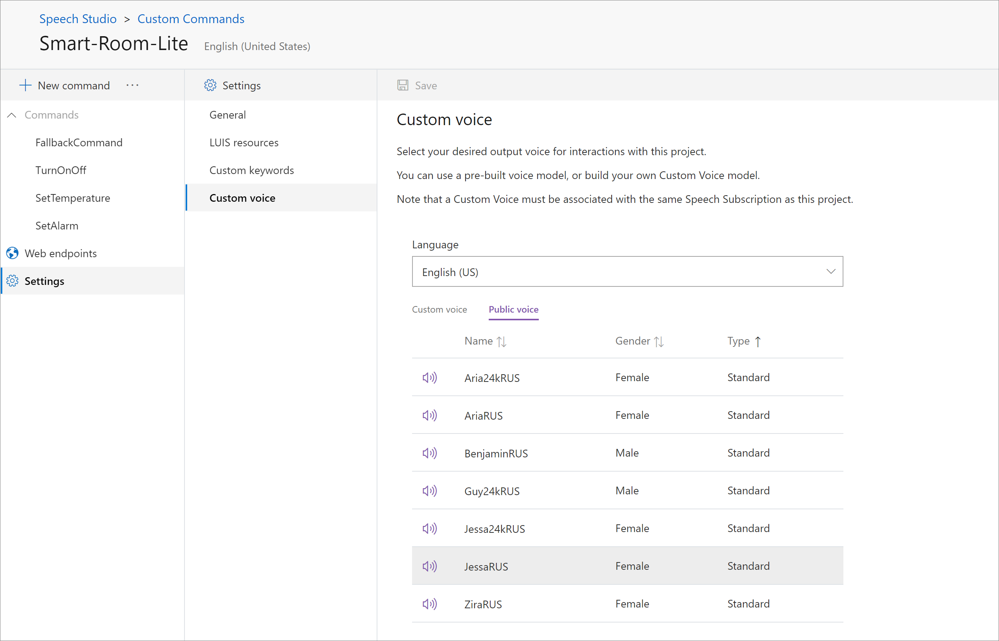

# Add language generation templates for speech responses

In this article, you learn how to use language generation templates with Custom Commands. Language generation templates allow you to customize the responses sent to the client, and introduce variance in the responses. Language generation customization can be achieved by:

- Use of language generation templates
- Use of adaptive expressions

## Prerequisites

You must have completed the steps in the following articles:

> [!div class="checklist"]
> * [How To: Create application with simple commands](./how-to-custom-commands-create-application-with-simple-commands.md)
> * [How To: Add parameters to commands](./how-to-custom-commands-add-parameters-to-commands.md)

## Language generation templates overview

Custom Commands templates are based on the BotFramework's [LG templates](/azure/bot-service/file-format/bot-builder-lg-file-format#templates). Since Custom Commands creates a new LG template when required (that is, for speech responses in parameters or actions) you do not have to specify the name of the LG template. So, instead of defining your template as:

 ```
    # CompletionAction
    - Ok, turning {OnOff} the {SubjectDevice}
    - Done, turning {OnOff} the {SubjectDevice}
    - Proceeding to turn {OnOff} {SubjectDevice}
 ```

You only need to define the body of the template without the name, as follows.

> [!div class="mx-imgBorder"]
> 


This change introduces variation to the speech responses being sent to the client. So, for the same utterance, the corresponding speech response would be randomly picked out of the options provided.

Taking advantage of LG templates also allows you to define complex speech responses for commands using adaptive expressions. You can refer to the [LG templates format](/azure/bot-service/file-format/bot-builder-lg-file-format#templates) for more details. Custom Commands by default supports all the capabilities with the following minor differences:

* In the LG templates entities are represented as ${entityName}. In Custom Commands we don't use entities but parameters can be used as variables with either one of these representations ${parameterName} or {parameterName}
* Template composition and expansion are not supported in Custom Commands. This is because you never edit the `.lg` file directly, but only the responses of automatically created templates.
* Custom functions injected by LG  are not supported in Custom Commands. Predefined functions are still supported.
* Options (strict, replaceNull & lineBreakStyle) are not supported in Custom Commands.

## Add template responses to TurnOnOff command

Modify the **TurnOnOff** command to add a new parameter with the following configuration:

| Setting            | Suggested value       | 
| ------------------ | --------------------- | 
| Name               | `SubjectContext`         | 
| Is Global          | unchecked             | 
| Required           | unchecked               | 
| Type               | String                |
| Default value      | `all` |
| Configuration      | Accept predefined input values from internal catalog | 
| Predefined input values | `room`, `bathroom`, `all`|

### Modify completion rule

Edit the **Actions** section of existing completion rule **ConfirmationResponse**. In the **Edit action** pop-up, switch to **Template Editor** and replace the text with the following example.

```
- IF: @{SubjectContext == "all" && SubjectDevice == "lights"}
    - Ok, turning all the lights {OnOff}
- ELSEIF: @{SubjectDevice == "lights"}
    - Ok, turning {OnOff} the {SubjectContext} {SubjectDevice}
- ELSE:
    - Ok, turning the {SubjectDevice} {OnOff}
    - Done, turning {OnOff} the {SubjectDevice}
```

**Train** and **Test** your application as follows. Notice the variation of responses due to usage of multiple alternatives of the template value, and also use of adaptive expressions.

* Input: turn on the tv
* Output: Ok, turning the tv on
* Input: turn on the tv
* Output: Done, turned on the tv
* Input: turn off the lights
* Output: Ok, turning all the lights off
* Input: turn off room lights
* Output: Ok, turning off the room lights

## Use Custom Voice

Another way to customize Custom Commands responses is to select a custom output voice. Use the following steps to switch the default voice to a custom voice.

1. In your custom commands application, select **Settings** from the left pane.
1. Select **Custom Voice** from the middle pane.
1. Select the desired custom or public voice from the table.
1. Select **Save**.

> [!div class="mx-imgBorder"]
> 

> [!NOTE]
> - For **Public voices**, **Neural types** are only available for specific regions. To check availability, see [standard and neural voices by region/endpoint](./regions.md#standard-and-neural-voices).
> - For **Custom voices**, they can be created from the Custom Voice project page. See [Get Started with Custom Voice](./how-to-custom-voice.md).

Now the application will respond in the selected voice, instead of the default voice.

## Next steps

> [!div class="nextstepaction"]
> [Integrate your Custom Commands using the Speech SDK](./how-to-custom-commands-setup-speech-sdk.md).