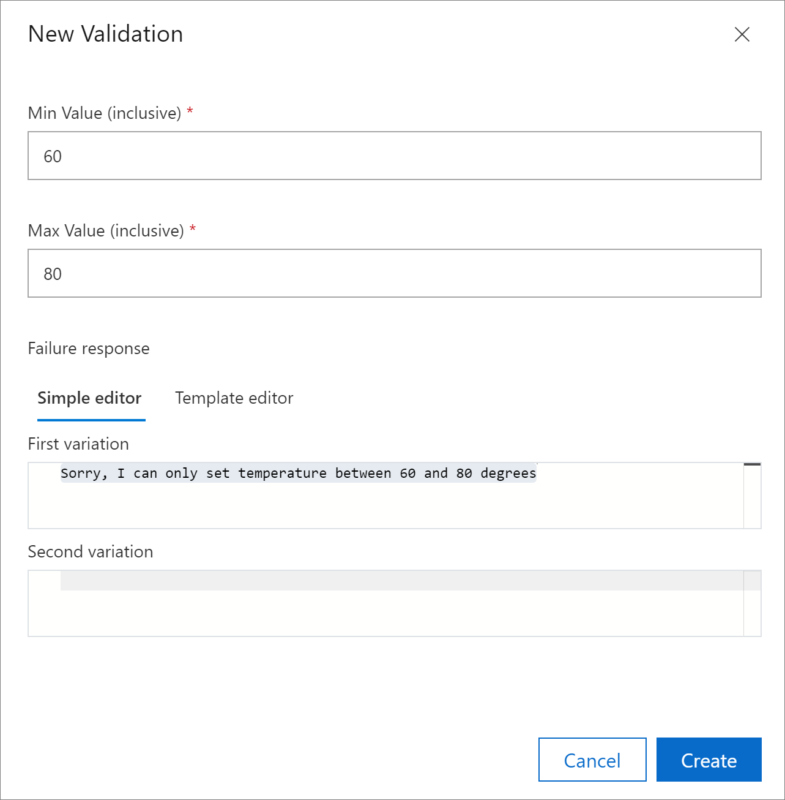

# Add configurations to commands parameters

In this article, you learn more about advanced parameter configuration, including:

 - How parameter values can belong to a set defined externally to custom commands application
 - How to add validation clauses on the value of the parameters

## Prerequisites

You must have completed the steps in the following articles:

> [!div class="checklist"]
> * [How To: Create application with simple commands](./how-to-custom-commands-create-application-with-simple-commands.md)
> * [How To: Add parameters to commands](./how-to-custom-commands-add-parameters-to-commands.md)


## Configure parameter as external catalog entity

In this section, you configure string-type parameters to refer to external catalogs hosted over a web endpoint. This allows you to update the external catalog independently without making edits to the Custom Commands application. This approach is useful in cases where the catalog entries can be large in number.

Reuse the **SubjectDevice** parameter from the **TurnOnOff** command. The current configuration for this parameter is **Accept predefined inputs from internal catalog**. This refers to static list of devices as defined in the parameter configuration. We want to move out this content to an external data source which can be updated independently.

To do this, start by adding a new web endpoint. Go to **Web endpoints** section in the left pane and add a new web endpoint with the following configuration.

| Setting | Suggested value |
|----|----|
| Name | `getDevices` |
| URL | `https://aka.ms/speech/cc-sampledevices` |
| Method | GET |


If the suggested value for URL doesn't work for you, you need to configure and host a simple web endpoint which returns a json consisting of list of the devices which can be controlled. The web endpoint should return a json formatted as follows:
    
```json
{
    "fan" : [],
    "refrigerator" : [
        "fridge"
    ],
    "lights" : [
        "bulb",
        "bulbs",
        "light"
        "light bulb"
    ],
    "tv" : [
        "telly",
        "television"
        ]
}

```


Next go the **SubjectDevice** parameter settings page and change the properties to the following.

| Setting | Suggested value |
| ----| ---- |
| Configuration | Accept predefined inputs from external catalog |                               
| Catalog endpoint | getDevices |
| Method | GET |

Then, select **Save**.

> [!IMPORTANT]
> You won't see an option to configure a parameter to accept inputs from an external catalog unless you have the web endpoint set in the **Web endpoint** section in the left pane.

### Try it out

Select **Train** and wait for training completion. Once training completes, select **Test** and try a few interactions.

* Input: turn on
* Output: Which device do you want to control?
* Input: lights
* Output: Ok, turning the lights on

> [!NOTE]
> Notice how you can control all the devices hosted on the web endpoint now. You still need to train the application for testing out the new changes and re-publish the application.

## Add validation to parameters

**Validations** are constructs applicable to certain parameter types which allow you to configure constraints on the parameter's value, and prompt for correction if values to do not fall within the constraints. For full list of parameter types extending the validation construct, go to [references](./custom-commands-references.md)

Test out validations using the **SetTemperature** command. Use the following steps to add a validation for the **Temperature** parameter.

1. Select **SetTemperature** command in the left pane.
1. Select  **Temperature** in the middle pane.
1. Select **Add a validation** present in the right pane.
1. In the **New validation** window, configure validation as follows, and select **Create**.


    | Parameter Configuration | Suggested value | Description |
    | ---- | ---- | ---- |
    | Min Value | `60` | For Number parameters, the minimum value this parameter can assume |
    | Max Value | `80` | For Number parameters, the maximum value this parameter can assume |
    | Failure response |  Simple editor > First Variation > `Sorry, I can only set temperature between 60 and 80 degrees. What temperature do you want?` | Prompt to ask for a new value if the validation fails |

    > [!div class="mx-imgBorder"]
    > 

### Try it out

1. Select **Train** icon present on top of the right pane.

1. Once, training completes, select **Test** and try a few interactions:

    - Input: Set the temperature to 72 degrees
    - Output: Ok, setting temperature to 72 degrees
    - Input: Set the temperature to 45 degrees
    - Output: Sorry, I can only set temperature between 60 and 80 degrees
    - Input: make it 72 degrees instead
    - Output: Ok, setting temperature to 72 degrees

## Next steps

> [!div class="nextstepaction"]
> [How To: Add interaction rules](./how-to-custom-commands-add-interaction-rules.md)
