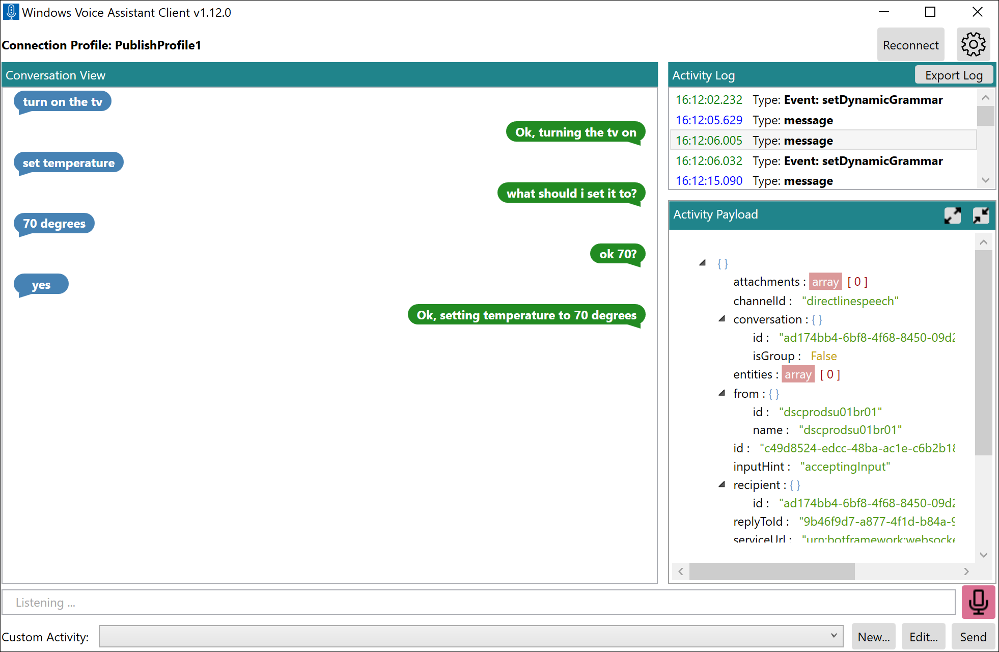

# Test your Custom Commands Application

In this article, you learn different approaches to testing a custom commands application.

## Test in the portal

Test in the portal is the simplest and quickest way to check if your custom command application work as expected. After the app is successfully trained, click `Test` button to start testing.

> [!div class="mx-imgBorder"]
> 

## Test with Windows Voice Assistant Client

The Windows Voice Assistant Client is a Windows Presentation Foundation (WPF) application in C# that makes it easy to test interactions with your bot before creating a custom client application.

The tool can accept a custom command application ID. It allows you to test your task completion or command-and-control scenario hosted on the Custom Commands service.

To set up the client, checkout [Windows Voice Assistant Client](https://github.com/Azure-Samples/Cognitive-Services-Voice-Assistant/tree/master/clients/csharp-wpf).

> [!div class="mx-imgBorder"]
> 

## Test with Speech SDK-enabled client applications 
The Speech software development kit (SDK) exposes many of the Speech service capabilities, which allows you to develop speech-enabled applications. It's also available in many programming languages and across all platforms.

To set up a Universal Windows Platform (UWP) client application with Speech SDK, and integrate it with your custom command application:  
- [How to: Integrate with a client application using Speech SDK](./how-to-custom-commands-setup-speech-sdk.md)
- [How to: Send activity to client application](./how-to-custom-commands-send-activity-to-client.md)
- [How to: Set up web endpoints](./how-to-custom-commands-setup-web-endpoints.md)

For other programming languages and platforms:
- [Speech SDK programming languages, platforms, scenario capacities](https://docs.microsoft.com/azure/cognitive-services/speech-service/speech-sdk)
- [Voice assistant sample codes](https://github.com/Azure-Samples/Cognitive-Services-Voice-Assistant)

## Next steps

> [!div class="nextstepaction"]
> [See samples on GitHub](https://aka.ms/speech/cc-samples)

