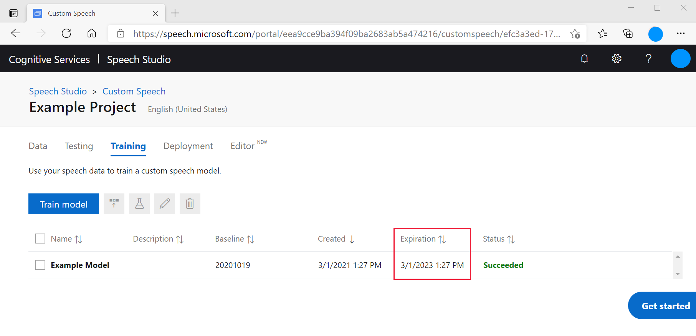
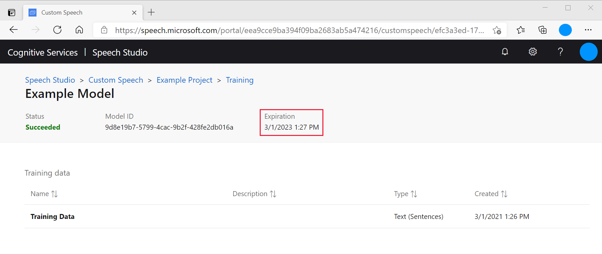

# Model and Endpoint lifecycle

Custom Speech uses both *base models* and *custom models*. Each language has one or more base models. Generally, when a new speech model is released to the regular speech service, it's also imported to the Custom Speech service as a new base model. They're updated every 6 to 12 months. Older models typically become less useful over time because the newest model usually has higher accuracy.

In contrast, custom models are created by adapting a chosen base model with data from your particular customer scenario. You can keep using a particular custom model for a long time after you have one that meets your needs. But we recommend that you periodically update to the latest base model and retrain it over time with additional data. 

Other key terms related to the model lifecycle include:

* **Adaptation**: Taking a base model and customizing it to your domain/scenario by using text data and/or audio data.
* **Decoding**: Using a model and performing speech recognition (decoding audio into text).
* **Endpoint**: A user-specific deployment of either a base model or a custom model that's accessible *only* to a given user.

### Expiration timeline

As new models and new functionality become available and older, less accurate models are retired, see the following timelines for model and endpoint expiration:

**Base models** 

* Adaptation: Available for one year. After the model is imported, it's available for one year to create custom models. After one year, new custom models must be created from a newer base model version.  
* Decoding: Available for two years after import. So you can create an endpoint and use batch transcription for two years with this model. 
* Endpoints: Available on the same timeline as decoding.

**Custom models**

* Decoding: Available for two years after the model is created. So you can use the custom model for two years (batch/realtime/testing) after it's created. After two years, *you should retrain your model* because the base model will usually have been deprecated for adaptation.  
* Endpoints: Available on the same timeline as decoding.

When either a base model or custom model expires, it will always fall back to the *newest base model version*. So your implementation will never break, but it might become less accurate for *your specific data* if custom models reach expiration. You can see the expiration for a model in the following places in the Custom Speech area of the Speech Studio:

* Model training summary
* Model training detail
* Deployment summary
* Deployment detail

Here is an example form the model training summary:


And also from the model training detail page:



You can also check the expiration dates via the [`GetModel`](https://westus.dev.cognitive.microsoft.com/docs/services/speech-to-text-api-v3-0/operations/GetModel) and [`GetBaseModel`](https://westus.dev.cognitive.microsoft.com/docs/services/speech-to-text-api-v3-0/operations/GetBaseModel) custom speech APIs under the `deprecationDates` property in the JSON response.

Here is an example of the expiration data from the GetModel API call. The "DEPRECATIONDATES" show the : 
```json
{
    "SELF": "HTTPS://WESTUS2.API.COGNITIVE.MICROSOFT.COM/SPEECHTOTEXT/V3.0/MODELS/{id}",
    "BASEMODEL": {
    "SELF": HTTPS://WESTUS2.API.COGNITIVE.MICROSOFT.COM/SPEECHTOTEXT/V3.0/MODELS/BASE/{id}
    },
    "DATASETS": [
    {
        "SELF": https://westus2.api.cognitive.microsoft.com/speechtotext/v3.0/datasets/{id}
    }
    ],
    "LINKS": {
    "MANIFEST": "HTTPS://WESTUS2.API.COGNITIVE.MICROSOFT.COM/SPEECHTOTEXT/V3.0/MODELS/{id}/MANIFEST",
    "COPYTO": https://westus2.api.cognitive.microsoft.com/speechtotext/v3.0/models/{id}/copyto
    },
    "PROJECT": {
        "SELF": https://westus2.api.cognitive.microsoft.com/speechtotext/v3.0/projects/{id}
    },
    "PROPERTIES": {
    "DEPRECATIONDATES": {
        "ADAPTATIONDATETIME": "2022-01-15T00:00:00Z",     // last date this model can be used for adaptation
        "TRANSCRIPTIONDATETIME": "2023-03-01T21:27:29Z"   // last date this model can be used for decoding
    }
    },
    "LASTACTIONDATETIME": "2021-03-01T21:27:40Z",
    "STATUS": "SUCCEEDED",
    "CREATEDDATETIME": "2021-03-01T21:27:29Z",
    "LOCALE": "EN-US",
    "DISPLAYNAME": "EXAMPLE MODEL",
    "DESCRIPTION": "",
    "CUSTOMPROPERTIES": {
    "PORTALAPIVERSION": "3"
    }
}
```
Note that you can upgrade the model on a custom speech endpoint without downtime by changing the model used by the endpoint in the deployment section of the Speech Studio, or via the custom speech API.

## Next steps

* [Train and deploy a model](how-to-custom-speech-train-model.md)

## Additional resources

* [Prepare and test your data](./how-to-custom-speech-test-and-train.md)
* [Inspect your data](how-to-custom-speech-inspect-data.md)