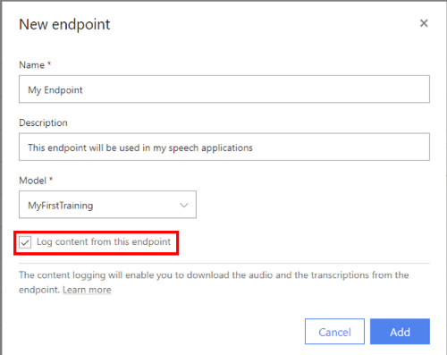

# Train and deploy a Custom Speech model

In this article, you'll learn how to train and deploy Custom Speech models. Training a speech-to-text model can improve recognition accuracy for the Microsoft baseline model. You use human-labeled transcriptions and related text to train a model. These datasets, along with previously uploaded audio data, are used to refine and train the speech-to-text model.

## Use training to resolve accuracy problems

If you're encountering recognition problems with a base model, you can use human-labeled transcripts and related data to train a custom model and help improve accuracy. Use this table to determine which dataset to use to address your problems:

| Use case | Data type |
| -------- | --------- |
| Improve recognition accuracy on industry-specific vocabulary and grammar, like medical terminology or IT jargon | Related text (sentences/utterances) |
| Define the phonetic and displayed form of a word or term that has nonstandard pronunciation, like product names or acronyms | Related text (pronunciation) |
| Improve recognition accuracy on speaking styles, accents, or specific background noises | Audio + human-labeled transcripts |

## Train and evaluate a model

The first step to train a model is to upload training data. See [Prepare and test your data](./how-to-custom-speech-test-and-train.md) for step-by-step instructions to prepare human-labeled transcriptions and related text (utterances and pronunciations). After you upload training data, follow these instructions to start training your model:

1. Sign in to the [Custom Speech portal](https://speech.microsoft.com/customspeech). If you plan to train a model with audio + human-labeled transcription datasets, pick a Speech subscription in a [region with dedicated hardware](custom-speech-overview.md#set-up-your-azure-account) for training.
2. Go to **Speech-to-text** > **Custom Speech** > **[name of project]** > **Training**.
3. Select **Train model**.
4. Give your training a **Name** and **Description**.
5. In the **Scenario and Baseline model** list, select the scenario that best fits your domain. If you're not sure which scenario to choose, select **General**. The baseline model is the starting point for training. The latest model is usually the best choice.
6. On the **Select training data** page, choose one or more related text datasets or audio + human-labeled transcription datasets that you want to use for training. When you train a new model, start with related text; training with audio + human-labeled transcription might take much longer (up to [several days](how-to-custom-speech-evaluate-data.md#improve-model-recognition)).
7. After training is complete, you can do accuracy testing on the newly trained model. This step is optional.
8. Select **Create** to build your custom model.

The **Training** table displays a new entry that corresponds to the new model. The table also displays the status: **Processing**, **Succeeded**, or **Failed**.

See the [how-to](how-to-custom-speech-evaluate-data.md) on evaluating and improving Custom Speech model accuracy. If you choose to test accuracy, it's important to select an acoustic dataset that's different from the one you used with your model to get a realistic sense of the model's performance.

> [!NOTE]
> Both base models and custom  models can be used only up to a certain date (see [Model lifecycle](custom-speech-overview.md#model-lifecycle)). Speech Studio shows this date in the **Expiration** column for each model and endpoint. After that date request to an endpoint or to batch transcription  might fail or fall back to base model.
>
> Retrain your model using the then most recent base model to benefit from accuracy improvements and to avoid that your model expires.

## Deploy a custom model

After you upload and inspect data, evaluate accuracy, and train a custom model, you can deploy a custom endpoint to use with your apps, tools, and products. 

To create a custom endpoint, sign in to the [Custom Speech portal](https://speech.microsoft.com/customspeech). Select **Deployment** in the **Custom Speech** menu at the top of the page. If this is your first run, you'll notice that there are no endpoints listed in the table. After you create an endpoint, you use this page to track each deployed endpoint.

Next, select **Add endpoint** and enter a **Name** and **Description** for your custom endpoint. Then select the custom model that you want to associate with the endpoint.  You can also enable logging from this page. Logging allows you to monitor endpoint traffic. If logging is disabled, traffic won't be stored.

> [!NOTE]
> Don't forget to accept the terms of use and pricing details.

Next, select **Create**. This action returns you to the **Deployment** page. The table now includes an entry that corresponds to your custom endpoint. The endpoint’s status shows its current state. It can take up to 30 minutes to instantiate a new endpoint using your custom models. When the status of the deployment changes to **Complete**, the endpoint is ready to use.

After your endpoint is deployed, the endpoint name appears as a link. Select the link to see information specific to your endpoint, like the endpoint key, endpoint URL, and sample code. Take a note of the expiration date and update the endpoint's model before that date to ensure uninterrupted service.

## View logging data

Logging data is available for export if you go to the endpoint's page under **Deployments**.
> [!NOTE]
>Logging data is available for 30 days on Microsoft-owned storage. It will be removed afterwards. If a customer-owned storage account is linked to the Cognitive Services subscription, the logging data won't be automatically deleted.

## Next steps

* [Learn how to use your custom model](how-to-specify-source-language.md)

## Additional resources

- [Prepare and test your data](./how-to-custom-speech-test-and-train.md)
- [Inspect your data](how-to-custom-speech-inspect-data.md)
- [Evaluate your data](how-to-custom-speech-evaluate-data.md)
