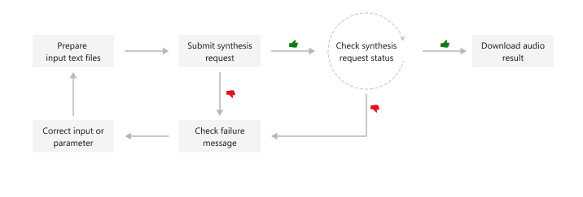

# Long Audio API (Preview)

The Long Audio API is designed for asynchronous synthesis of long-form text to speech (for example: audio books). This API doesn't return synthesized audio in real-time, instead the expectation is that you will poll for the response(s) and consume the output(s) as they are made available from the service. Unlike the text to speech API that's used by the Speech SDK, the Long Audio API can create synthesized audio longer than 10 minutes, making it ideal for publishers and audio content platforms.

Additional benefits of the Long Audio API:

* Synthesized speech returned by the service uses neural voices, which ensures high-fidelity audio outputs.
* Since real-time responses aren't supported, there's no need to deploy a voice endpoint.

> [!NOTE]
> The Long Audio API now supports only [Custom Neural Voice](https://docs.microsoft.com/azure/cognitive-services/speech-service/how-to-custom-voice#custom-neural-voices).

## Workflow

Typically, when using the Long Audio API, you'll submit a text file or files to be synthesized, poll for the status, then if the status is successful, you can download the audio output.

This diagram provides a high-level overview of the workflow.

## Prepare content for synthesis

When preparing your text file, make sure it:

* Is either plain text (.txt) or SSML text (.txt)
* Is encoded as [UTF-8 with Byte Order Mark (BOM)](https://www.w3.org/International/questions/qa-utf8-bom.en#bom)
* Is a single file, not a zip
* Contains more than 400 characters for plain text or 400 [billable characters](https://docs.microsoft.com/azure/cognitive-services/speech-service/text-to-speech#pricing-note) for SSML text, and less than 10,000 paragraphs
  * For plain text, each paragraph is separated by hitting **Enter/Return** - View [plain text input example](https://github.com/Azure-Samples/Cognitive-Speech-TTS/blob/master/CustomVoice-API-Samples/Java/en-US.txt)
  * For SSML text, each SSML piece is considered a paragraph. SSML pieces shall be separated by different paragraphs - View [SSML text input example](https://github.com/Azure-Samples/Cognitive-Speech-TTS/blob/master/CustomVoice-API-Samples/Java/SSMLTextInputSample.txt)
> [!NOTE]
> For Chinese (Mainland), Chinese (Hong Kong), Chinese (Taiwan), Japanese, and Korean, one word will be counted as two characters. 

## Submit synthesis requests

After preparing the input content, follow the [long-form audio synthesis quickstart](https://aka.ms/long-audio-python) to submit the request. If you have more than one input file, you will need to submit multiple requests. There are some limitations to be aware of: 
* Client is allowed to submit up to 5 requests to server per second for each Azure subscription account. If it exceeds the limitation, client will get a 429 error code (too many requests). Please reduce the request amount per second
* Server is allowed to run and queue up to 120 requests for each Azure subscription account. If it exceeds the limitation, server will return a 429 error code (too many requests). Please wait and avoid submitting new request until some requests are completed
* Server will keep up to 20,000 requests for each Azure subscription account. If it exceeds the limitation, please delete some requests before submitting new ones

## Audio output formats

We support flexible audio output formats. You can generate audio outputs per paragraph or concatenate the audios into one output by setting the 'concatenateResult' parameter. The following audio output formats are supported by the Long Audio API:

> [!NOTE]
> The default audio format is riff-16khz-16bit-mono-pcm.

* riff-8khz-16bit-mono-pcm
* riff-16khz-16bit-mono-pcm
* riff-24khz-16bit-mono-pcm
* riff-48khz-16bit-mono-pcm
* audio-16khz-32kbitrate-mono-mp3
* audio-16khz-64kbitrate-mono-mp3
* audio-16khz-128kbitrate-mono-mp3
* audio-24khz-48kbitrate-mono-mp3
* audio-24khz-96kbitrate-mono-mp3
* audio-24khz-160kbitrate-mono-mp3

## Quickstarts

We offer quickstarts designed to help you run the Long Audio API successfully. This table includes a list of Long Audio API quickstarts organized by language.

* [Quickstart: Python](https://aka.ms/long-audio-python)

## Sample code
Sample code for Long Audio API is available on GitHub.

* [Sample code: Python](https://github.com/Azure-Samples/Cognitive-Speech-TTS/tree/master/CustomVoice-API-Samples/Python)
* [Sample code: C#](https://github.com/Azure-Samples/Cognitive-Speech-TTS/tree/master/CustomVoice-API-Samples/CSharp)
* [Sample code: Java](https://github.com/Azure-Samples/Cognitive-Speech-TTS/blob/master/CustomVoice-API-Samples/Java/)
