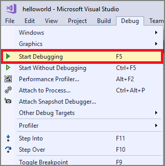

# Quickstart: Synthesize speech in C++ on Windows by using the Speech SDK

Quickstarts are also available for [speech-recognition](quickstart-cpp-windows.md) and [speech-translation](quickstart-translate-speech-cpp-windows.md).

In this article, you create a C++ console application for Windows. You use the Cognitive Services [Speech SDK](speech-sdk.md) to synthesize speech from text in real time and play the speech on your PC's speaker. The application is built with the [Speech SDK NuGet package](https://aka.ms/csspeech/nuget) and Microsoft Visual Studio 2017 or later (any edition).

The feature described within this article is available from [Speech SDK 1.5.0](https://www.nuget.org/packages/Microsoft.CognitiveServices.Speech/1.5.0).

For a complete list of languages/voices available for speech synthesis, see [language support](language-support.md#text-to-speech).

## Prerequisites

You need a Speech Services subscription key to complete this Quickstart. You can get one for free. See [Try the Speech Services for free](get-started.md) for details.

## Create a Visual Studio project

[!INCLUDE [Quickstart C++ project](../../../includes/cognitive-services-speech-service-quickstart-cpp-create-proj.md)]

## Add sample code

1. Open the source file *helloworld.cpp*. Replace all the code below the initial include statement (`#include "stdafx.h"` or `#include "pch.h"`) with the following:

   [!code-cpp[Quickstart Code](~/samples-cognitive-services-speech-sdk/quickstart/text-to-speech/cpp-windows/helloworld/helloworld.cpp#code)]

1. In the same file, replace the string `YourSubscriptionKey` with your subscription key.

1. Replace the string `YourServiceRegion` with the [region](regions.md) associated with your subscription (for example, `westus` for the free trial subscription).

1. Save changes to the project.

## Build and run the app

1. Build the application. From the menu bar, choose **Build** > **Build Solution**. The code should compile without errors.

   

1. Start the application. From the menu bar, choose **Debug** > **Start Debugging**, or press **F5**.

   

1. A console window appears, prompting you to type some text. Type a few words or a sentence. The text that you typed is transmitted to the Speech Services and synthesized to speech, which plays on your speaker.

   

## Next steps

Additional samples, such as how to save speech to an audio file, are available on GitHub.

> [!div class="nextstepaction"]
> [Explore C++ samples on GitHub](https://aka.ms/csspeech/samples)

## See also

- [Customize voice fonts](how-to-customize-voice-font.md)
- [Record voice samples](record-custom-voice-samples.md)
