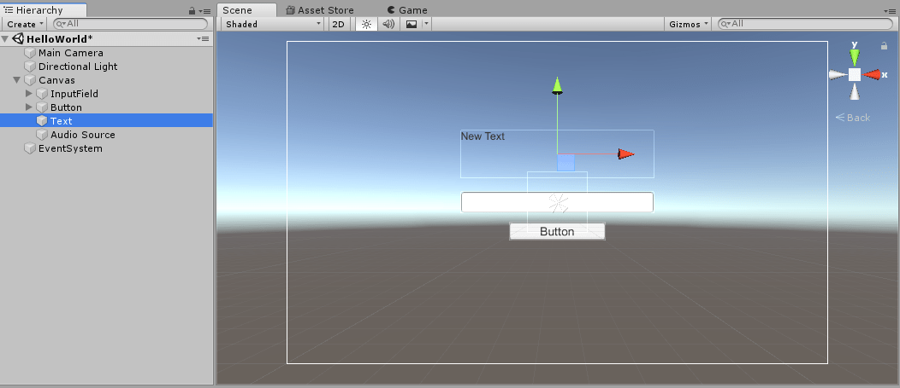
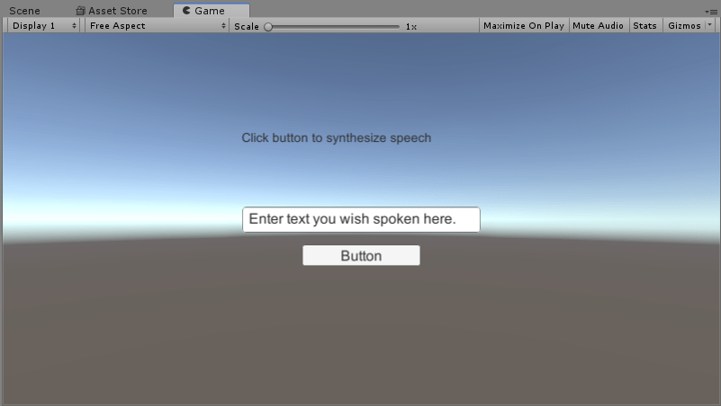

# Quickstart: Synthesize speech with the Speech SDK for Unity

Quickstarts are also available for [speech recognition](quickstart-csharp-unity.md).

Use this guide to create a text-to-speech application by using [Unity](https://unity3d.com/) and the Azure Cognitive Services Speech SDK for Unity.
When you're finished, you can synthesize speech from text in real time to your device's speaker.
If you aren't familiar with Unity, study the [Unity User Manual](https://docs.unity3d.com/Manual/UnityManual.html) before you start your application development.

> [!NOTE]
> Unity supports Windows Desktop (x86 and x64) or the Universal Windows Platform (x86, x64, ARM/ARM64), Android (x86, ARM32/64), and iOS (x64 simulator, ARM32 and ARM64).

## Prerequisites

To complete this project, you'll need:

* [Unity 2018.3 or later](https://store.unity.com/) with [Unity 2019.1 adding support for UWP ARM64](https://blogs.unity3d.com/2019/04/16/introducing-unity-2019-1/#universal).
* [Visual Studio 2019](https://visualstudio.microsoft.com/downloads/). Version 15.9 or higher of Visual Studio 2017 is also acceptable.
* For Windows ARM64 support, install the [optional build tools for ARM64 and the Windows 10 SDK for ARM64](https://blogs.windows.com/buildingapps/2018/11/15/official-support-for-windows-10-on-arm-development/).
* A subscription key for the Speech Service. [Get one for free](get-started.md).

## Create a Unity project

* Start Unity, and under the **Projects** tab, select **New**.
* Specify **Project name** as **csharp-unity** and **Template** as **3D**, and pick a location.
  Then select **Create project**.
* After a bit of time, the Unity Editor window should pop up.

## Install the Speech SDK

[!INCLUDE [License notice](../../../includes/cognitive-services-speech-service-license-notice.md)]

* The Speech SDK for Unity (Beta) is packaged as a Unity asset package (.unitypackage). Download it from [this website](https://aka.ms/csspeech/unitypackage).
* Import the Speech SDK by selecting **Assets** > **Import Package** > **Custom Package**. For more information, see the [Unity documentation](https://docs.unity3d.com/Manual/AssetPackages.html).
* In the file picker, select the Speech SDK .unitypackage file that you downloaded.
* Ensure that all files are selected, and select **Import**.

  

## Add a UI

We add a minimal UI to our scene that consists of an input field to enter the text for synthesis, a button to trigger speech synthesis, and a text field to display the result.

* In the [Hierarchy window](https://docs.unity3d.com/Manual/Hierarchy.html) (by default on the left), a sample scene is shown that Unity created with the new project.
* Select the **Create** button at the top of the **Hierarchy** window, and select **UI** > **Input Field**.
* This option creates three game objects that you can see in the **Hierarchy** window: an **Input Field** object nested within a **Canvas** object, and an **EventSystem** object.
* [Navigate the Scene view](https://docs.unity3d.com/Manual/SceneViewNavigation.html) so that you have a good view of the canvas and the input field in the [Scene view](https://docs.unity3d.com/Manual/UsingTheSceneView.html).
* Select the **Input Field** object in the **Hierarchy** window to display its settings in the [Inspector window](https://docs.unity3d.com/Manual/UsingTheInspector.html) (by default on the right).
* Set the **Pos X** and **Pos Y** properties to **0** so that the input field is centered in the middle of the canvas.
* Select the **Create** button at the top of the **Hierarchy** window again. Select **UI** > **Button** to create a button.
* Select the **Button** object in the **Hierarchy** window to display its settings in the [Inspector window](https://docs.unity3d.com/Manual/UsingTheInspector.html) (by default on the right).
* Set the **Pos X** and **Pos Y** properties to **0** and **-48**. Set the **Width** and **Height** properties to **160** and **30** to ensure that the button and the input field don't overlap.
* Select the **Create** button at the top of the **Hierarchy** window again. Select **UI** > **Text** to create a text field.
* Select the **Text** object in the **Hierarchy** window to display its settings in the [Inspector window](https://docs.unity3d.com/Manual/UsingTheInspector.html) (by default on the right).
* Set the **Pos X** and **Pos Y** properties to **0** and **80**. Set the **Width** and **Height** properties to **320** and **80** to ensure that the text field and the input field don't overlap.
* Select the **Create** button at the top of the **Hierarchy** window again. Select **Audio** > **Audio Source** to create an audio source.

When you're finished, the UI should look similar to this screenshot:

## Add the sample code

1. In the [Project window](https://docs.unity3d.com/Manual/ProjectView.html) (by default on the left bottom), select the **Create** button and then select **C# script**. Name the script `HelloWorld`.

1. Edit the script by double-clicking it.

   > [!NOTE]
   > You can configure which code editor is launched by selecting **Edit** > **Preferences**. For more information, see the [Unity User Manual](https://docs.unity3d.com/Manual/Preferences.html).

1. Replace all code with the following:

   [!code-csharp[Quickstart code](~/samples-cognitive-services-speech-sdk/quickstart/text-to-speech/csharp-unity/Assets/Scripts/HelloWorld.cs#code)]

1. Locate and replace the string `YourSubscriptionKey` with your Speech Services subscription key.

1. Locate and replace the string `YourServiceRegion` with the [region](regions.md) associated with your subscription. For example, the region is `westus` if you use the free trial.

1. Save the changes to the script.

1. Back in the Unity Editor, add the script as a component to one of your game objects.

   * Select the **Canvas** object in the **Hierarchy** window to open the setting in the [Inspector window](https://docs.unity3d.com/Manual/UsingTheInspector.html) (by default on the right).
   * Select the **Add Component** button in the **Inspector** window. Then search for the `HelloWorld` script we previously created and add it.
   * The HelloWorld component has four uninitialized properties, **Output Text**, **Input Field**, **Speak Button** and **Audio Source**, that match public properties of the `HelloWorld` class.
     To wire them up, select the Object Picker (the small circle icon to the right of the property). Select the text and button objects you created earlier.

     > [!NOTE]
     > The input field and button also have a nested text object. Make sure you don't accidentally pick it for text output. Or, you can rename the text objects that use the **Name** field in the **Inspector** window to avoid that confusion.

## Run the application in the Unity Editor

* Select the **Play** button in the Unity Editor toolbar that's underneath the menu bar.
* After the app launches, enter some text in the input field and select the button. Your text is transmitted to Speech Service and synthesized to speech, which plays on your speaker.

  

* Check the [Console window](https://docs.unity3d.com/Manual/Console.html) for debug messages.
* When you're finished synthesizing speech, select the **Play** button in the Unity Editor toolbar to stop the app.

## Additional options to run this application

This application can also be deployed to Android as a Windows stand-alone app or a UWP application.
See the [sample repository](https://aka.ms/csspeech/samples) in the quickstart/csharp-unity folder that describes the configuration for these additional targets.

## Next steps

> [!div class="nextstepaction"]
> [Explore C# samples on GitHub](https://aka.ms/csspeech/samples)

## See also

- [Customize voice fonts](how-to-customize-voice-font.md)
- [Record voice samples](record-custom-voice-samples.md)
