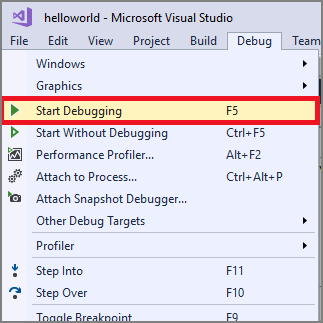

# Quickstart: Synthesize speech with the Speech SDK for .NET Framework (Windows)

Quickstarts are also available for [speech-recognition](quickstart-csharp-dotnet-windows.md) and [speech-translation](quickstart-translate-speech-dotnetframework-windows.md).

Use this guide to create a text-to-speech console application using the .NET framework for Windows and the Speech SDK. When finished, you can synthesize speech from text, and hear the speech on your speaker in real time.

For a quick demonstration (without building the Visual Studio project yourself as shown below):

Get the latest [Cognitive Services Speech SDK Samples](https://github.com/Azure-Samples/cognitive-services-speech-sdk) from GitHub.

## Prerequisites

To complete this project, you'll need:

* [Visual Studio 2019](https://visualstudio.microsoft.com/downloads/)
* A subscription key for the Speech Service. [Get one for free](get-started.md).
* A speaker (or headset) available.

## Create a Visual Studio project

[!INCLUDE [Create project](../../../includes/cognitive-services-speech-service-create-speech-project-vs-csharp.md)]

## Add sample code

1. Open `Program.cs` and replace the automatically generated code with this sample:

    [!code-csharp[Quickstart Code](~/samples-cognitive-services-speech-sdk/quickstart/text-to-speech/csharp-dotnet-windows/helloworld/Program.cs#code)]

1. Locate and replace the string `YourSubscriptionKey` with your Speech Services subscription key.

1. Locate and replace the string `YourServiceRegion` with the [region](regions.md) associated with your subscription. For example, if you're using the free trial, the region is `westus`.

1. Save the changes to the project.

## Build and run the app

1. From the menu bar, select **Build** > **Build Solution**. The code should compile without errors now.

    

1. From the menu bar, select **Debug** > **Start Debugging**, or press **F5** to start the application.

    

1. A console window will appear, prompting you to type some text. Type a few words or a sentence. The text that you typed is transmitted to the Speech Services and synthesized to speech, which plays on your speaker.

    

## Next steps

> [!div class="nextstepaction"]
> [Explore C# samples on GitHub](https://aka.ms/csspeech/samples)

## See also

- [Customize voice fonts](how-to-customize-voice-font.md)
- [Record voice samples](record-custom-voice-samples.md)
