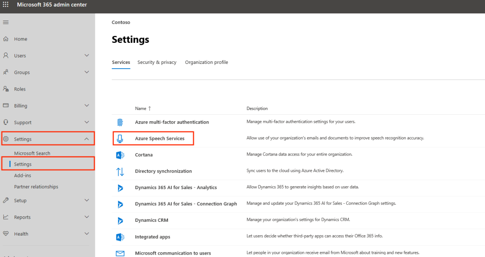
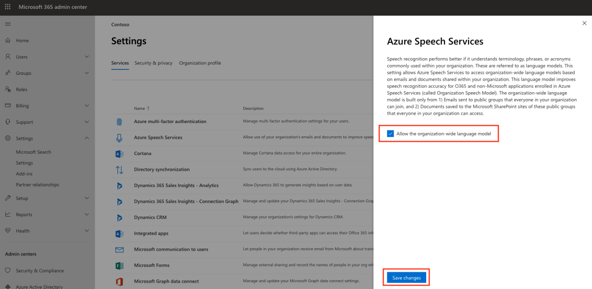

# Create a Tenant Model (Preview)

Tenant Model (Custom Speech with Office 365 data) is an opt-in service for Office 365 enterprise customers that automatically generates a custom speech recognition model from your organization's Office365 data. The model that's created is optimized for technical terms, jargon and people's names, all in a secure and compliant way.

> [!IMPORTANT]
> If your organization enrolls with Tenant Model, the Speech service may access your organization’s language model, which is generated from Office 365 public group emails and documents that can be seen by anyone in your organization. Your organization's Office 365 administrator may turn on/off the usage of the organization-wide language model using the Office 365 Admin Portal.

In this tutorial, you'll learn how to:

> [!div class="checklist"]
> * Enroll to use a Tenant Model in the Microsoft 365 Admin Center
> * Get a Speech subscription key
> * Create a Tenant Model
> * Deploy a Tenant Model
> * Use a Tenant Model with the Speech SDK

## Enroll using the Microsoft 365 Admin Center

Before you can deploy your Tenant Model, first need to enroll using the Microsoft 365 Admin Center. This task can only be completed by your Microsoft 365 Admin.

1. Sign into the [Microsoft 365 Admin Center](https://admin.microsoft.com ).
2. From the left panel, select **Settings** then **Apps**.

   

3. Locate and select **Azure Speech Services**.

   

4. Click the checkbox and save.

If you need to turn off the Tenant Model, navigate back to this screen, deselect the checkbox, and save.

## Get a Speech subscription key

In order to use a Tenant Model with the Speech SDK, you'll need a Speech resource and its associated subscription key.

1. Sign into the [Azure portal](https://aka.ms/azureportal).
2. Select **Create a resource**.
3. In the search bar, type: **Speech**.
4. Select **Speech**, then click **Create**.
5. Follow the onscreen instructions to create your resource. Make sure:
   * **Location** is set to either **eastus** or **westus**.
   * **Pricing tier** is set to **S0**.
6. Click **Create**.
7. After a few minutes, your resource is created. The subscription key is available in the **Overview** section for your resource.

## Create a model

After your admin has enabled Tenant Model for your organization, you can create a language model based on your Office365 data.

1. Sign into the [Speech Studio](https://speech.microsoft.com/).
2. In the upper right corner, locate and click the gear icon (settings), then select **Tenant Model settings**.

   

3. At this point you'll see a message letting you know if you are qualified to create a Tenant Model.
   > [!NOTE]
   > Office 365 enterprise customers in North America are eligible to create a Tenant Model (English). If you are a Customer Lockbox (CLB), Customer Key (CK), or Office 365 Government customer, this feature isn't available. To determine if you are a Customer Lockbox or Customer Key customer, follow these instructions:
   > * [Customer Lockbox](https://docs.microsoft.com/office365/securitycompliance/controlling-your-data-using-customer-key#FastTrack)
   > * [Customer Key](https://docs.microsoft.com/microsoft-365/compliance/customer-lockbox-requests)
   > * [Office 365 Government](https://www.microsoft.com/microsoft-365/government)

4. Next, select **Opt in**. You'll receive an email with instructions when your Tenant Model is ready.

## Deploy your model

When your Tenant Model is ready, follow these steps to deploy your model:

1. Click the **View model** button in confirmation email you received, or sign into the [Speech Studio](https://speech.microsoft.com/).
2. In the upper right corner, locate and click the gear icon (settings), then select **Tenant Model settings**.

   

3. Click **Deploy**.
4. When your model is deployed, the status will change to **Deployed**.

## Use your model with the Speech SDK

Now that you've deployed your model, you can use it with the Speech SDK. In this section, you'll use the sample code provided to call the Speech Service using Azure AD authentication.

Let's look at the code you'll use to call the Speech SDK in C#. In this example, you'll perform speech recognition using a Tenant Model. This guide presumes that your platform is already set up. If you need help with setting up, see [Quickstart: Recognize speech, C# (.NET Core)](quickstarts/speech-to-text-from-microphone.md?pivots=programming-language-csharp&tabs=dotnetcore).

Copy this code into your project:

```csharp
namespace PrincetonSROnly.FrontEnd.Samples
{
    using System;
    using System.Collections.Generic;
    using System.IO;
    using System.Net.Http;
    using System.Text;
    using System.Text.RegularExpressions;
    using System.Threading.Tasks;
    using Microsoft.CognitiveServices.Speech;
    using Microsoft.CognitiveServices.Speech.Audio;
    using Microsoft.IdentityModel.Clients.ActiveDirectory;
    using Newtonsoft.Json.Linq;

    // Note: ServiceApplicationId is a fixed value.  No need to change.

    public class TenantLMSample
    {
        private const string EndpointUriArgName = "EndpointUri";
        private const string SubscriptionKeyArgName = "SubscriptionKey";
        private const string UsernameArgName = "Username";
        private const string PasswordArgName = "Password";
        private const string ClientApplicationId = "f87bc118-1576-4097-93c9-dbf8f45ef0dd";
        private const string ServiceApplicationId = "18301695-f99d-4cae-9618-6901d4bdc7be";

        public static async Task ContinuousRecognitionWithTenantLMAsync(Uri endpointUri, string subscriptionKey, string audioDirPath, string username, string password)
        {
            var config = SpeechConfig.FromEndpoint(endpointUri, subscriptionKey);

            // Passing client specific information for obtaining LM
            if (string.IsNullOrEmpty(username) || string.IsNullOrEmpty(password))
            {
                config.AuthorizationToken = await AcquireAuthTokenWithInteractiveLoginAsync().ConfigureAwait(false);
            }
            else
            {
                config.AuthorizationToken = await AcquireAuthTokenWithUsernamePasswordAsync(username, password).ConfigureAwait(false);
            }

            var stopRecognition = new TaskCompletionSource<int>();

            // Creates a speech recognizer using file as audio input.
            // Replace with your own audio file name.
            using (var audioInput = AudioConfig.FromWavFileInput(audioDirPath))
            {
                using (var recognizer = new SpeechRecognizer(config, audioInput))
                {
                    // Subscribes to events
                    recognizer.Recognizing += (s, e) =>
                    {
                        Console.WriteLine($"RECOGNIZING: Text={e.Result.Text}");
                    };

                    recognizer.Recognized += (s, e) =>
                    {
                        if (e.Result.Reason == ResultReason.RecognizedSpeech)
                        {
                            Console.WriteLine($"RECOGNIZED: Text={e.Result.Text}");
                        }
                        else if (e.Result.Reason == ResultReason.NoMatch)
                        {
                            Console.WriteLine($"NOMATCH: Speech could not be recognized.");
                        }
                    };

                    recognizer.Canceled += (s, e) =>
                    {
                        Console.WriteLine($"CANCELED: Reason={e.Reason}");
                        if (e.Reason == CancellationReason.Error)
                        {
                            Exception exp = new Exception(string.Format("Error Code: {0}\nError Details{1}\nIs your subscription information updated?", e.ErrorCode, e.ErrorDetails));
                            throw exp;
                        }

                        stopRecognition.TrySetResult(0);
                    };

                    recognizer.SessionStarted += (s, e) =>
                    {
                        Console.WriteLine("\n    Session started event.");
                    };

                    recognizer.SessionStopped += (s, e) =>
                    {
                        Console.WriteLine("\n    Session stopped event.");
                        Console.WriteLine("\nStop recognition.");
                        stopRecognition.TrySetResult(0);
                    };

                    // Starts continuous recognition. Uses StopContinuousRecognitionAsync() to stop recognition.
                    await recognizer.StartContinuousRecognitionAsync().ConfigureAwait(false);

                    // Waits for completion.
                    // Use Task.WaitAny to keep the task rooted.
                    Task.WaitAny(new[] { stopRecognition.Task });

                    // Stops recognition.
                    await recognizer.StopContinuousRecognitionAsync().ConfigureAwait(false);
                }
            }
        }

        public static void Main(string[] args)
        {
            var arguments = new Dictionary<string, string>();
            string inputArgNamePattern = "--";
            Regex regex = new Regex(inputArgNamePattern);
            if (args.Length > 0)
            {
                foreach (var arg in args)
                {
                    var userArgs = arg.Split("=");
                    arguments[regex.Replace(userArgs[0], string.Empty)] = userArgs[1];
                }
            }

            var endpointString = arguments.GetValueOrDefault(EndpointUriArgName, $"wss://westus.online.princeton.customspeech.ai/msgraphcustomspeech/conversation/v1");
            var endpointUri = new Uri(endpointString);

            if (!arguments.ContainsKey(SubscriptionKeyArgName))
            {
                Exception exp = new Exception("Subscription Key missing! Please pass in a Cognitive services subscription Key using --SubscriptionKey=\"your_subscription_key\"" +
                    "Find more information on creating a Cognitive services resource and accessing your Subscription key here: https://docs.microsoft.com/azure/cognitive-services/cognitive-services-apis-create-account?tabs=multiservice%2Cwindows");
                throw exp;
            }

            var subscriptionKey = arguments[SubscriptionKeyArgName];
            var username = arguments.GetValueOrDefault(UsernameArgName, null);
            var password = arguments.GetValueOrDefault(PasswordArgName, null);

            var audioDirPath = Path.Combine(Path.GetDirectoryName(System.Reflection.Assembly.GetExecutingAssembly().Location), "../../../AudioSamples/DictationBatman.wav");
            if (!File.Exists(audioDirPath))
            {
                Exception exp = new Exception(string.Format("Audio File does not exist at path: {0}", audioDirPath));
                throw exp;
            }

            ContinuousRecognitionWithTenantLMAsync(endpointUri, subscriptionKey, audioDirPath, username, password).GetAwaiter().GetResult();
        }

        private static async Task<string> AcquireAuthTokenWithUsernamePasswordAsync(string username, string password)
        {
            var tokenEndpoint = "https://login.microsoftonline.com/common/oauth2/token";
            var postBody = $"resource={ServiceApplicationId}&client_id={ClientApplicationId}&grant_type=password&username={username}&password={password}";
            var stringContent = new StringContent(postBody, Encoding.UTF8, "application/x-www-form-urlencoded");
            using (HttpClient httpClient = new HttpClient())
            {
                var response = await httpClient.PostAsync(tokenEndpoint, stringContent).ConfigureAwait(false);

                if (response.IsSuccessStatusCode)
                {
                    var result = await response.Content.ReadAsStringAsync().ConfigureAwait(false);

                    JObject jobject = JObject.Parse(result);
                    return jobject["access_token"].Value<string>();
                }
                else
                {
                    throw new Exception($"Requesting token from {tokenEndpoint} failed with status code {response.StatusCode}: {await response.Content.ReadAsStringAsync().ConfigureAwait(false)}");
                }
            }
        }

        private static async Task<string> AcquireAuthTokenWithInteractiveLoginAsync()
        {
            var authContext = new AuthenticationContext("https://login.windows.net/microsoft.onmicrosoft.com");
            var deviceCodeResult = await authContext.AcquireDeviceCodeAsync(ServiceApplicationId, ClientApplicationId).ConfigureAwait(false);

            Console.WriteLine(deviceCodeResult.Message);

            var authResult = await authContext.AcquireTokenByDeviceCodeAsync(deviceCodeResult).ConfigureAwait(false);

            return authResult.AccessToken;
        }
    }
}
```

Next, you'll need rebuild and run the project from the command line. There are a few parameters you'll need to update before you run the command.

1. Replace `<Username>` and `<Password>` with the values for a valid tenant user.
2. Replace `<Subscription-Key>` with the subscription key for your Speech resource. This value is available in the **Overview** section for your Speech resource in the [Azure portal](https://aka.ms/azureportal).
3. Replace `<Endpoint-Uri>` with the endpoint below. Make sure that you replace `{your-region}` with the region where your Speech resource was created. These regions are supported: `westus`, `westus2`, and `eastus`. Your region information is available in the **Overview** section for your Speech resource in the [Azure portal](https://aka.ms/azureportal).
   ```
   "wss://{your region}.online.princeton.customspeech.ai/msgraphcustomspeech/conversation/v1".
   ```
4. Run the command:
   ```bash
   dotnet TenantLMSample.dll --Username=<Username> --Password=<Password> --SubscriptionKey=<Subscription-Key> --EndpointUri=<Endpoint-Uri>
   ```

## Next steps

* [Speech Studio](https://speech.microsoft.com/)
* [Speech SDK](speech-sdk.md)
