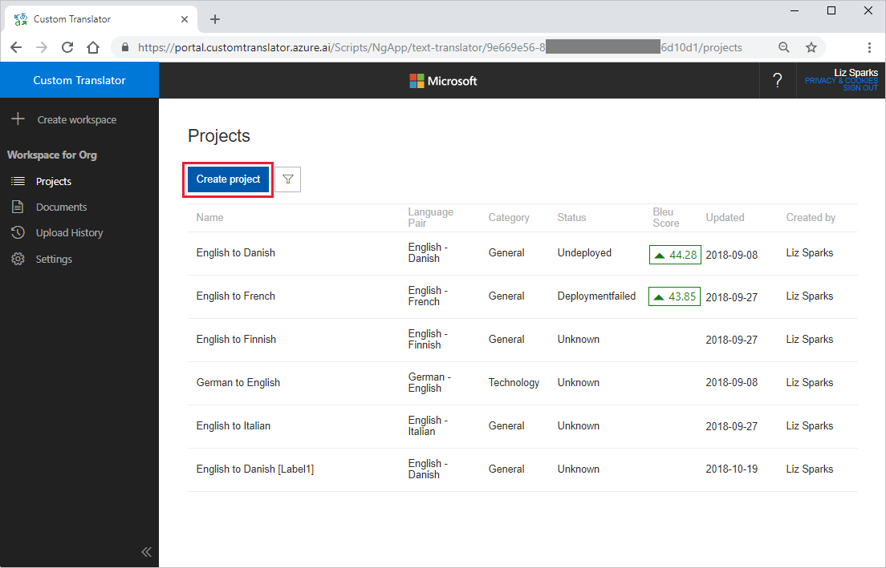
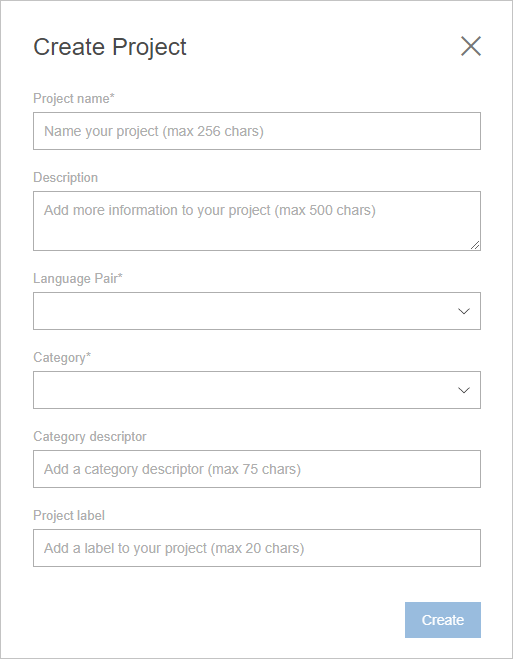

# Create a project

A project is a container for a models, documents, and tests. Each project automatically includes all documents that are uploaded into that workspace that have the correct language pair.

Creating project is the first step toward building a model.

## Create a project:

1.  In the [Custom Translator](https://portal.customtranslator.azure.ai) portal,
    click Create project.

    

2.  Enter the following details about your project in the dialog:

    a.  Project name (required): Give your project a unique, meaningful name. It's not necessary to mention the languages within the title.

    b.  Description: A short summary about the project. This description has no
        influence over the behavior of the Custom Translator or your resulting
        custom system, but can help you differentiate between different
        projects.

    c.  Language pair (required): Select the language that you're translating
        from and to.

    d.  Category (required): Select the category that's most appropriate for
        your project. The category describes the terminology and style of the
        documents you intend to translate.

    e.  Category description: Use this field to better describe the particular
        field or industry in which you're working. For example, if your
        category is medicine, you might add a particular document, such a surgery,
        or pediatrics. The description has no influence over the behavior of the
        Custom Translator or your resulting custom system.

    f.  Project label: The [project label](workspace-and-project.md#project-labels) distinguishes between
        projects with the same language pair and category. As a best practice,
        use a label *only* if you're planning to build multiple projects for
        the same language pair and same category and want to access these
        projects with a different CategoryID. Don't use this field if you're
        building systems for one category only. A project label is not required
        and not helpful to distinguish between language pairs. You can use the
        same label for multiple projects.

    

3.  Click Create

## View project details

The Custom Translator landing page shows the first 10 projects in your workspace. It displays the project name, language pair, category, status, and BLEU score.

After selecting a project, you'll see the following on the project page:

- CategoryID: A CategoryID is created by concatenating the WorkspaceID,
    project label, and category code. You use the CategoryID with the Text
    Translator API to get custom translations. To copy, click the copy icon.

- Train button: Use this button to start a [training a model](how-to-train-model.md).

- Add documents button: Use this button to [upload documents](how-to-upload-document.md).

- Filter documents button: Use this button to filter and search for specific
    document(s).

    

## Next steps

- Learn [how to search, edit, delete project](how-to-search-edit-delete-projects.md).
- Learn [how to upload document](how-to-upload-document.md) to build translation models.
