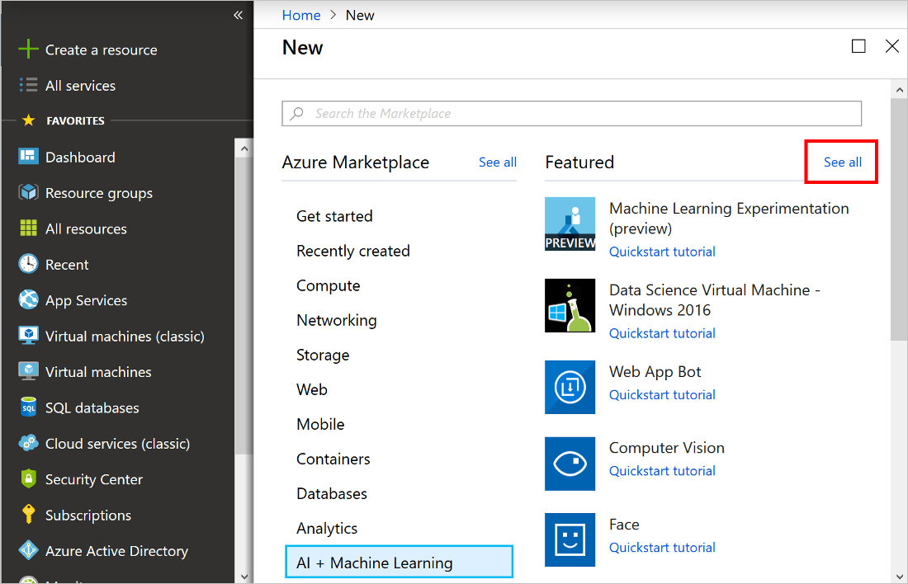

# Create a Cognitive Services resource using the Azure portal

Use this quickstart to get started with Azure Cognitive Services using the Azure portal. Cognitive Services are represented by Azure [resources](https://docs.microsoft.com/azure/azure-resource-manager/resource-group-portal) that you create in your Azure subscription. After creating the resource, Use the keys and endpoint generated for you to authenticate your applications. 

## Prerequisites

* A valid Azure subscription - [Create one for free](https://azure.microsoft.com/free/)

[!INCLUDE [cognitive-services-subscription-types](../../includes/cognitive-services-subscription-types.md)]

## Create a new Azure Cognitive Services resource

Before creating a Cognitive Services resource, you must have an Azure resource group to contain the resource. When you create a new resource, you have the option to either create a new resource group, or use an existing one. This article shows how to create a new resource group.

1. Sign in to the [Azure portal](https://portal.azure.com), and click **+Create a resource**.

    

2. You can find available Cognitive Services with in the following ways:
    * Use the search bar and enter the name of the service you want to subscribe to.
        * To create a multi-service resource, enter **Cognitive Services** in the search bar, and select the **Cognitive Services** resource.

        

    * To see all available cognitive services, select **AI + Machine Learning**, under **Azure Marketplace**. If you don't see the service you're interested in, click on **See all** and scroll to **Cognitive Services**. Click **More** to view the entire catalog of Cognitive Services APIs.
    
        

3. On the **Create** page, provide the following information:

    > [!IMPORTANT]
    > Remember your Azure location, as you may need it when calling the Azure Cognitive Services.

    |    |    |
    |--|--|
    | **Name** | A descriptive name for your cognitive services resource. For example *MyCognitiveServicesAccount*. |
    | **Subscription** | Select one of your available Azure subscriptions. |
    | **Location** | The location of your cognitive service instance. Different locations may introduce latency, but have no impact on the runtime availability of your resource. |
    | **Pricing tier** | The cost of your Cognitive Services account depends on the options you choose and your usage. For more information, see the API [pricing details](https://azure.microsoft.com/pricing/details/cognitive-services/).
    | **Resource group** | The [Azure resource group](https://docs.microsoft.com/azure/architecture/cloud-adoption/governance/resource-consistency/azure-resource-access#what-is-an-azure-resource-group) that will contain your Cognitive Services resource. You can create a new group or add it to a pre-existing group. |

    

## Get the keys for your resource

After creating your resource, you can access it from the Azure dashboard if you pinned it. Otherwise, you can find it in **Resource Groups**. After selecting your resource, you can get the keys by selecting **Keys** under **Resource Management**.

[!INCLUDE [cognitive-services-environment-variables](../../includes/cognitive-services-environment-variables.md)]

## Pricing tiers and billing

Pricing tiers (and the amount you get billed) are based on the number of transactions you send using your authentication information. Each pricing tier specifies the:
* maximum number of allowed transactions per second (TPS).
* service features enabled within the pricing tier.
* The cost for a predefined amount of transactions. Going above this amount will cause an extra charge as specified in the [pricing details](https://azure.microsoft.com/pricing/details/cognitive-services/custom-vision-service/) for your service.

## Clean up resources

If you want to clean up and remove a Cognitive Services subscription, you can delete the resource or resource group. Deleting the resource group also deletes any other resources contained in the group.

To remove a resource group using the Azure portal:

1. In the Azure portal, expand the menu on the left side to open the menu of services, and choose **Resource Groups** to display the list of your resource groups.
2. Locate the resource group to delete, and right-click the More button (...) on the right side of the listing.
3. Select **Delete resource group**, and confirm.

## See also

* [Authenticate requests to Azure Cognitive Services](authentication.md)
* [What are Azure Cognitive Services?](Welcome.md)
* [Natural language support](language-support.md)
* [Docker container support](cognitive-services-container-support.md)
