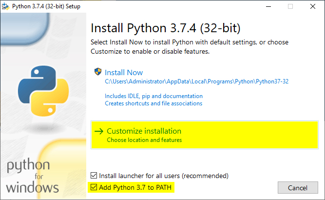
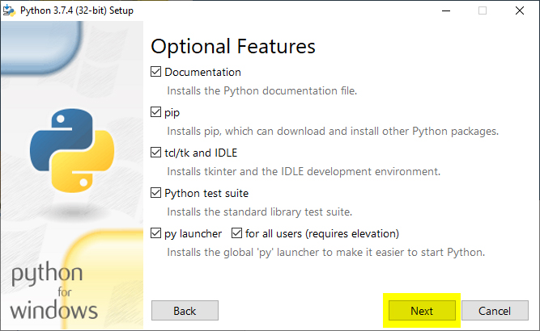
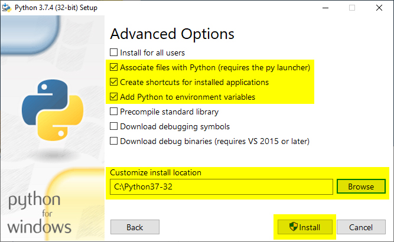

## Prerequisites

* Azure subscription - [Create one for free](https://azure.microsoft.com/free/cognitive-services)
* An Immersive Reader resource configured for Azure Active Directory authentication. Follow [these instructions](../../how-to-create-immersive-reader.md) to get set up.  You will need some of the values created here when configuring the environment properties. Save the output of your session into a text file for future reference.
* [Git](https://git-scm.com/).
* [Immersive Reader SDK](https://github.com/microsoft/immersive-reader-sdk).
* [Python](https://www.python.org/downloads/) and [pip](https://docs.python.org/3/installing/index.html). Starting with Python 3.4, pip is included by default with the Python binary installers.
* [Flask](https://flask.palletsprojects.com/en/1.0.x/).
* [Jinja](http://jinja.pocoo.org/docs/2.10/).
* [virtualenv](https://virtualenv.pypa.io/en/latest/) and [virtualenvwrapper-win for Windows](https://pypi.org/project/virtualenvwrapper-win/) or [virtualenvwrapper for OSX](https://virtualenvwrapper.readthedocs.io/en/latest/).
* The [requests module](https://pypi.org/project/requests/2.7.0/).
* An IDE such as [Visual Studio Code](https://code.visualstudio.com/).

## Configure authentication credentials

Create a new file called **.env**, and paste the following names and values into it. Supply the values given when you created your Immersive Reader resource.

```text
TENANT_ID={YOUR_TENANT_ID}
CLIENT_ID={YOUR_CLIENT_ID}
CLIENT_SECRET={YOUR_CLIENT_SECRET}
SUBDOMAIN={YOUR_SUBDOMAIN}
```

Don't commit this file into source control because it contains secrets that shouldn't be made public.

Secure the **getimmersivereadertoken** API endpoint behind some form of authentication, for example, [OAuth](https://oauth.net/2/). Authentication prevents unauthorized users from obtaining tokens to use against your Immersive Reader service and billing. That work is beyond the scope of this tutorial.

## Create a Python web app on Windows

Create a Python web app by using `flask` on Windows.

Install [Git](https://git-scm.com/).

After Git is installed, open a command prompt and clone the Immersive Reader SDK Git repository to a folder on your computer.

```cmd
git clone https://github.com/microsoft/immersive-reader-sdk.git
```

Install [Python](https://www.python.org/downloads/).

Select the **Add Python to PATH** check box.



Add **Optional Features** by selecting check boxes, and then select **Next**.



Select **Custom installation**, and set the installation path as your root folder, for example, `C:\Python37-32\`. Then select **Install**.



After the Python installation is finished, open a command prompt and use `cd` to go to the Python Scripts folder.

```cmd
cd C:\Python37-32\Scripts
```

Install Flask.

```cmd
pip install flask
```

Install Jinja2. It's a full-featured template engine for Python.

```cmd
pip install jinja2
```

Install virtualenv. This tool creates isolated Python environments.

```cmd
pip install virtualenv
```

Install virtualenvwrapper-win. The idea behind virtualenvwrapper is to ease usage of virtualenv.

```cmd
pip install virtualenvwrapper-win
```

Install the requests module. Requests is an Apache2 Licensed HTTP library, written in Python.

```cmd
pip install requests
```

Install the python-dotenv module. This module reads the key-value pair from the .env file and adds them to the environment variable.

```cmd
pip install python-dotenv
```

Make a virtual environment.

```cmd
mkvirtualenv advanced-python
```

Use `cd` to go to the sample project root folder.

```cmd
cd C:\immersive-reader-sdk\js\samples\advanced-python
```

Connect the sample project with the environment. This action maps the newly created virtual environment to the sample project root folder.

```cmd
setprojectdir .
```

Activate the virtual environment.

```cmd
activate
```

The project should now be active, and you'll see something like `(advanced-python) C:\immersive-reader-sdk\js\samples\advanced-python>` in the command prompt.

Deactivate the environment.

```cmd
deactivate
```

The `(advanced-python)` prefix should be gone because the environment is deactivated.

To reactivate the environment, run `workon advanced-python` from the sample project root folder.

```cmd
workon advanced-python
```

### Start the Immersive Reader with sample content

When the environment is active, run the sample project by entering `flask run` from the sample project root folder.

```cmd
flask run
```

Open your browser, and go to http://localhost:5000.

## Create a Python web app on OSX

Create a Python web app by using `flask` on OSX.

Install [Git](https://git-scm.com/).

After Git is installed, open Terminal and clone the Immersive Reader SDK Git repository to a folder on your computer.

```bash
git clone https://github.com/microsoft/immersive-reader-sdk.git
```

Install [Python](https://www.python.org/downloads/).

The Python root folder, for example, `Python37-32`, should now be in the Applications folder.

After the Python installation is finished, open Terminal and use `cd` to go to the Python Scripts folder.

```bash
cd immersive-reader-sdk/js/samples/advanced-python
```

Install pip.

```bash
curl https://bootstrap.pypa.io/get-pip.py -o get-pip.py
```

Run the following code to install pip for the currently signed-in user to avoid permissions issues.

```bash
python get-pip.py --user
```

```bash
sudo nano /etc/paths
```

- Enter your password, when prompted.
- Add the path of your pip installation to your PATH variable.
- Go to the bottom of the file, and enter the path you want to add as the last item of the list, for example, `PATH=$PATH:/usr/local/bin`.
- Select **CTRL+X** to quit.
- Enter **Y** to save the modified buffer.
- That's it! To test it, in a new Terminal window, enter `echo $PATH`.

Install Flask.

```bash
pip install flask --user
```

Install Jinja2. It's a full-featured template engine for Python.

```bash
pip install Jinja2 --user
```

Install virtualenv. This tool creates isolated Python environments.

```bash
pip install virtualenv --user
```

Install virtualenvwrapper. The idea behind virtualenvwrapper is to ease usage of virtualenv.

```bash
pip install virtualenvwrapper --user
```

Install the requests module. Requests is an Apache2 Licensed HTTP library, written in Python.

```bash
pip install requests --user
```

Install the python-dotenv module. This module reads the key-value pair from the .env file and adds them to the environment variable.

```bash
pip install python-dotenv --user
```

Choose a folder where you want to keep your virtual environments, and run this command:

```bash
mkdir ~/.virtualenvs
```

Use `cd` to go to the Immersive Reader SDK Python sample application folder.

```bash
cd immersive-reader-sdk/js/samples/advanced-python
```

Make a virtual environment.

```bash
mkvirtualenv -p /usr/local/bin/python3 advanced-python
```

Connect the sample project with the environment. This action maps the newly created virtual environment to the sample project root folder.

```bash
setprojectdir .
```

Activate the virtual environment.

```bash
activate
```

The project should now be active, and you'll see something like `(advanced-python) /immersive-reader-sdk/js/samples/advanced-python>` in the command prompt.

Deactivate the environment.

```bash
deactivate
```

The `(advanced-python)` prefix should be gone because the environment is deactivated.

To reactivate the environment, run `workon advanced-python` from the sample project root folder.

```bash
workon advanced-python
```

## Start the Immersive Reader with sample content

When the environment is active, run the sample project by entering `flask run` from the sample project root folder.

```bash
flask run
```

Open your browser, and go to http://localhost:5000.

## Next steps

* Explore the [Immersive Reader SDK](https://github.com/microsoft/immersive-reader-sdk) and the [Immersive Reader SDK reference](../../reference.md).
* View code samples on [GitHub](https://github.com/microsoft/immersive-reader-sdk/tree/master/js/samples/).
