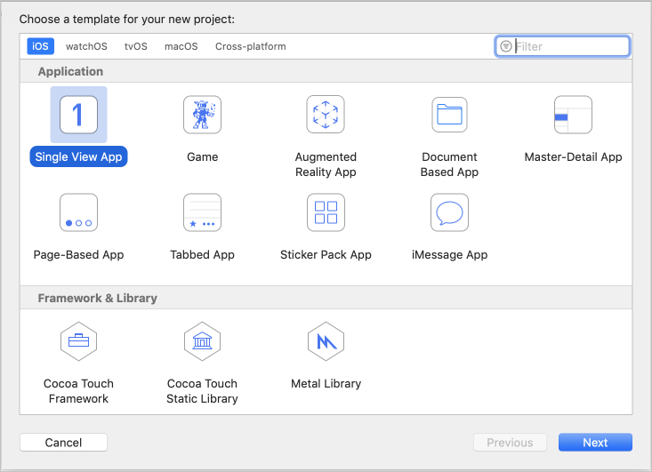
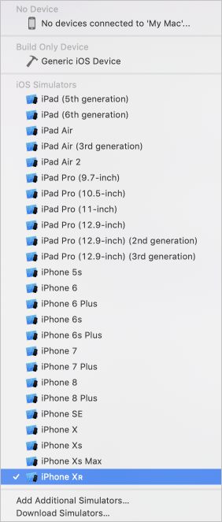
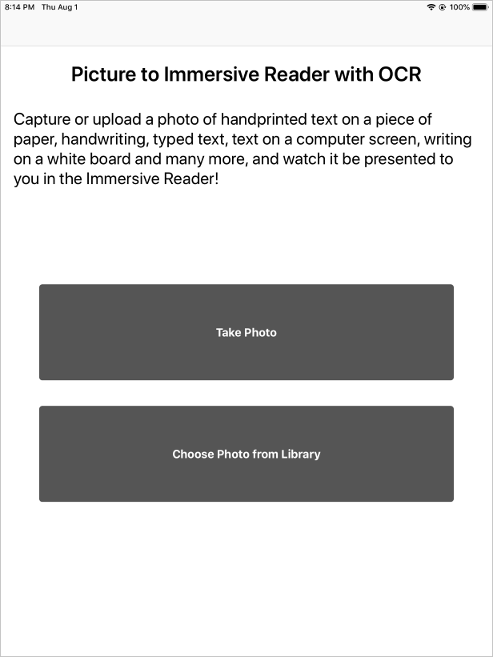
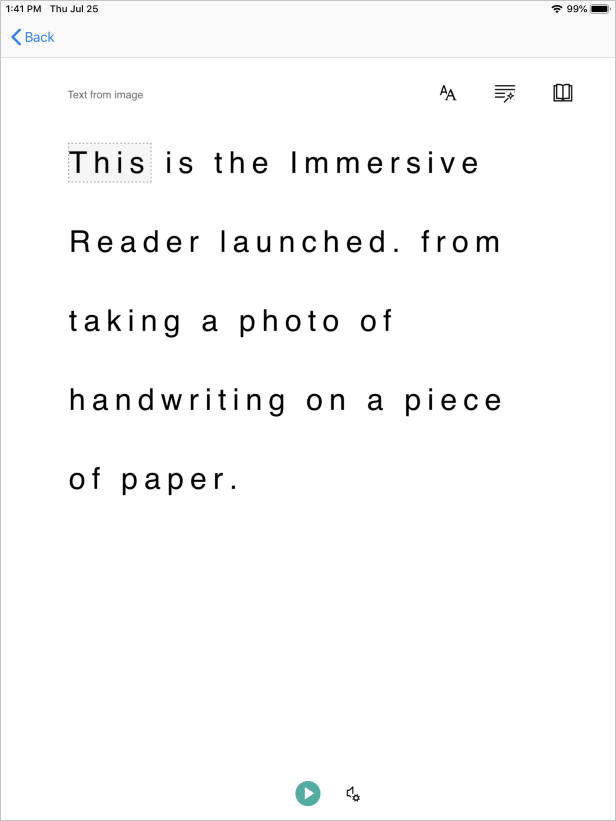

# Tutorial: Create an iOS app that launches the Immersive Reader with content from a photo (Swift)

The [Immersive Reader](https://www.onenote.com/learningtools) is an inclusively designed tool that implements proven techniques to improve reading comprehension.

The [Computer Vision Cognitive Services Read API](https://docs.microsoft.com/azure/cognitive-services/computer-vision/concept-recognizing-text) detects text content in an image using Microsoft's latest recognition models and converts the identified text into a machine-readable character stream.

In this tutorial, you will build an iOS app from scratch and integrate the Read API, and the Immersive Reader by using the Immersive Reader SDK. A full working sample of this tutorial is available [here](https://github.com/microsoft/immersive-reader-sdk/tree/master/js/samples/ios).

If you don't have an Azure subscription, create a [free account](https://azure.microsoft.com/free/cognitive-services/) before you begin.

## Prerequisites

* [Xcode](https://apps.apple.com/us/app/xcode/id497799835?mt=12)
* An Immersive Reader resource configured for Azure Active Directory authentication. Follow [these instructions](./how-to-create-immersive-reader.md) to get set up. You will need some of the values created here when configuring the sample project properties. Save the output of your session into a text file for future reference.
* Usage of this sample requires an Azure subscription to the Computer Vision Cognitive Service. [Create a Computer Vision Cognitive Service resource in the Azure portal](https://ms.portal.azure.com/#create/Microsoft.CognitiveServicesComputerVision).

## Create an Xcode project

Create a new project in Xcode.


Choose **Single View App**.



## Get the SDK CocoaPod
The easiest way to use the Immersive Reader SDK is via CocoaPods. To install via Cocoapods:
1. [Install CocoaPods](http://guides.cocoapods.org/using/getting-started.html) - Follow the getting started guide to install Cocoapods.
2. Create a Podfile by running `pod init` in your Xcode project's root directory.
3.  Add the CocoaPod to your Podfile by adding `pod 'immersive-reader-sdk', :path => 'https://github.com/microsoft/immersive-reader-sdk/tree/master/iOS/immersive-reader-sdk'`. Your Podfile should look like the following, with your target's name replacing picture-to-immersive-reader-swift:
 ```ruby
  platform :ios, '9.0'

  target 'picture-to-immersive-reader-swift' do
  use_frameworks!
  # Pods for picture-to-immersive-reader-swift
  pod 'immersive-reader-sdk', :git => 'https://github.com/microsoft/immersive-reader-sdk.git'
  end
```
4. In the terminal, in the directory of your Xcode project, run the command `pod install` to install the Immersive Reader SDK pod.
5. Add `import immersive_reader_sdk` to all files that need to reference the SDK.
6. Ensure to open the project by opening the `.xcworkspace` file and not the `.xcodeproj` file.

## Acquire an Azure AD authentication token

You need some values from the Azure AD authentication configuration prerequisite step above for this part. Refer back to the text file you saved of that session.

````text
TenantId     => Azure subscription TenantId
ClientId     => Azure AD ApplicationId
ClientSecret => Azure AD Application Service Principal password
Subdomain    => Immersive Reader resource subdomain (resource 'Name' if the resource was created in the Azure portal, or 'CustomSubDomain' option if the resource was created with Azure CLI Powershell. Check the Azure portal for the subdomain on the Endpoint in the resource Overview page, for example, 'https://[SUBDOMAIN].cognitiveservices.azure.com/')
````

In the main project folder, which contains the ViewController.swift file, create a Swift class file called Constants.swift. Replace the class with the following code, adding in your values where applicable. Keep this file as a local file that only exists on your machine and be sure not to commit this file into source control, as it contains secrets that should not be made public. It is recommended that you do not keep secrets in your app. Instead, we recommend using a backend service to obtain the token, where the secrets can be kept outside of the app and off of the device. The backend API endpoint should be secured behind some form of authentication (for example, [OAuth](https://oauth.net/2/)) to prevent unauthorized users from obtaining tokens to use against your Immersive Reader service and billing; that work is beyond the scope of this tutorial.

## Set up the app to run without a storyboard

Open AppDelegate.swift and replace the file with the following code.

## Add functionality for taking and uploading photos

Rename ViewController.swift to PictureLaunchViewController.swift and replace the file with the following code.

## Build and run the app

Set the archive scheme in Xcode by selecting a simulator or device target.
<br/>


In Xcode, press Ctrl + R or click on the play button to run the project and the app should launch on the specified simulator or device.

In your app, you should see:



Inside the app, take or upload a photo of text by pressing the 'Take Photo' button or 'Choose Photo from Library' button and the Immersive Reader will then launch displaying the text from the photo.



## Next steps

* Explore the [Immersive Reader SDK Reference](./reference.md)
