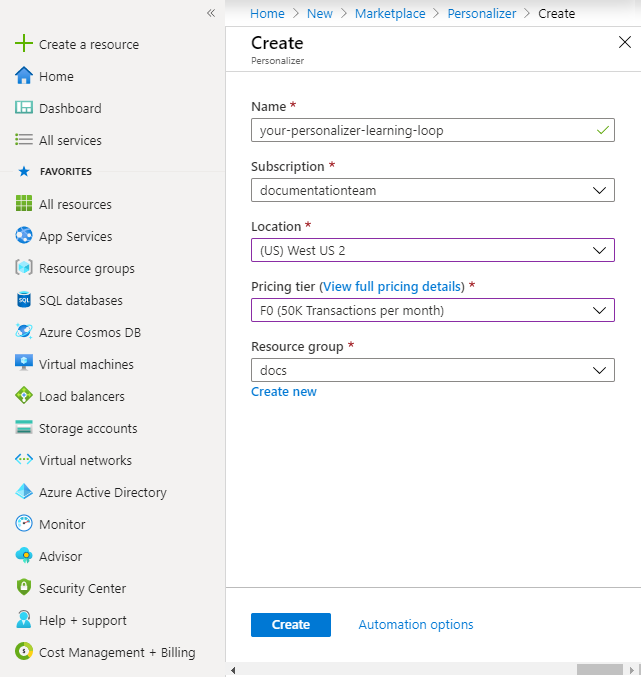

# Create a Personalizer resource

A Personalizer resource is the same thing as a Personalizer learning loop. A single resource, or learning loop, is created for each subject domain or content area you have. Do not use multiple content areas in the same loop because this will confuse the learning loop and provide poor predictions.

If you want Personalizer to select the best content for more than one content area of a web page, use a different learning loop for each.


## Create a resource in the Azure portal

Create a Personalizer resource for each feedback loop.

1. Sign in to [Azure portal](https://ms.portal.azure.com/#create/Microsoft.CognitiveServicesPersonalizer). The previous link takes you to the **Create** page for the Personalizer service.
1. Enter your service name, select a subscription, location, pricing tier, and resource group.

    > [!div class="mx-imgBorder"]
    > 

1. Select **Create** to create the resource.

1. Once your resource has deployed, select the **Go to Resource** button to go to your Personalizer resource. Go to the **Configuration** page for the new resource to [configure the learning loop](how-to-settings.md).

## Create a resource with the Azure CLI

1. Sign in to the Azure CLI with the following command:

    ```bash
    az login
    ```

1. Create a resource group, a logical grouping to manage all Azure resources you intend to use with the Personalizer resource.


    ```bash
    az group create \
        --name your-personalizer-resource-group \
        --location westus2
    ```

1. Create a new Personalizer resource, _learning loop_, with the following command for an existing resource group.

    ```bash
    az cognitiveservices account create \
        --name your-personalizer-learning-loop \
        --resource-group your-personalizer-resource-group \
        --kind Personalizer \
        --sku F0 \
        --location westus2 \
        --yes
    ```
## Next steps

* [Configure](how-to-settings.md) Personalizer learning loop