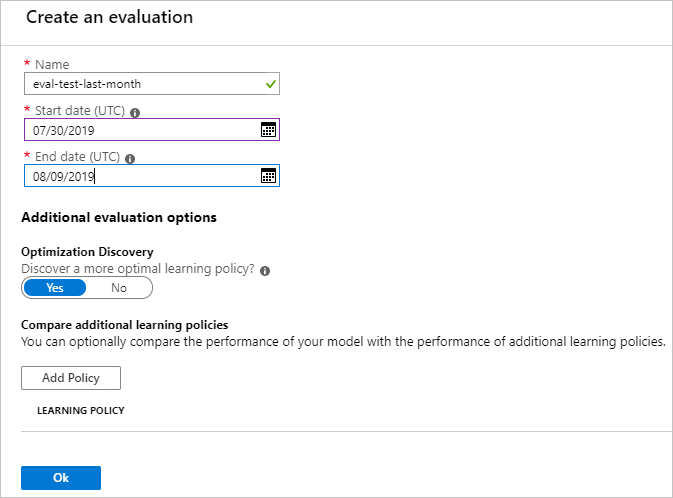

# Analyze your learning loop with an offline evaluation

Learn how to complete an offline evaluation and understand the results.

Offline Evaluations allow you to measure how effective Personalizer is compared to your application's default behavior, learn what features are contributing most to personalization, and discover new machine learning values automatically.

Read about [Offline Evaluations](concepts-offline-evaluation.md) to learn more.

## Prerequisites

* A configured Personalizer loop
* The Personalizer loop must have a representative amount of data - as a ballpark we recommend at least 50,000 events in its logs for meaningful evaluation results. Optionally, you may also have previously exported _learning policy_ files you can compare and test in the same evaluation.

## Run an offline evaluation

1. In the [Azure portal](https://azure.microsoft.com/free/cognitive-services), locate your Personalizer resource.
1. In the Azure portal, go to the **Evaluations** section and select **Create Evaluation**.
    
1. Configure the following values:

    * An evaluation name.
    * Start and end date - these are dates that specify the range of data to use in the evaluation. This data must be present in the logs, as specified in the [Data Retention](how-to-settings.md) value.
    * Optimization Discovery set to **yes**.

    > [!div class="mx-imgBorder"]
    > 

1. Start the Evaluation by selecting **Ok**.

## Review the evaluation results

Evaluations can take a long time to run, depending on the amount of data to process, number of learning policies to compare, and whether an optimization was requested.

Once completed, you can select the evaluation from the list of evaluations, then select **Compare the score of your application with other potential learning settings**. Select this feature when you want to see how your current learning policy performs compared to a new policy.

1. Review the performance of the [learning policies](concepts-offline-evaluation.md#discovering-the-optimized-learning-policy).

    > [!div class="mx-imgBorder"]
    > 

1. Select **Apply** to apply the policy that improves the model best for your data.

## Next steps

* Learn more about [how offline evaluations work](concepts-offline-evaluation.md).
